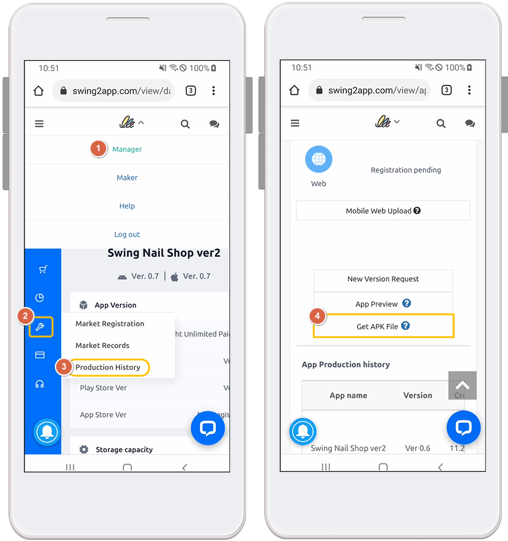
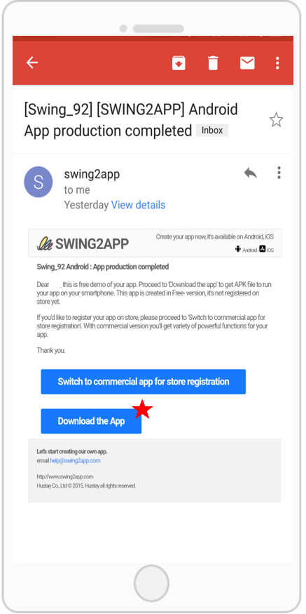

# App installation and download FAQ

How do I download an app I've created?

**Swing2App Official App** - You can use the app preview to see which apps you've created.

1\) Please download the official 'Swing2App' app from the App Store and Play Store.

\*If the app is already installed, please update to the latest version.

 [App store launch link\*\*(URL)\*\*](https://itunes.apple.com/us/app/%EC%8A%A4%EC%9C%99%ED%88%AC%EC%95%B1-swing2app/id1089434204?l=ko\&ls=1\&mt=8)

 [Play store launch link\*\*(URL)\*\*](https://play.google.com/store/apps/details?id=com.hustay.swing.n24b9904fe8b52497d87aaa75f795b5f96)

2\) After launching the app, select the \[App Preview] menu at the top of the → category and log in with your Swing2App website subscription account (ID, password).

**\*Note: To log in, you must enter the account you signed up for in the Swing2App homepage** [<mark style="color:blue;">http://www.swing2app.com</mark>](https://www.swing2app.com/)

**It's not an account signed up for in the official Swing2App app\~!**

3\) Once you're done signing in, the app preview page will open, where you can see a list of apps you've created.

\*iPhones can be confirmed by pressing the preview button. (WebView, apps created by push are not available on the iPhone)

\*On Android phones, you can preview the app and download the app.

For more information on how to install the app, please check the manual link below.

 [<mark style="color:blue;">See how to install the app</mark>](../manual/appoperation/appinstall.md)

Can't test an app I've created on an iPhone?

The app can also be tested on iPhone.

Here are 2 ways to do it.

**1)When using the free version app - Use the Swing2App App app preview**

Download and install the official \[Swing2App] app from the App Store.

Launch the app, select the \[App Preview] menu at the top, and log in with your Swing2App account - you can preview the app you created as a preview on your iPhone.

\*You can check all the apps you create for free.

\*Only Prototype - Apps created with Push or WebView are not available for preview (only apps created by regular prototypes - slides, tops, footers, etc.)

**2) When using the paid version of the app - register the test version with the user's Apple ID 'test-flight'**

You can test using the test-flight provided by the App Store.

Please purchase a paid app pass, an App Store upload ticket, and apply for an App Store upload.

Email after completion of upload application: Please email the App Store test-flight request to the help@swing2app.com

Please collect and send us all the Apple accounts (email addresses) of users who want to use the iPhone app.

The audit takes 3 to 5 days, and once it's complete, you can install the app on your iPhone to test it.

The test-flight is only available for 90 days, and if you do extend, you will need to purchase an App Store upload ticket and reapply for the upload.

\* This applies to the paid version and requires you to purchase an App Store upload ticket and apply for an upload. (Swing Paid Use Pass must be paid.)

When installing the Android phone application, it says that it is from an unknown source.

Currently, Google defaults to warning about apps installed from sources other than the Google Play Store.

Therefore, if you received your app through an external channel other than the official Play Store, you may receive this message.

On your Android phone, you can install the downloaded application by checking **"Settings> Security > Unknown Sources".**

Of course, if your app has been uploaded to the Play Store, you won't be able to see these messages, so uploading to the Market will solve it simply.

In addition, you can select and proceed with the protection security message as 'Ignore and install'.

**☞** [<mark style="color:blue;">**\[How to install APK file Android phone\]**</mark>](../manual/appoperation/appinstall.md)

If I update my app after it's built, how will users of existing versions get the update?

An update message window appears when the app runs, so users can get the update to the latest version.

Currently, when making updates in Swing2App App Production, administrators can choose 'Recommended', 'Required', and 'Do not show updates' themselves.

Depending on the option chosen, the contents of the message window will vary, and if 'Required' is selected, the user must update before they can use the app normally.

If your app is registered on the App Store or Play Store after switching to the paid version, you will need to update the newly updated version of the app again on that Store.

Only when it is updated will users be able to use the changed content.

<strong>The apk file received as a free version tries to register on the market (Google, Naver, etc.), so the message ‘Certificate for Debugging’ appears, and it cannot be registered.</strong>

The debug message is the one you get when you try to market a free version of the app.

The free version of the app is not available on the Store.

\*Swing2App - The free version of the app is for personal use only (not available on the Store)

A paid version of the app is available for release in the Store. (PlayStore, App Store, OneStore, etc. are available)

Therefore, if you want to register for the Play Store, please make a paid payment and then receive the aab file to register.

I try to install an app, but I get a message that the signature is conflicting, and it won't install.

If you install the paid version after installing the free version, you will receive the following message:

Uninstall and install the existing free app and it will install without problems.

\*The free version app and the paid version app are not compatible, so please uninstall and reinstall it.

How do I switch to a free app after the end of the paid app period?

If you no longer use it as a paid app and want to use it as a free app, please proceed using the method below.

1\) Check for paid apps that have expired

2\)Delete apps installed on Android phone (delete paid apps that have been downloaded previously)

3\)Select the \[Update App] button on the app creation page (when you create a new app, it will switch to the free version)

4\)Swing2App Official App – From App Preview – App Download Progress

5\)Launch the free version of the app again and it will run normally.

6\) In addition, apps that have been uploaded to the Play Store etc. can be downloaded directly by users.

(The App Store will be dropped off upon request)

[<mark style="color:blue;">\[Go to the manual on how to switch to a free app after the end of the paid app period\]</mark>](../manual/appoperation/freeversionapp-change.md)

Please tell us how to share app on your Android phone.

App Sharing is a feature that lets you share apps you create for free with each other on your Android phone so that you can pass on your apps to other users.

If you apply the settings or the app sharing menu when creating the app, you can use the function to send a link to share the app with another app.

You can use it by taking the link and installing the app.

**\* App sharing is only possible on Android phones, the free version of the app cannot be shared on iPhone\~!**

**iPhones can only download apps released on the App Store.**

[<mark style="color:blue;">**\[Go to see how to install the app to share\]**</mark>](../manual/appoperation/share-app.md)

Where can I get a link to install the app?

Swing2App homepage - When you receive an APK file from your app's creation history, you can copy the link address from the download to install the app.

On Android phones, you can download the app directly from the app installation link.

**\*The app cannot be installed on iPhone, it is only available on Android phones.**

**\*Important\* Progress on PC, Web Browser: Please use Chrome!!**

You can copy and install the link address you received by copying it to various paths.

[<mark style="color:blue;">\[Go to the app installation link address to see the app download manual\]</mark>](../manual/appoperation/applink-install.md)

Please tell me how to download the APK file directly.

Swing2App Official App - In addition to using the app preview function, you can download it directly as an APK file on your Android phone.

**How to download and install the app as an APK file is only available on your Android phone. \*iPhone not available**

**1)Swing2App homepage - Use to receive APK files from app production history**

After the app is finished creating, access the Swing2App homepage on your mobile, and select the \[Get APK File] button on the app creation history page.

If you choose Get APK file, the file download will start and you can install the app directly on your mobile.

**2)Download the app from email**

When the app is published, the completed APK file is sent to the user's email.

**Blue banner** – You can select \[Download App] to install the app.

There are many ways to download the app.

For more detailed instructions, please refer to the manual below.

[\[Go to the manual on how to install the app on your phone\]](../manual/appoperation/appinstall.md)

After switching to a paid app, I get a 'Blocked by Play Protect' message when I download the app.

When you try to install a paid app that has been switched to it, you may get a 'Blocked by Play Protect' message, as shown in the image above.

Before you launch (register) on the Play Store, if you download from an external channel other than the official Play Store, Google Protect will display the message.

In this case, you can select \[Ignore and install] and you can install normally.

When you release an app to the Play Store, you won't see that message.

After switching to a paid app, I download the app and get the message "The app is not installed."

The message is also a case in which Google blocked the installation of the app on its own.

If you don't launch the Play Store, Google will recognize it as an unknown path and arbitrarily block the installation, which will result in a case where you can't install it properly.

**Paid apps made with Swing2App that are not available on the Play Store have been identified as unauthenticated paths on Android phones and have been blocked from installation.**

Disable Protect security settings in the PlayStore app for easy trouble.

**\* In the Play Store app → 'Play Protect', we recommend →that you deselect "Scan your device for security threats" and "Supplement the ability to detect harmful apps".**

Where can I find out how many apps I have downloaded?

The free version of the app allows you to check the storage capacity by checking the application information.

Long press the app icon installed on your Android phone and a banner window will pop up, and you can check it in the application information window when you select the icon with the shape of an exclamation point.

The free version of the app is only available for download on Android phones, so the iPhone is not applicable.

Apps released on the Play Store and the App Store as paid versions of the app are listed in the launch notes for the app size.

Please check the storage capacity listed on the App Store for your iPhone.

Where can I find the version of the app I downloaded?

If you have applied the 'Settings' menu to your app from a regular prototype app or a push app, you can check the version in Settings.

Apps that do not apply the setting menu, webview apps, can be checked through the application information, which is a function inside the phone.

\*Long press the app icon installed on your Android phone to check the app information.

The iPhone can only download the app through the App Store, so please check the version downloaded from the App Store.

