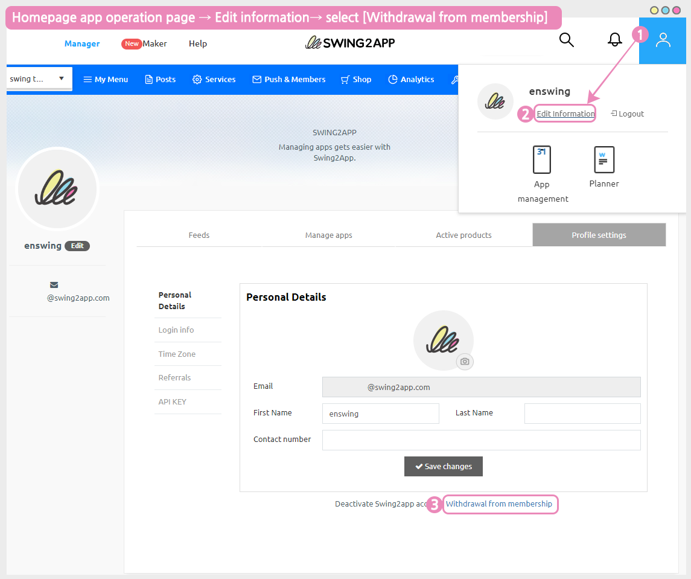
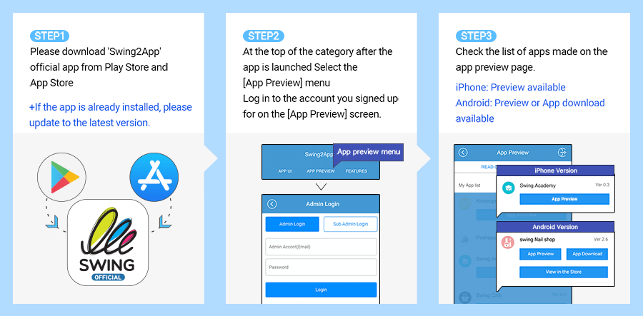
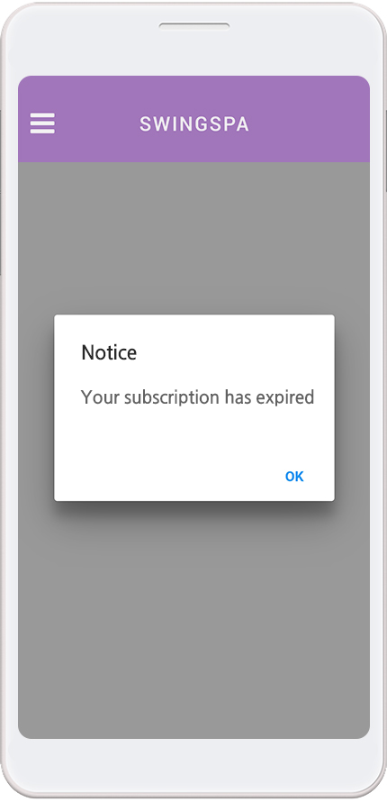

# Frequently Asked Questions (FAQ)

What is the difference between the paid version and the free version?

**The first difference between a paid version and a free version is being able to launch (commercialized) in the Store and not being able to do it.**

\-Free is only available as an Android phone installation file, and paid can be commercialized and released on Play Store, App Store, etc.

\-The paid version can be distributed to stores such as the Play Store, the App Store, etc. This means you can release apps that you have created in the Store.

**Secondly, there is a difference in the storage capacity.**

The Free version comes with a basic 100MB capacity, while the paid version offers 2GB to 50 GB. (Depending on the product, the amount of the paid version app varies)

**The third difference is, that number of app productions is different.**

Paid users can create up to 10 apps per account, and free users can create up to 3 apps per account.

In addition, there are differences in the number of bulletin board productions, the number of group chat rooms, and the limit of the number of users.

Most features are available in the free version, so try it out for free and switch to paid when ready.

\*\*☞ \*\*<mark style="color:blue;">**How to use the Swing2App service?**</mark>

<strong>How long do I need to wait for my app to be released in each store?</strong>

**\[App Store]**

The app Store review period is a minimum of 7 days.

If there are no issues with the review, the app will be released within 7 days. In some cases, the app release can take even more than 7 days, because the app gets often rejected during the review phase.

Therefore, please consider these points while applying for app store upload, and make sure to check the review feedback for the reasons for the rejection of the app.

**\[PlayStore]**

Play Store review period takes a minimum of 7 days.

If there are no issues with the review, the app will be released on the store immediately after the above review period, but the app upload on the Play Store may also be delayed in the release date if the review is declined.

Therefore, please consider these points while applying for the app upload.

What is a Store Upload Agent?

A paid version of the app (an app with paid app subscription) will be available for commercialization. Users can launch their paid apps in the stores such as the Play Store and the App Store.

If users face difficulty while uploading their app directly to the store, they can apply for the store upload request form. By doing that, on your behalf, the Swing2App team will upload your app to the store.

**In other words, putting an app created by a user on the Store instead is called an upload agency.**

Therefore, **if you request an upload agency, you can apply by purchasing \[App Store Upload Ticket $20], \[Play Store Upload Ticket $10] on the Swing Payment – Swing Pass, Ticket Purchase page.**

After purchasing, you will need to apply for an upload to complete the application. Go to the Version Control →App Creation History menu\*\*,\*\* and **select the \[Request to upload to Play Store] or \[Request for App Store Upload] button in the Market Registration box.**

\*The Play Store allows individual uploads, so if you can upload them yourself, you don't need to buy an upload ticket.

\*The App Store cannot be uploaded directly by the user and can only be released by the upload agency.

When will the number of days of use of paid subscriptions be counted?

Paid subscriptions are counted for days from the date the pass is paid.

For example, if you paid on March 4th, the period of use starts on the 4th.

**If you need to put your app on the stove, please purchase a paid pass and upload ticket after the app is finished creating.**

How do I get AAB files that I can register on the Play Store?

AAB files are not available in the free version of the app, but only in the paid version of the app where you have purchased a subscription to the paid app.

(Free version app users can only provide APK file)

Please update the app once more after purchasing the paid app subscription provided by the Swing To App. \*Select \[Update App button] in App Creation

When the authoring is complete, a button will be created on the app production history page → On the Manager page-> Click on the version control → Click on the production history

If I purchase my subscription again long after the expiration of the subscription period, will the app be able to use it normally?

Yes, the expiration of the subscription period does not delete the app, so you can purchase it later.

The app will switch to the free version.

<mark style="color:red;">\*Users who download the app from the App Store or Play Store when switching to the free version will not be able to use the app.</mark>

So if you buy your pass again later, the app will be automatically restored and you can use it normally.

Apps from users who downloaded apps from the Store will also be restored to normal.

However, after the launch of the app such as the app store, play store, etc., we will check whether it is being used well.

At this time, <mark style="color:red;">if the app is discontinued, it will be removed from the store because it is not a normal app, so when the period of use ends, it is recommended that you repurchase the subscription and extend the use as soon as possible.</mark>

When an app is deleted from the Store, it can sometimes be difficult to restore the app again, and all existing users will be lost.

How do I unsubscribe from the Swing2app Home homepage?

To cancel your membership, you can select your profile in the upper right corner of the Swing2app homepage app manager page → click on Edit information → select [Withdrawal from membership](https://www.swing2app.com/view/user\_secession).

The ID you withdrew cannot be recovered, and you cannot rejoin with the same ID in the future.

When you unsubscribe, all apps and content you created will be deleted, so please choose carefully.

How do I set up App Manager?

Even if you're the creator of the app, **you will need to change the rating as an administrator before you can use the app as an administrator.**

**\[How to set up the app manager]**

1. Please register in the app first.

2\. On the swing homepage, go to the → app manager page →Push & Member → Click on the View all members option.

3\. On the View all members page, select the member you want to change to an administrator, and then select the → 'Administrator' from the 'User' of the current group information → and select the \[Change Group] button.

When you have finished making the change, you are done changing the administrator level. \~!!

Can I delete an app I've created?

Can I delete an app I've created?

Yes, you can delete the apps you created yourself. To uninstall an app, <mark style="color:blue;">**go to the \[Manager page]-> Click on \[My menu]-> Click on the \[Manage app] option-> here you can check all of your created apps and delete them-> Click on the \[Remove app] button.**</mark>

You can select the button to delete the app.

<mark style="color:red;">**\[Precautions]**</mark>

\* You can delete it when you have more than 2 apps.

\*Deleted apps will not be restored, so please think carefully about it.

\*Please note that paid users do not want the app to be uninstalled until the end of the paid period.

How do I download and check my app?

\*There are 2 ways to download and check the created app on your phone.

\*Android phones can be checked by installing the app on the phone, and it is available as a preview on the iPhone.

**1) Check on the swing2app preview (app preview)**

Please download the \[Swing2App] official app from the App Store and Play Store.

After launching the app → Select the top of the category \[App Preview] menu → Please log in with your account subscribed to swing2app in the admin login window.

In the app preview, you can see a list of apps created by swing2app.

**-iPhone: Check by pressing the Preview button**

**-Android: Preview or check app download**

\*Please note that the iPhone is only previewed, not downloaded.

(Apps created with push and web view cannot be checked on iPhone.

**2) Install Android phone APK file \*Only available on Android phones**

When you make a request to create an app, an APK file will be sent to the user by e-mail.

You can download the APK file to your phone and install the app. You can also download APK files from swing2app-> go to <mark style="color:blue;">app manager page → version control →app production history</mark>

Can't install the free version of the app on my iPhone?

Yes, iPhones are not allowed to install and download the free version of the app.

The free version of the app created by Swing2App can only be downloaded and installed on Android phones.

**The iPhone is only required to use apps downloaded from the official App Store due to the policy.**

**Instead, iPhone users can check out the app in a preview.**

If you use \[App Preview] in the official Swing2App app, you can check the apps created on the iPhone by 'Preview'.

**\[How to use the swing2app app preview]**

1\)Please download the official \[Swing2App] app from the App Store.

2\)After launching the app → Select the top of the category \[App Preview] menu → Please log in with your account subscribed to swing2app in the admin login window.

3\)In the app preview, you can see the list of apps created by the swing2app app.

**\*Prototype**- Apps built with Push, WebView cannot be viewed with the swing app preview.

How do I modify and update my app after it is created?

The Swing2App has no app modification and update restrictions and is freely available by modifying its content.

Since there is no separate task page for modifying (updating) the content of the app, please go to the \[App Creation Page] and proceed with the same when you make the modification.

You can overwrite existing apps and keep updating.

After saving, press the **\[Update App]** button to update it back to the new version and recreate it.

<strong>What happens if I exceed the built-in capacity while using an app?</strong>

**If you exceed your capacity, your app will be suspended after 3 days of capacity overage.**

**\*If the capacity is exceeded, we will notify you by e-mail or text. (Text messages are sent only when the number is registered)**

Suspension of an app due to an overcapacity is the same as the expiration of the subscription period.

The app won't be deleted, but when you launch it, you'll get a message that says "Your subscription has expired" and the app will automatically freeze.

Users who have previously downloaded the app from the market will also be restricted from using the app when the message appears.

**\*For paid users, please note that if the capacity is exceeded, the app will be suspended even if the paid app period remains.**

Therefore, before the capacity is exceeded, please purchase and apply the amount of capacity you are lacking by purchasing a separate capacity add-on product.

**☞** [<mark style="color:blue;">**\[Go to Swing Payment Page\]**</mark>](https://www.swing2app.com/view/shop\_list)

You can also free up capacity by deleting unnecessary posts from the App Operations page → Service Management → Resource Management page.

**☞**[ <mark style="color:blue;">**\[Go to see how to use resource management\]**</mark>](../manual/appmanage/service/capacity-management.md)

What happens when the usage period expires while using a paid app?

**If you do not pay for the subscription again after the expiration of the paid app usage period, the use of the app will be suspended.**

Apps released to the Store won't be deleted or lost, **but when you launch the app early, you'll get a "Your subscription has expired" message, and the app won't run.**

**Users who have previously downloaded the app from Store will also be restricted from using the app when the message appears.**

If you pay for your subscription again, you will not receive the message, and you will be able to use the app again normally.

**\[Expired Use Message Window]**

If you want to use the app for free again, please delete the app that was previously installed on your phone and re-create the app in a new version after the end of the period.

After the end of the paid trial period, the version is a free version, so you can use it as a free app.

However, since it is a conversion to a free app, it is not possible to distribute it in the Store.

Are all the features offered by the Swing2App free of charge?

**Yes, you can use them all for free.**

Swing2App is free to create and operate apps.

Therefore, users can use all the functions for free without any restrictions.

I want to upload the app directly to the Play Store. How can I register?

After the app is finished creating, you can register and upload the AAB file after purchasing the paid app subscription.

How to register (launch) a Play Store app is provided in the manual. (We will not provide you with any consultation related to the registration of the Play Store app)

Please proceed by looking at the manual.

**☞** [<mark style="color:blue;">**\[How to launch the Play Store app\]**</mark>](../store/playstore/update-playstore.md)

Is the free app sharing feature only available on Android phones?

The ability to share (app sharing, bulletin boards, post sharing, etc.) for free version apps is only available on Android phones.

It can only be shared with Android Android ↔ phones.

Since the iPhone does not install the free version of the app, you will not be able to use the sharing function. Available after launch on the App Store.

