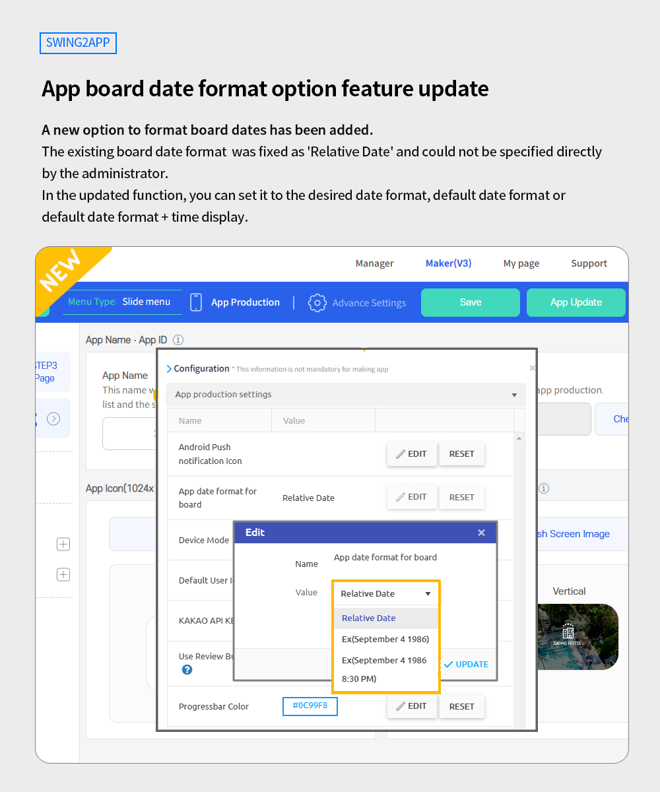
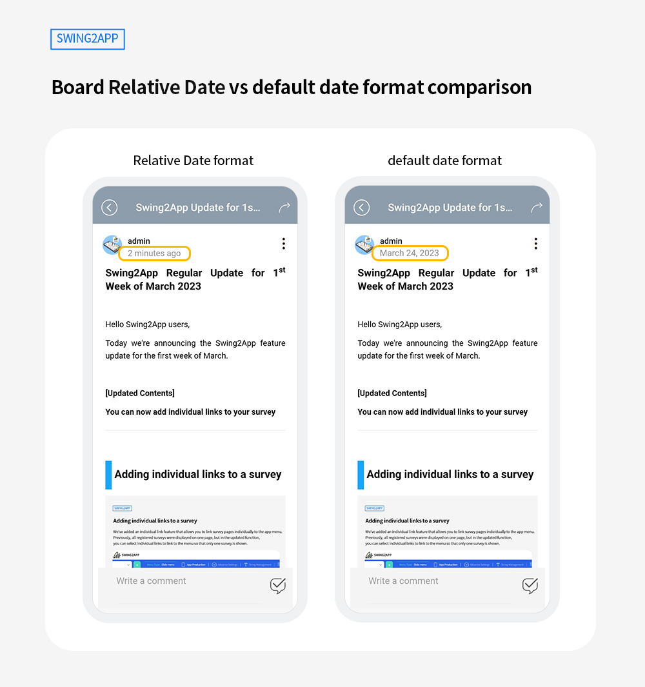
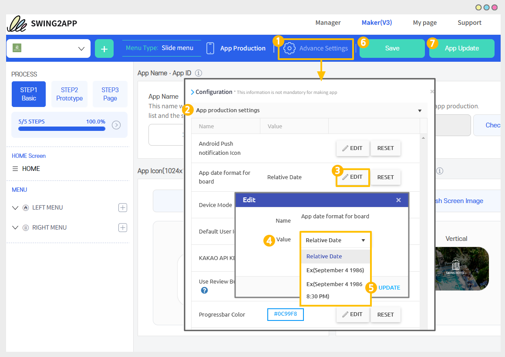

# Swing2App Update

<figure><figcaption></figcaption></figure>

##  **Added app board date format option feature**&#x20;

<figure><figcaption></figcaption></figure>

A new option to format board dates has been added.&#x20;

The existing board date format  was fixed as 'Relative Date' and could not be specified directly by the administrator.&#x20;

&#x20;In the updated function, you can set it to the desired date format, default date format or default date format + time display.

<mark style="color:red;">\*This function is available in the Maker V3 version of the app. If you are using V2, please switch to the Maker V3 version before using it.</mark>

### <mark style="color:blue;">**Date Board Relative Date vs default date format comparison**</mark>

<figure><figcaption></figcaption></figure>

Relative Date is the default setting date format provided on the Swing2App board.&#x20;

When you write the post, it doesn't show up as a date, it's ‘a minute ago', 'a day ago'... And post displayed as \*After a week, will be changed to year/month/day.&#x20;

The default date format is displayed as YY/MM/DD from the moment the post is created.&#x20;

Therefore, you can use the board date format  option function to directly select the date format displayed on the app board.

<figure><figcaption></figcaption></figure>

### &#x20; **How to Use**

<figure><figcaption></figcaption></figure>

On the Maker V3 Page

1\. Click on the Advanced settings.&#x20;

2\) Settings: App production settings&#x20;

3\. Select the \[EDIT] button for the date format of the app board.

4\) Select the setting value - Select "Ex"

\*The default setting is "Relative Date". The time options displayed in existing apps. (One minute ago, 1 day ago...)

\*If you want it to be displayed in date format, please select "Default date format".

\*If you want to display the date and time, please select the last setting value.&#x20;

5\. Click on the \[UPDATE] button.&#x20;

6\) Close the settings window, and then click on the \[Save] button at the top of the app creation screen.

7\. Click on the \[App Update] button.

&#x20;If you check after updating the app, you can see that the date format of the board has changed.

### &#x20; **Instructions**

1\) This function is available in the Maker V3 version of the app production.&#x20;

If you are using V2, please switch to the Maker V3 version before using it.

2\) Changing the board date requires an app update.

An app update is required to reflect board changed date format in the app.&#x20;

If your app has been released on the Play Store, App Store, etc., please update it again in that store as well.&#x20;

3\) The default settings are provided in 'Relative Date'.&#x20;

You can use it as it is or modify each option item to suit your app style.&#x20;

4\) If you change the default date and then change it to a Relative Date composite date again, you must update the app again to reflect it.

<figure><figcaption></figcaption></figure>

