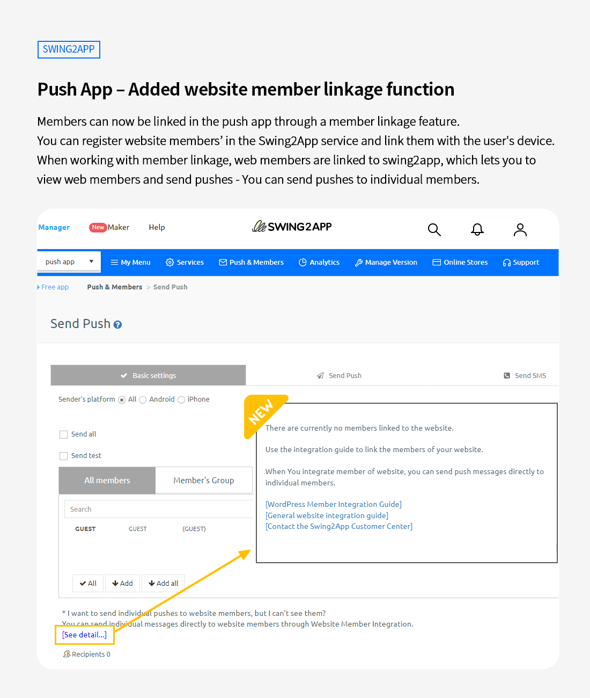
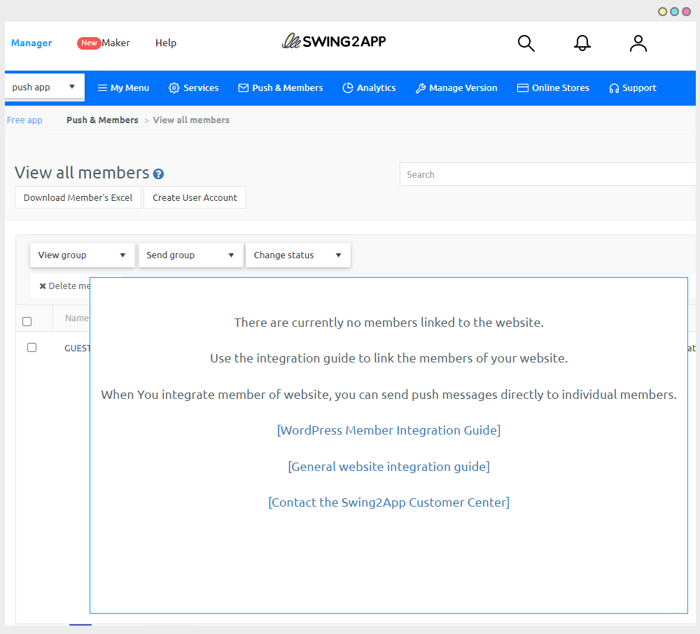

# Swing2App Update

<figure><figcaption></figcaption></figure>

##  **Push App – Added website member linkage function**&#x20;

<figure><figcaption></figcaption></figure>

**Members can now be linked in the push app through a member linkage feature.**

You can register website members’ in the Swing2App service and link them with the user's device.&#x20;

When working with member linkage, web members are linked to swing2app, which lets you to

view web members and send pushes - You can send pushes to individual members. \
\

###  **What is member linkage?**

If you do not link members, no members will be viewed in the view member list.

This is because you are a member of the site, not a member who signed up in the actual app, so there is no information to load.

In addition, when sending push, members cannot be inquired, so individual push sending is not possible (only full sending is possible).&#x20;

If you link your membership, you can check all the linked member information on the website as shown in the image above.

In the Send Push menu, you can also select individual members to send pushes.&#x20;

### &#x20;**How to Use**

<figure><figcaption></figcaption></figure>

After creating the push app, when you enter the member inquiry and push sending menu, a pop-up window will appear with member linkage instructions.

You can check each linked guide to work on the integration.&#x20;


### **Instructions**

1\)This function is only available in push-only prototype apps.&#x20;

Web view apps and general prototype apps are not applicable.&#x20;

2\) We provide all the necessary guides for member linkage.

Please check the guide to work on it.

3\)If it is difficult to link members, you can send us work request anytime.

Our development team will work on your project, the agency will charge you a fee.

(The cost varies depending on the site implementation, so we can guide you to the final estimate after consultation)

4\)Member linkage is an optional function, not a mandatory function.

Even if you do not link members, it does not affect the use of the push app, and you can send the same push without any issue.&#x20;

However, when sending a push, it can only be sent to all members and not individually.&#x20;


<figure><figcaption></figcaption></figure>

