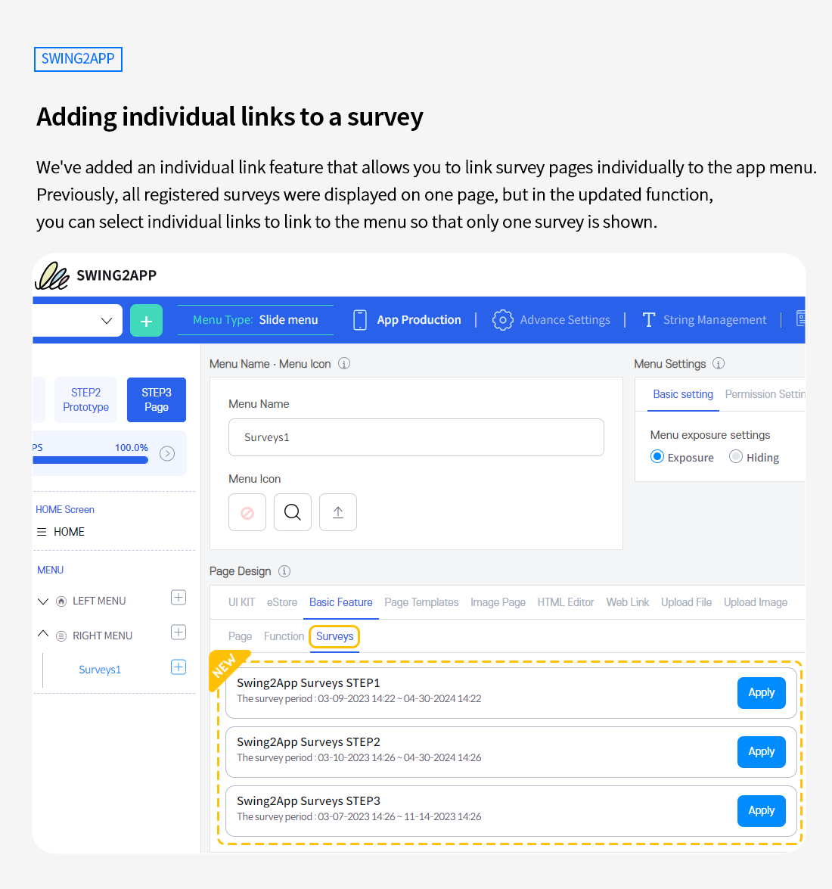
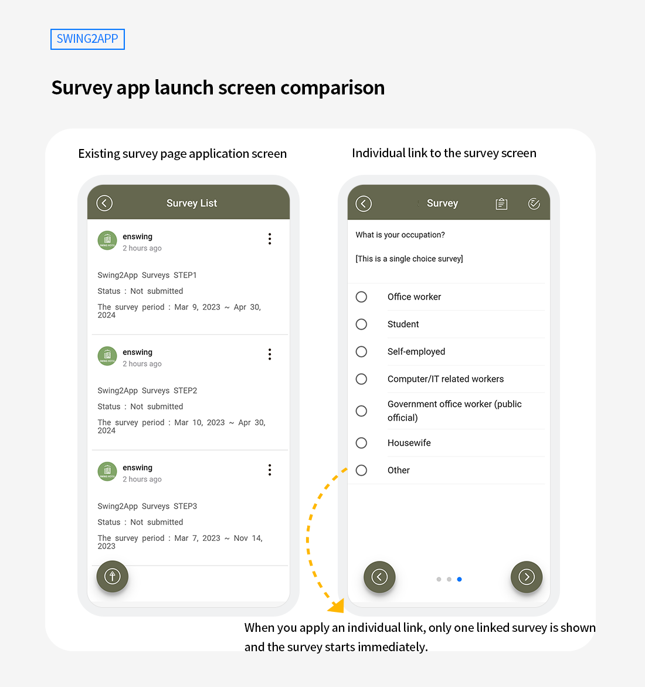

# Swing2App Update

<figure><figcaption></figcaption></figure>

###  **Adding individual links to a survey**&#x20;

<figure><figcaption></figcaption></figure>

We've added an individual link feature that allows you to link survey pages individually to the app menu.

**Individual Survey Links is** a feature that allows you to select only one survey and link to the menu.&#x20;

Previously, all registered surveys were displayed on one page, but in the updated function, you can select individual links to link to the menu so that only one survey is shown.

<mark style="color:blue;">**TIP**</mark>

\-When releasing new questionnaires at a specific time, you can open and use multiple questionnaires one by one according to your schedule.

\-In this way, you can prevent the disclosure of questionnaires that have not even begun.

\-It is possible to link questionnaires on different topics by menu to receive a variety of questionnaires from users.

<figure><figcaption></figcaption></figure>

 **Survey app launch screen comparison**

<figure><figcaption></figcaption></figure>

Please check the existing survey page application screen and the screen applied as an individual link to the survey.

When applied to an existing page, all registered surveys will be active on one page.

When you apply an individual link, only one linked survey is shown, and the survey starts immediately.

\
 **How to Use**

1\) Create a survey first.&#x20;

[View how to Create a survey manual](https://documentation.swing2app.com/manual/appmanage/service/survey)

2\) If you have registered the survey, please link it to the app maker page by applying it as an individual link to the menu.&#x20;

3\) Go to the app Maker screen →STEP3 page → On the left screen Select the menu → Select \[Basic Functions] from the 'Page Design' item → Select \[Survey] → Select the questionnaire you want to apply, click on the \[Apply] button→ click on the \[Save] button at the top

\*If you apply individual links to the questionnaire in the page creation tool (web template, image page, HTML editor), please proceed with the following method.

Page Creator Screen →Select the \[Link Wizard] button → select \[Basic Functions→ select \[Survey] → Select the questionnaire you want to apply, click on the \[Apply] button, click on the →Save button, and then select the →Return to the app creation screen and click on the \[Save] button at the top.

\
 **Instructions**

1\) You can also use the existing survey page menu, and the updated menu is only available when you link surveys individually and show them one after another.

2\) This function can be used immediately without updating.

Please check the above instructions and apply them to the app.&#x20;

Thank You.

<figure><figcaption></figcaption></figure>

