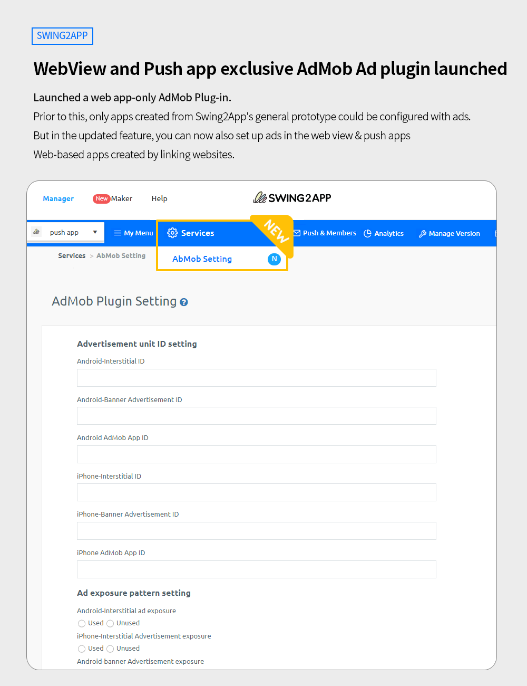
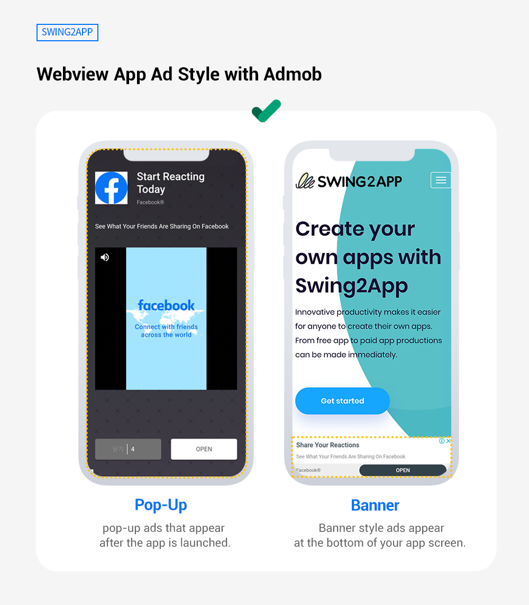

# Swing2App Update

<figure><figcaption></figcaption></figure>

###  **WebView and Push app exclusive AdMob Ad plugin launched.**

<figure><figcaption></figcaption></figure>

The Google AdMob ad plugin feature that can be applied to webview apps and push-only apps has been released.

Google Admob is a service that allows you to place ads on your app, and it is an advertising platform operated by Google.

Prior to this, only apps created from Swing2App's general prototype could be configured with ads.

But in the updated feature, you can now also set up ads in the web view & push apps Web-based apps created by linking websites.

Now you can show ads in your web app and generate ad revenue form it\~!

<figure><figcaption></figcaption></figure>

 **Web View App - Admob Advertising Screen**&#x20;

<figure><figcaption></figcaption></figure>

 **How to Use AdMob Plug-in**

1\) Complete the creation of the webview or push-only app.

2\) Go to [App Manager page> Online Store> Swing Plug-in](https://www.swing2app.com/view/new\_product\_list\_by\_plugin) .

3\) Purchase Google Admob application plugin product worth $220 .

4\) When AdMob is purchased, on the App Manager page> Service option> The AdMob Plugin setting menu will be created immediately.  &#x20;

5\) Connect the Ad ID on the AdMob plugin setting screen.

The same ad setting method as the existing general prototype app can be used.

For detailed instructions on setting up the AdMob plugin, please check the manual below.&#x20;

☞ [See how to set up AdMob plugin ads](https://documentation.swing2app.com/store/admob/admob-pluginsettings)

\
 **Instructions**

1\) AdMob plugin products cost per app.

If you wish to set up ads in multiple apps, you need to purchase products for each app individually

2\)After applying the AdMob plugin, you need to update the app again.&#x20;

(On App maker screen - Click on the Update App button.

If your existing app has already been released to the Store (Play Store, App Store), you will need to update the app to the newly created version.

If you don't update it to the store, your ads won't apply.

3\)AdMob application plugin product is a stand-alone product that only supports AdMob ad settings.

Paid app passes and store upload tickets are not included and must be purchased separately.

We recommend unlimited webview/push pass.  [\[Unlimited product recommendation page\]](https://www.swing2app.com/view/payment\_list\_by\_recommend\_voucher)

4\) Ads displayed in the app cannot be selected (ads are displayed randomly by Google), and the ad settings are - interstitial ads and banner ads.

Web apps cannot set interstitial impression patterns.

5\)Information related to AdMob operation, such as ad revenue costs, operation methods, and policies related to AdMob, is not provided on the Swing2App.

Please check the contents and precautions on the official Google AdMob website before applying.

<figure><figcaption></figcaption></figure>

