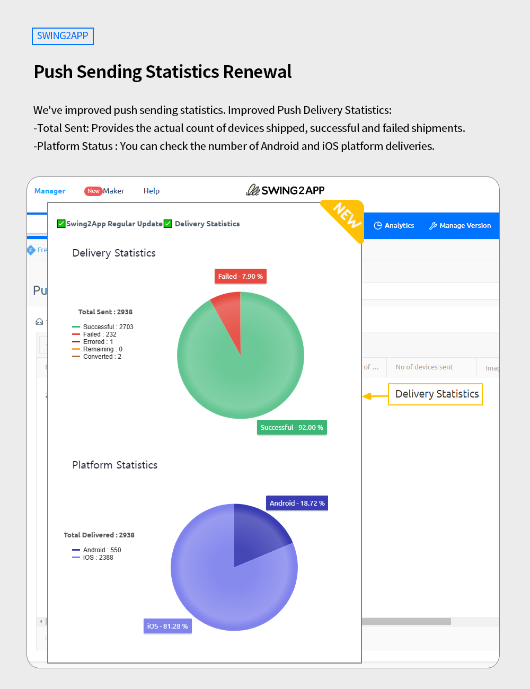

# Swing2App Update

<figure><figcaption></figcaption></figure>

**\[Updated]**

Improved statistics on the number of push-sending devices

<figure><figcaption></figcaption></figure>

##  **Push Sending Statistics Renewal**

<figure><figcaption></figcaption></figure>

We've improved push sending statistics.  Improved Push Delivery Statistics:

Total Devices Shipped: Provides the actual count of devices shipped, including successful and failed shipments.

Shipment Status by Platform: Allows you to view the number of shipments categorized by Android and iOS platforms.\

### &#x20;**How to Use**

\*Since it is an operational function, you can check it directly from the dashboard without updating the app.&#x20;

[App Manager screen → Push & Members → Go to Push History](https://www.swing2app.com/view/push\_list)&#x20;

If there is a device on which you’ve sent a push, you can see that a button called \[Delivery Statistics] has been created.&#x20;

When you select the button, you can check the Delivery statistics.&#x20;

If you hover your mouse cursor over the pie graph, you can check the percentages for each category.&#x20;

### .png)**Notice**


1\)It is a function provided by the App Manager and can be used immediately without updating the app.

2\)Before the update dated (18/05/23), the shipping history may not be provided for some periods in the past.

Due to the reorganization of the statistics system, shipments were not counted during that period.

3\)Shipment history may not be provided for group shipments or scheduled shipments sent before the update standard date (18/05/23) or during some periods in the past.

4\)App production Apps created in the V2 version do not count iPhone statistics.

Only apps distributed and installed with the App Maker V3 version will be viewed with the history of the number of push devices sent to the iPhone.

5\)This function is not available in the WebView app.

It can only be checked in push-only apps that provide a push sending function, and apps created with general prototypes.&#x20;


<figure><figcaption></figcaption></figure>

