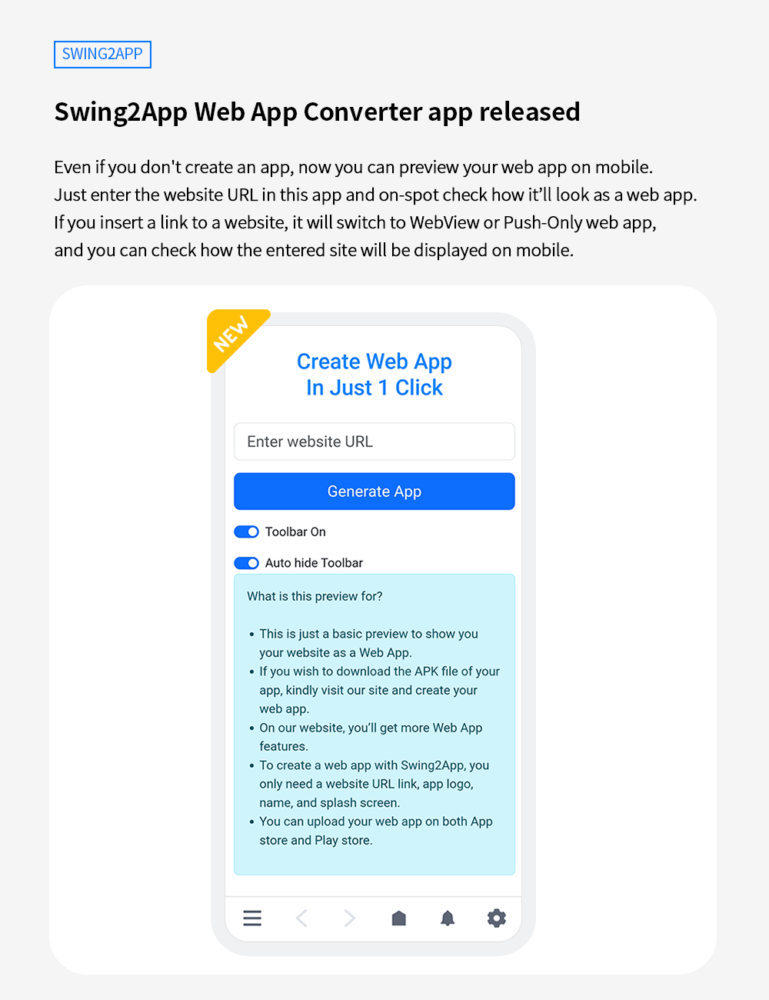
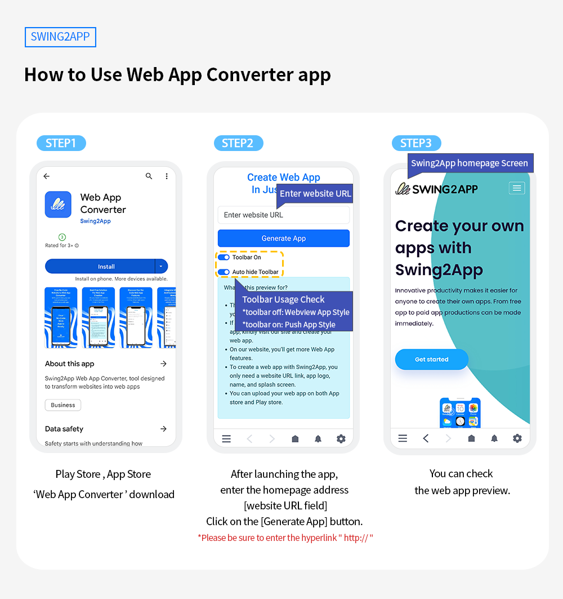

# Swing2App Update

<figure><figcaption></figcaption></figure>

**\[Update Information]**

**Swing2App Web App Converter app released**

<figure><figcaption></figcaption></figure>

##  **Swing2App Web App Converter app released**

<figure><figcaption></figcaption></figure>

**What is a Swing2App Web App Converter app?**

Even if you don't create an app, now you can preview your web app on mobile. Just enter the website URL in this app and on-spot check how it’ll look as a web app. &#x20;

If you insert a link to a website, it will switch to WebView or Pushweb app, and you can check how the entered site will be displayed on mobile.\

**Advantages of Swing2App Web App Converter App**

1\) Instantly preview how your website would appear as a web app without the need to create one.

2\) Now you can preview your web app on your iPhone&#x20;

3\) You can select the desired UI style and check it (choose if you want the Push-Only prototype toolbar feature).

4\) Convert your website into an app anytime, anywhere, with unlimited previewing capabilities.

\

### &#x20;**How to Use**

<figure><figcaption></figcaption></figure>

1\) Android phones users can download the Play Store version of this app: Web App Converter&#x20;

iPhone users can download the App Store version of this app: Web App Converter

[Play Store Release link](https://play.google.com/store/apps/details?id=com.hustay.swing.db3eca85393934fb9af1d049bcd410d70)

[App Store Release link](https://apps.apple.com/us/app/%EC%8A%A4%EC%9C%99%ED%88%AC%EC%95%B1-%EB%B8%8C%EB%9D%BC%EC%9A%B0%EC%A0%80/id6450099622?platform=iphone)

2\) After launching the app, enter the homepage address of the website which you want to convert as a web app in the \[website URL field].

\*Please be sure to enter the hyperlink "http://"

3\) Click on the \[Generate App] button.&#x20;

4\)You can check the web app preview.

### .png)**Notice**


1\)The Swing2App Web App Converter app is not for the purpose of making the actual app or downloading it as an app for checking the preview within the app.

2\)After checking only the web app preview in the Web App Converter application, you need to create the app directly in the app creation after registering and logging in on the official website of Swing to App.&#x20;

3\) When using the toolbar, you can also use the functions provided by the toolbar.

So, Check out the features available in the toolbar.&#x20;

4\)Since it is not an actual app, functions such as push notification cannot be used.


<figure><figcaption></figcaption></figure>

