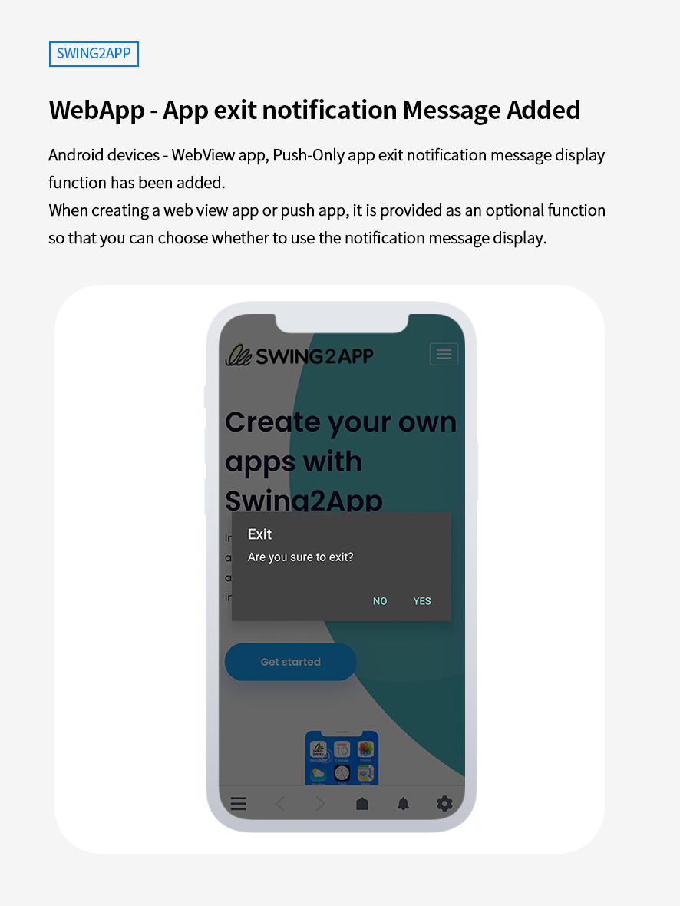
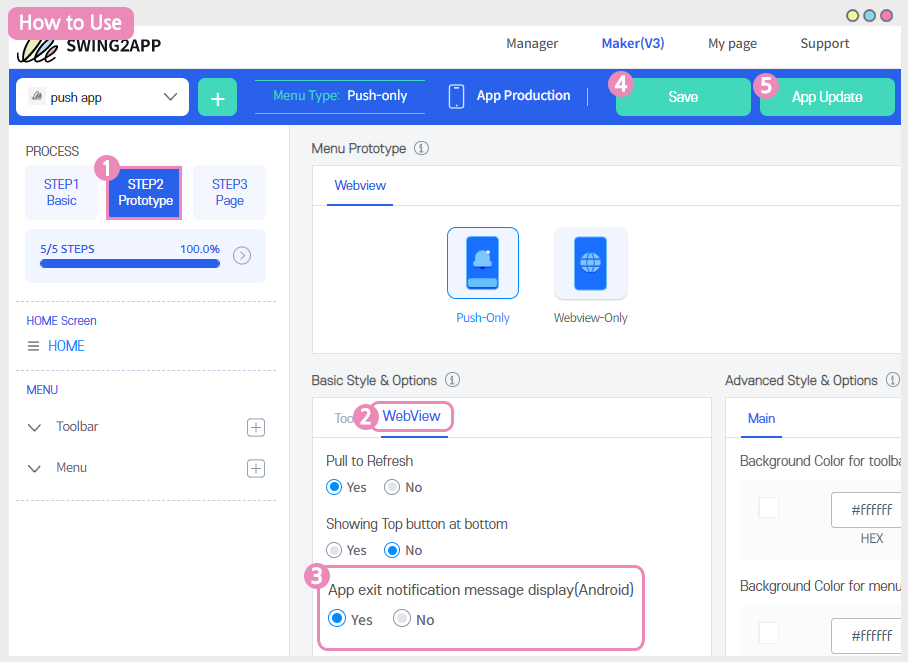

# Swing2App Update

<figure><figcaption></figcaption></figure>

**\[Update Information]**

**Web app (WebView app, push app) - App esexit notification function added**

<figure><figcaption></figcaption></figure>

##  **WebView app, push app - App exit notification message**

<figure><figcaption></figcaption></figure>

**Android devices - WebView app, Push-Only app exit notification message display function has been added.** &#x20;

When creating a web view app or push app, it is provided as an optional function so that you can choose whether to use the notification message display.

The existing web app does not display a separate message when the app is closed, and the app is automatically closed if there is no longer a previous page to return to.

In the updated function**, you can now choose whether to use the display of notification messages when creating a WebView app or Push app.**

If you use the app exit prompt:

When you select the Back button on your Android device, you will see a message "Are you sure to exit?".\

### &#x20;**How to Use**

<figure><figcaption></figcaption></figure>

Go to the app MakerV3 screen.

1\)Click on the \[STEP2 Prototype] option

2\) Select \[WebView] from the Menu Prototype options

3\)Select app exit notification message - Enabled (notification message pops) or Unused (ends immediately without message)&#x20;

4\) Click on the top \[Save] button

5 Click on the \[App Update] button.&#x20;

### .png)**Notice**


1\)This feature requires an app update.

After the update, you can see the new content that appears when you check using the latest version.

Apps released on the Play Store or App Store must be updated to a newly created version.

2\) You need to update it even when you use it and change it back to unused.

The same process is applied for the opposite (unused→used).&#x20;

3\)The app shutdown notification message is only available on Android phones.

The apps on iPhone cannot be closed separately due to the nature of the device, so it can only be used on Android phones.

4\)The default setting is 'Unused', and if you use it without \[use], the end message will not appear and the app will close immediately.

If you want to use the end message, please check 'Enable' before using it.

5\)It is available in both the WebView app and the Push-Only prototype app.

Apps made as general prototypes do not need to be updated separately because an app termination notification message is already provided.


<figure><figcaption></figcaption></figure>

