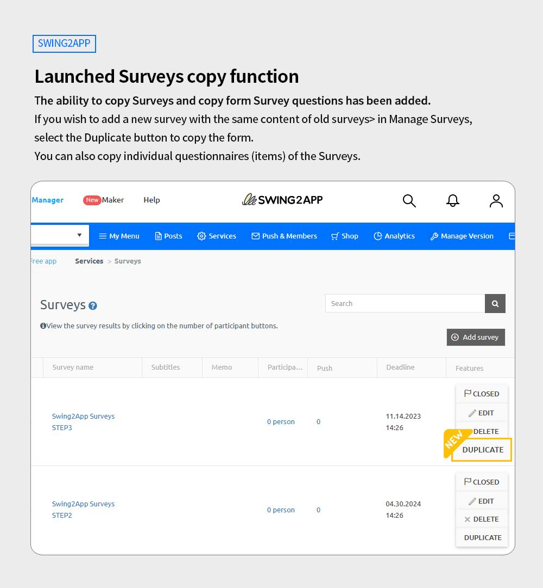
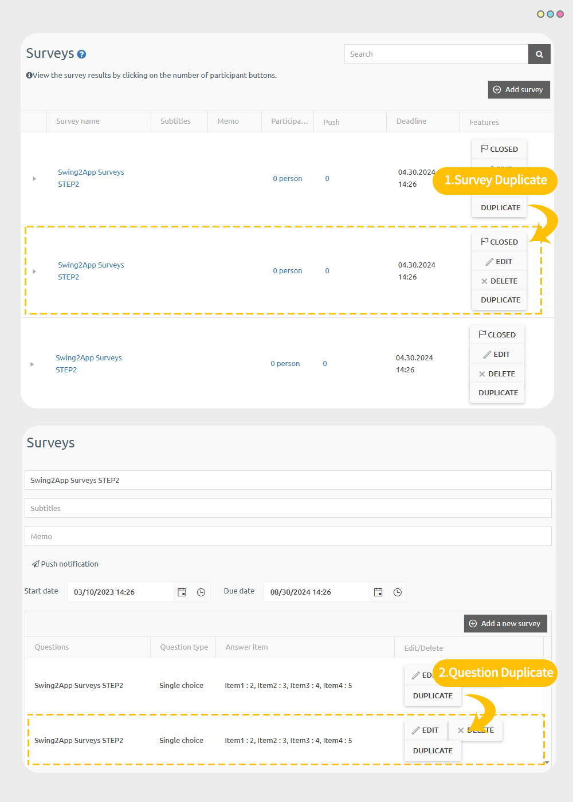

# Swing2App Update

<figure><figcaption></figcaption></figure>

**\[Updated]**

**1.Survey – Copy Questionnaire & Copy Question feature updated**

\*This updated feature is available in the General Prototype app.

Web view app and push app users are not eligible.

##  Launched Survey copy function

<figure><figcaption></figcaption></figure>

**The ability to copy Surveys and copy form Survey questions has been added.**

If you wish to add a new survey with the same content of old surveys> in Manage Surveys,

select the Duplicate button to copy the form.

You can also copy individual questionnaires (items) of the Surveys.

If you need a questionnaire with the same content as used in the older questionnaire or if you want to add the same questions, you can use the copy function more conveniently.\

### &#x20;**How to Use**

<figure><figcaption></figcaption></figure>

\*You can use it immediately without any app update.

On the [App Manager Page→ Go to the Service option→ Click on the Surveys](https://www.swing2app.com/view/survey).

If you haven't created a survey yet, select the \[Add Survey] button.

\-After creating the questionnaire in survey, a \[Duplicate] button will appear.

\-To copy a question, first select a questionnaire to go to the questionnaire detail page, and there click on the \[Duplicate] button for each question (item).

When you select the duplicate button, a copied post is created at the bottom of the list.

To learn how to use the survey, please check the manual below.



### .png)**Instructions**


1\)The function provided in the App Manager Page can be used immediately without a separate app update.

2\)You must have a questionnaire to use the copy function, so if you do not have a questionnaire, please create one first.

3\)This function is only available for apps made with general prototypes.&#x20;

Web view apps and push apps that connect websites are not applicable.


<figure><figcaption></figcaption></figure>

