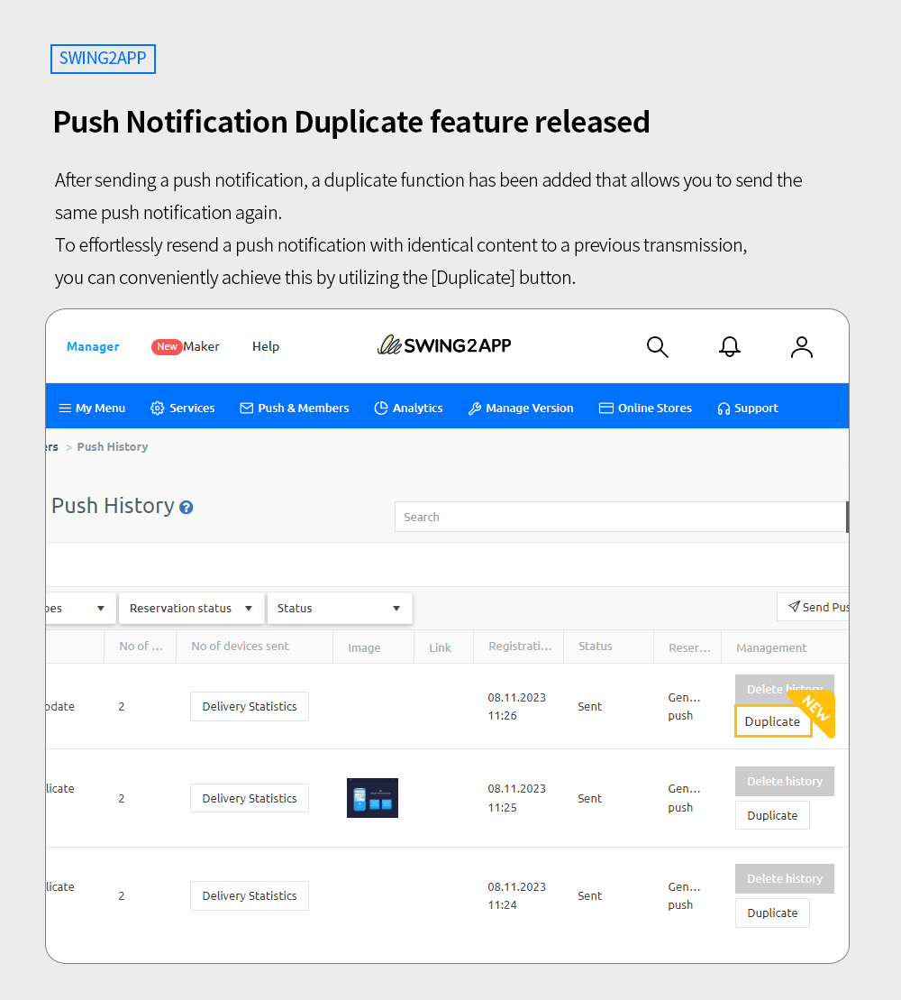
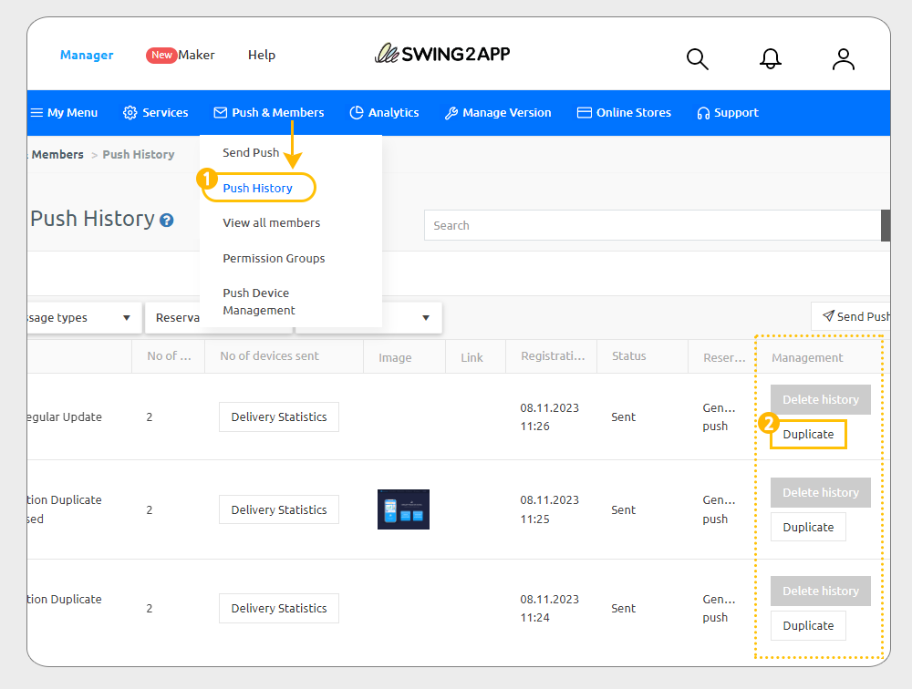

# Swing2App Update

<figure><figcaption></figcaption></figure>

**\[Update Information]**

**Push Notification Duplicate feature released**&#x20;

<figure><figcaption></figcaption></figure>

##  **Push Notification Duplicate feature released**

<figure><figcaption></figcaption></figure>

After sending a push notification, a duplicate function has been added that allows you to send the same push notification again.&#x20;

To effortlessly resend a push notification with identical content to a previous transmission, you can conveniently achieve this by utilizing the \[Duplicate] button.\

### &#x20;**How to Use**

You can check it by moving to App Manager page  Go to [Push & Member option – Click on the Push History option.](https://www.swing2app.com/view/push\_list)

<figure><figcaption></figcaption></figure>

1\) Go to the Push History option.

2\) If you look at the management area on the far right of the list, you can see the \[Duplicate] button.

If you press the duplicate button, you will be taken to the 'Send Push' screen.&#x20;

The previously created content (message title, content, image, link, etc.) is copied and linked in the same way.

### .png)**Notice**


1\)We have this additional function in the App Manager dashboard, no app update is required. You can access this feature immediately.

2\) Go to push history page and check the push notification list you want to copy and click on the Duplicate button.

3\)When copying, not only the content but also the recipient list gets duplicated.&#x20;

4\) Reservation setting for the duplicated push notification is also available.&#x20;


<figure><figcaption></figcaption></figure>

