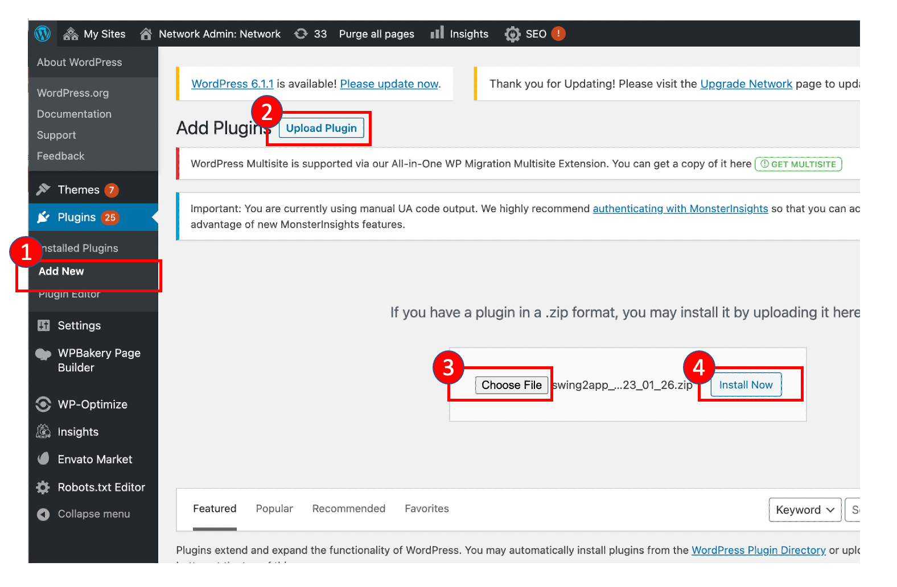

# WordPress Website Member Integration Guide

If you install the plugin on WordPress and activate it, the member linkage gets completed.

After linking, users who run the site in the app are displayed on the Swing2App console member inquiry screen.

If you install the plugin zip file below, there is no need to set it up in WordPress.


Swing2App Webview User Integration Wordpress Plugin



How to install WordPress plugins

\*Installation methods may vary depending on the WordPress version.


<figure><figcaption>
Wordpress admin console
</figcaption></figure>

After the integration is completed, check if the users of the website are displayed on the Swing2App console member inquiry screen.


Swing2App Console Link


Thank You
