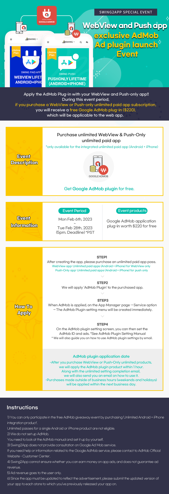

# Event

<figure><figcaption></figcaption></figure>

WebView and Push app exclusive AdMob ad plugin!!

Now you can apply the AdMob Plug-in with your WebView and Push-only app!!

During this event period, if you purchase a WebView or Push-only unlimited paid app subscription,&#x20;

you will receive a free Google AdMob plugin worth $220, which will be applicable to the web app. &#x20;

Please check the event details and participation process.

<figure><figcaption></figcaption></figure>

<mark style="color:green;">**▶ Event Details**</mark>

**Purchase unlimited WebView & Push-Only unlimited paid app ticket**

**→ Get Google AdMob application plugin worth $220 for free.**

\

<mark style="color:green;">**▶ Event Eligibility**</mark>

During the event period \*Those who will purchase WebView unlimited paid app or Push-Only unlimited paid app ticket will get free AdMon Plugin

\*NOTE: AdMob Plug is only available for the integrated unlimited paid app ticket  (Android + iPhone) purchases.&#x20;

\

<mark style="color:green;">**▶ Event Period**</mark>

Mon Feb 6th, 2023 \~ Tue Feb 28th, 2023 (5pm Deadline) \*PST

\

<mark style="color:green;">**▶How to apply for the event**</mark>

1\) After creating the app, please purchase an unlimited paid app pass. [ \[recommended Swing2app pass\] ](https://www.swing2app.com/view/payment\_list\_by\_recommend\_voucher)

\-When creating a WebView app: Purchase Unlimited paid apps (Android + iPhone) for WebView only + Play Store upload tickets + App Store upload tickets = $330

\-When creating a Push-Only app: Purchase Unlimited paid apps (Android + iPhone) for push only + Play Store upload tickets + App Store upload tickets = $580&#x20;

2\) We will apply 'AdMob Plugin' to the purchased app.

3\)When AdMob is applied, on the App Manager page> Service option> The AdMob Plugin setting menu will be created immediately.

4\)On the AdMob plugin setting screen, you can then set the AdMob ID and ads.&#x20;

☞ [See AdMob Plugin Setting Manual](https://documentation.swing2app.com/store/admob/admob-plugin-apply)

\* We will also guide you on how to use AdMob plugin settings by email.&#x20;

\

<mark style="color:green;">**▶AdMob plugin application date**</mark>

After you purchase WebView or Push-Only unlimited products, we will apply the AdMob plugin product within 1 hour.

Along with the unlimited setting completion email, we will also send you an email on how to use it.

Purchases made outside of business hours (weekends and holidays) will be applied within the next business day.&#x20;

\

<mark style="color:green;">**▶Instructions**</mark>

☞[ What is Google AdMob](https://support.swing2app.com/admob/)

☞ [See AdMob Plugin Setting Manual](https://documentation.swing2app.com/store/admob/admob-plugin-apply)

1\) You can only participate in the free AdMob giveaway event by purchasing 'Unlimited Android + iPhone integration product'.

Unlimited passes for a single Android or iPhone product are not eligible.

2\) We do not set up AdMob.

You need to look at the AdMob manual and set it up by yourself.

3\) Swing2App does not provide consultation on Google Ad Mob service.

If you need help or information related to the Google AdMob service, please contact to AdMob Official Website - Customer Center.&#x20;

4\)Swing2App cannot ensure whether you can earn money on app ads, and does not guarantee ad revenue.&#x20;

5\) Ad revenue goes to the user only.

6\) Since the app must be updated to reflect the advertisement, please submit the updated version of your app to each store to which you’ve previously released your app on.&#x20;

7\) Those who are already using the unlimited WebView & Push pass cannot participate in the event, but can purchase and use the AdMob plugin product separately.&#x20;

8\) It is not mandatory to apply the ad mob provided as an event.&#x20;

The AdMob plugin is not a product with a fixed period of use, so you can use it at any time as per requirement.&#x20;

9\)AdMob plugins are only applicable to apps that have purchased unlimited passes, and cannot be changed to other apps.

\

<mark style="color:green;">**▶Web View App - Admob Advertising Screen**</mark>&#x20;

<figure><figcaption></figcaption></figure>

<figure><figcaption></figcaption></figure>

\*Participate in the event, If you want to create a webview app or push-only app, and you want to apply an ads to it!

To enjoy AdMob plug-in service for free, please purchase the product within the event period.&#x20;

\
\

