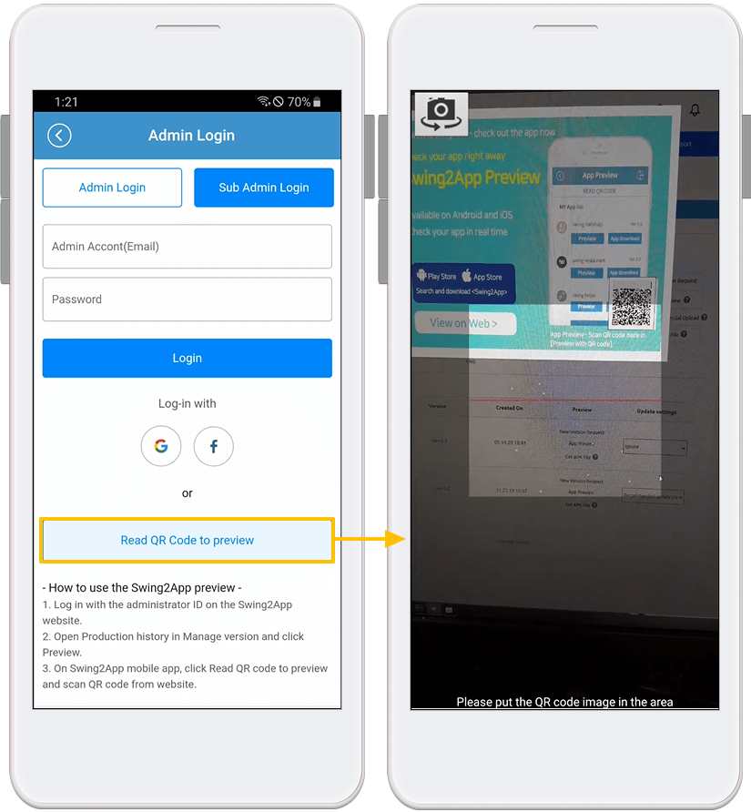
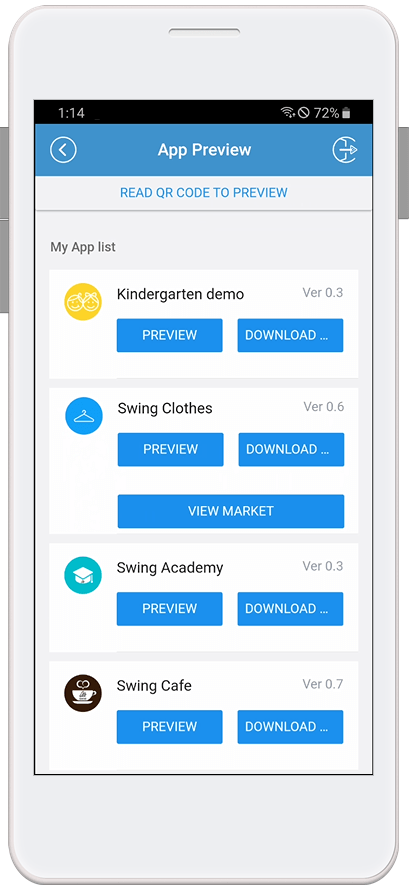

# App Preview FAQ

What is Swing Preview (App Preview)?

Swing Preview is an \[App Preview] service that allows you to check the apps created by Swing2App in real-time.

After downloading the official Swing2App app – from the App Preview menu – please log in to the account you signed up for on the Swing homepage.

On the app preview page, you can see a list of all the apps created by Swing2App.

You can preview, download and check it directly on your phone from within the app.

\*App preview is also available, especially on iPhones that have not been supported so far. (No download\~!)

★For a detailed description of the swing preview, please check the relevant manual.&#x20;

**☞** [<mark style="color:blue;">**See how to use the swing preview**</mark>](../manual/swingpreview.md)<mark style="color:blue;">****</mark>

How can I use the swing preview?

1\) Please download the official 'Swing2App' app from the App Store and Play Store. \*If the app is already installed, please update to the latest version

2\) After launching the app, select the \[App Preview] menu at the top of the → category and log in with your swing website subscription account (ID, password).

3\) Once you're done signing in, the app preview page will open, where you can see a list of apps you've created.

\- iPhone can be confirmed by pressing the preview button.

\-On Android phones, you can preview the app, download the app.

Can app assistant administrators also use app preview?

Your vice administrator can also log in from the app preview to see the app.&#x20;

When logging in, enter the **sub administrator ID, password, and app ID, and select the \[Associate Administrator Login] button to log in.**

Here! For your username and password, please enter the ID and password associated with the app.

**App ID can be found on the Swing2App Maker(V2) page → Step 1 App Basic Information, app ID.**

Then do the same as logging in to the Assistant Administrator on the Swing2App website!

You can log in by entering the secondary administrator ID, password, and app ID.

**Please refer to the manual below on how to set up the app assistant manager and how to log in.**

**\* See images)**

********

How to set up the app assistant administrator and how to log in, please refer to the manual below!

  [<mark style="color:blue;">\[Check out the Swing Preview Detailed Method Manual\]</mark>](../manual/swingpreview.md)<mark style="color:blue;"></mark>

How do I use the QR code provided in the preview?

On the app preview page, you can check the ‘Preview by QR Code’ menu.

You don’t have to log in as an administrator for this menu. **You can preview the app on your phone by scanning the QR code provided for each app.**

**★ How to use QR code**

********

Open Swing2App – App Preview – Select the \[Preview by QR Code] button → Bring your phone to the QR code image and your app will run as a preview on your phone.

<strong>Cannot send push notifications when viewed as a Preview?</strong>

Yes, push notifications are not sent when viewing an app as a preview rather than as an app download.

In addition, to push, sharing is not available.

(No app sharing, bulletin boards, posts, or image sharing)

★iPhone users can only use the preview \* Please note that this feature is not available.

★Android users can select the app download and can use all the features of Swing2app in the downloaded app.

What's the difference between previewing and downloading apps?

Swing2App Official App – When you log in to your swing account in \[App Preview], a list of apps you have created will open.

At the bottom of the app name, you can check the \[Preview] and \[Download App] buttons.

**\* Preview: You can check the app in preview format on your phone without downloading the app.**

**\* App download: Download and install the app directly to your phone.**

Prototype: Can I see apps created with Push or WebView in Swing Preview? Did?

You can check it with \[App Download] on an **** Android phone, b**ut not on iPhone.**

\-Android phone prototype – Apps created with Push and Web View can only be used to view swing2app previews \[app downloads].

Preview is not supported and can only be checked by downloading the app on your phone.

\-On iPhone, apps created with push and web view are not listed and cannot be checked on the phone.

<strong>Can I use Swing2App preview on my iPhone?</strong>

Yes, downloading the app is not supported for iPhones, and you can check the app through \[Preview].

On the app preview page, you can log in with the same swing account: administrator ID and password to see the list of apps you've created.

**\*Prototype: Apps created with Push or WebView are not available as swing previews.**

Apps created with Push or WebView are not supported on the iPhone because they can only be downloaded from the app.

**\[iPhone – Swing Preview App Launchscreen]**

Can I download the app by receiving the APK file without using the app preview?

Yes, Android phone existing app installation method – You can download and install the APK file.

You can download and use the APK file that is completed when the app is produced without using Swing2App Preview.

Please note that you can use the existing app installation method and swing2app preview together.

**\*APK file download is only available for Android phones**

How do users who have subscribed to the Swing2App homepage with Easy Login sign in use the app preview?

If you used to log in with a simple login when you signed up for the Swing2App, please select the Naver, Google, and Facebook icons to log in.

**\*The iPhone does not come with a simple login function.**

For users with Easy Login, please use your Android phone or use the preview function as a deputy administrator login or QR code when using the iPhone.

I'm signed in to app preview, but I don't have a list of apps that have been created.

Only apps that have been created will appear in the preview list.

So if your app isn't on the list, it's likely that your app hasn't been built yet.

If you haven't created the app yet, please press the \[Create App] button to create it.

If you have clicked \[Create App], please check the status indicating that the creation is complete in version control and re-connect. (Production time 5-10 minutes)

