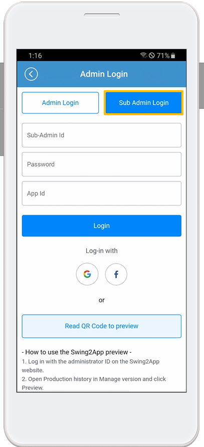
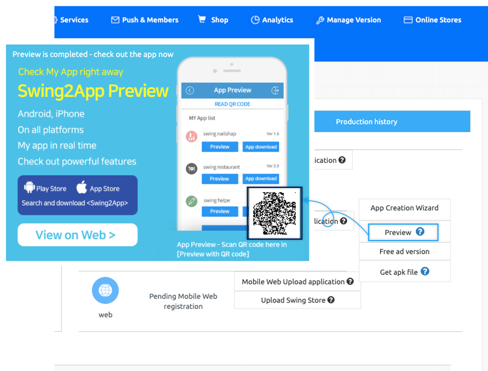
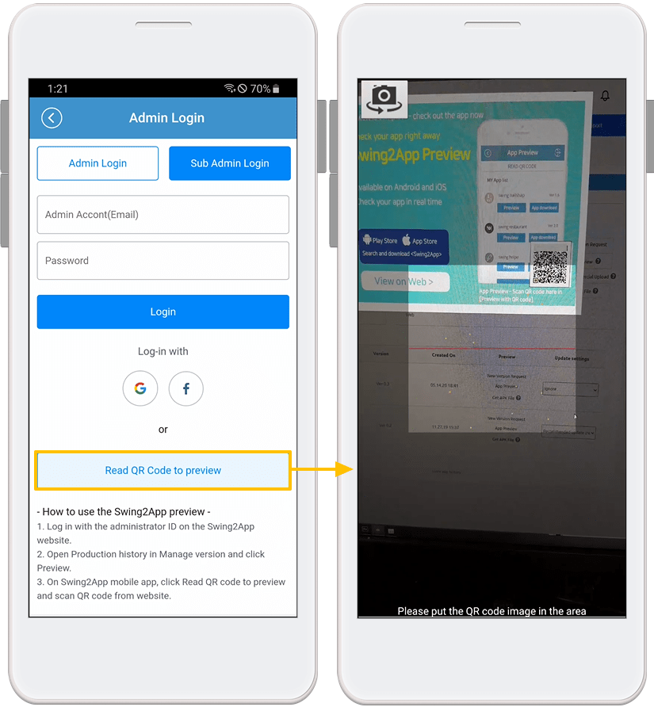
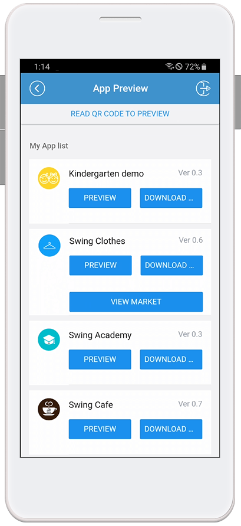

# App Preview FAQ

What is Swing Preview (App Preview)?

Swing Preview is an \[App Preview] service that allows you to check the apps created by the Swing-to-App in real time.

After downloading the official Swing-to-App app – from the App Preview menu – please log in to the account you signed up for on the Swing homepage.

On the app preview page, you can see a list of all the apps created by Swing-to-App.

You can preview, download and check it directly on your phone from within the app.

Even if you don't have to cumbersome pick up and install APK files, you can check out the apps you've created in real time!

\*App preview is also available, especially on iPhones that have not been supported so far. (No down\~!)

★For a detailed description of the swing preview, please check the relevant manual.&#x20;

**☞** [<mark style="color:blue;">**See how to use the swing preview**</mark>](../manual/swingpreview.md)<mark style="color:blue;">****</mark>

How can I use the swing preview?

1\) Please download the official 'Swing to App' app from the App Store and Play Store. \*If the app is already installed, please update to the latest version

2\) After launching the app, select the \[App Preview] menu at the top of the → category and log in with your swing website subscription account (ID, password).

3\) Once you're done signing in, the app preview page will open, where you can see a list of apps you've created.

\- iPhone can be confirmed by pressing the preview button.

\-On Android phones, you can preview the app, download the app.

Can app assistant administrators also use app preview?

The four deputy administrators can also check the app by logging in from the app preview.

When logging in, enter the **deputy administrator ID, password, and app ID, and select the \[Associate Administrator Login] button to log in.**

Here! For your username and password, please enter the ID and password associated with the app.

**The app ID can be found on the swing app creation page → in the basic information in step 1, and you can check the app ID.**

Same as how to log in as a deputy administrator on the SwingTwo website!

You can log in by entering your deputy administrator ID, password, and app ID.

**\* See images)**

********

How to set up the app assistant administrator and how to log in, please refer to the manual below!

  [<mark style="color:blue;">\[Check out the Swing Preview Detailed Method Manual\]</mark>](../manual/swingpreview.md)<mark style="color:blue;"></mark>

How do I use the QR code provided in the preview?

On the app preview page, you can check the "Preview by QR Code" menu.

That menu doesn't require you to be logged in as an administrator! **You can scan the QR code provided by each app to preview the app on your phone.**

QR code previews are only available for apps built from regular prototypes. \*Webview and apps created with push apps are not available

**★ How to use QR code**

********

Launch the swing2app app – Preview the app – Select the \[Preview with QR Code] button → When you bring your phone to the QR code image and touch it, the app you created will be previewed on your phone.

When I view it as [Preview], I can't send push notifications?

Yes, when you view the app as a preview rather than downloading the app, you won't receive push notifications.

In addition to pushing, sharing is not available.

(App sharing, bulletin boards, posts, image sharing all not)

★Please note that iPhone users will not be able to use this feature as it is only available for \*preview.

★Android users can choose to download the app and the downloaded app will be able to use all the functions of Swing.

What's the difference between previewing and downloading apps?

Official App to Swing – When you log in with your swing account in \[App Preview], a list of apps that you have created will appear.

**At the bottom of the app name, you can check the \[Preview], \[Download App] buttons.**

**\* Preview: Without downloading the app, you can check the app directly in preview format on your phone.**

**\* App Download: Download and install the app directly to your phone.**

Prototype: Can I see apps created with Push or WebView in Swing Preview? Did?

You can check it by \[Download App] on your Android phone, but you can't check it on your iPhone.

\- Android Phone Prototype – Apps created with Push and WebView are only available for swing preview \[App Download].

Preview is not supported, and you will need to download the app to your phone to see it.

\-On the iPhone, apps created with push or webview will not be listed.

Is the iPhone only available for app previews?

Yes, downloading the app is not supported for iPhones, and you can check the app through \[Preview].

On the app preview page, you can log in with the same swing account: administrator ID and password to see the list of apps you've created.

**\*Prototype: Apps created with Push or WebView are not available as swing previews.**

Apps created with Push or WebView are not supported on the iPhone because they can only be downloaded from the app.

**\[iPhone – Swing Preview App Launchscreen]**

Can I download the app by receiving the APK file without using the app preview?

How to install an existing app on your Android phone – You can download and install the APK file to use it.

Instead of using the swing preview, you can download the APK file that is completed during the creation of the app and install it directly on your mobile phone for use.

You can use the existing app installation method and the swing preview together, so please note the use.

**\*APK file download is only available for Android phones**

How do users who have subscribed to the Swing-to-App homepage with Easy Login sign in from the app preview?

If you used to log in with a simple login when you signed up for the Swing-to-App, please select the Naver, Google, and Facebook icons to log in.

**\*The iPhone does not come with a simple login function.**

For users with Easy Login, please use your Android phone or use the preview function as a deputy administrator login or QR code when using the iPhone.

I'm signed in to app preview, but I don't have a list of apps that have been created.

Only apps that have been created will appear in the preview list.

So if your app isn't on the list, it's likely that your app hasn't been built yet.

If you haven't created the app yet, please press the \[Create App] button to create it.

If you have clicked \[Create App], please check the status indication that the creation is complete in version control and re-connect. (Production time 5-10 minutes)

