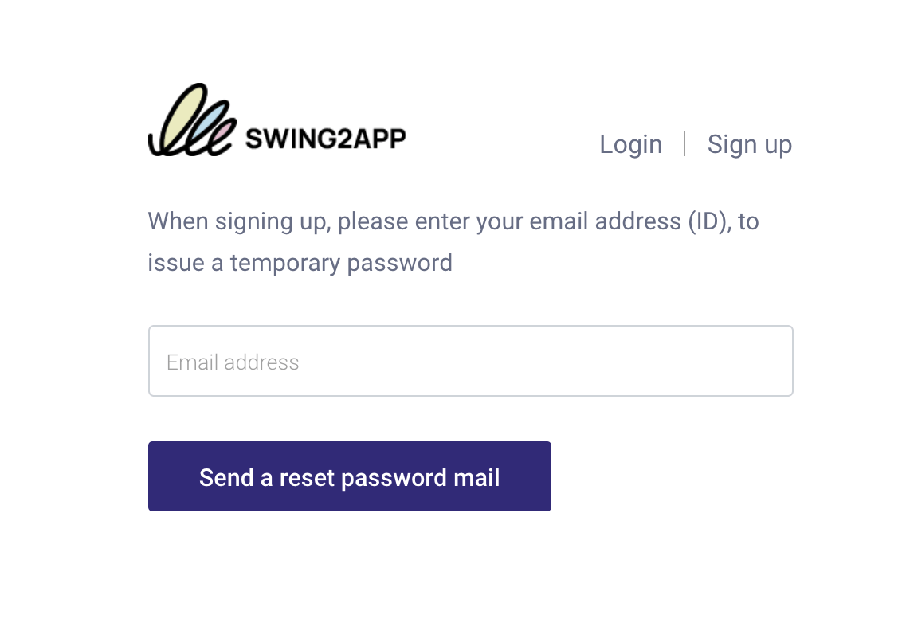

# Registration and Login FAQ

Can I change the ID (email) subscribed to on the Swing2App homepage?

Some enterprise customers may request a change in their Swing subscribed ID as their app rep changes.

Since the username change is linked to the personal information account, the user cannot change it directly.

If you make a request to the Swing2App app, we will send you a consent form to change your account, and we will be able to make the changes once we have received the necessary documents.

The password is the same as the previous one, and you can reset it to the desired password in Change your personal information after logging in.

How do I unsubscribe from the Swing2App homepage?

To unsubscribe , **you can select your profile in the upper right corner of the Swing homepage app operation page → edit your internal information → select Cancel Membership.**

The ID you withdrew cannot be recovered, and you cannot rejoin with the same ID in the future.

When you unsubscribe, all apps and content you created will be deleted, so please choose carefully.

Can I re-register after unsubscribing from the Swing2App homepage?

The ID you withdrew cannot be recovered, and you cannot rejoin with the same ID in the future.

Swing2app homepage account - I lost my password.

If you lost the password for your Swing2App Site account!

**You can find your temporary password by email through \[Forgot Password], log in, and change your information Edit \[New Password].**

1\) Select to access the homepage → find password

2\)Enter your email address, and get a temporary password issued by that email

3\)You can change your password again on the \[Edit My Information] page - Login Information.&#x20;

[<mark style="color:blue;">https://www.swing2app.co.kr/view/myinfo\_login\_info</mark>](https://www.swing2app.com/view/myinfo\_login\_info)<mark style="color:blue;"></mark>

<mark style="color:blue;"></mark><mark style="color:blue;"></mark>

<mark style="color:blue;"></mark>

Can I find my password or change my password when I sign up with the simple login on the homepage?

Swing2App Homepage - Easy Login is connected to the account used by Naver and Google to log in.

Therefore, the password must be verified with the account you connected to.

(If it's a Google account, please go to Google Gmail and check the account you're using)

In the Swing2App you can't find your password because you're only logged in with an account connected, and you can't change your password.

Please tell me how to log in as a Associate Administrator on the Swin2App homepage.

When logging in as a deputy administrator on the Swing2App homepage, please log in by selecting \[Associate Administrator] from the login screen.

1\)App ID: Enter the ID that the administrator set when creating the app.

→ App ID refers to the ID that the administrator entered when creating the app in the App Creation - Step 1 Basic Information.

2\) Deputy Administrator ID: Enter the ID that the deputy administrator registered with in the app.

3\)Password: Enter the password set by the deputy administrator when registering for the app.

After you have finished typing, press the Login button and you will be taken to the admin page.

\*Note: The app must be built before you can log in as a deputy administrator.

If you are not in the state where you created the app, the app ID will not be recognized, so please use the deputy administrator login after you have created the app.

For information on how to set up a deputy administrator to manage the app, please refer to this post^^&#x20;

**☞** [<mark style="color:blue;">**\[Go to the post on how to set up a**</mark>** Associate Administrator**<mark style="color:blue;">**\]**</mark>](../manual/appmanage/pushmember/associate-administrator.md)<mark style="color:blue;">****</mark>

Tell me how to sign in as a Associate administrator in the app.

Unlike the homepage, the app doesn't have a login page dedicated to the deputy administrator.

From the login screen, you can log in with the username and password of the user designated as the deputy administrator.

Since the rating has already been changed from User to Administrator, you can see that the rating has been changed to 'Administrator' by logging in using the normal method.

For instructions on how to set up the app assistant administrator, please refer to the post ☞ [<mark style="color:blue;">\[Go to the post on how to set up a</mark> Associate <mark style="color:blue;">administrator\]</mark>](../manual/appmanage/pushmember/associate-administrator.md)<mark style="color:blue;"></mark>

Do the creators of the app also need to register in the app before they can use the app?

The administrator who created the four apps can also use it by registering for membership in the app and setting it up as an app administrator.

\*The web and app are not interconnected.

After installing the app, be sure to register and use the app even if it is your own.

How do I unsubscribe from the app?

You can unsubscribe from the app from the \[Settings] menu.

If you see the \[Settings] menu while logged in from the app, there is a \[Cancel Membership] menu.

You can unsubscribe from the app by selecting the appropriate menu.

Withdrawal of membership is only available if you are logged in from the app.

If you do not become a member, there is no concept of withdrawal of membership.

How do I find my password in the app?

In order to find your password in the app, your username must be specified as \*\*'Email'\*\*.

I can send a temporary password to my subscribed email.

Launch the app and at the bottom of the login screen, there is a 'Forgot Password' button.

If you select the button, you will receive your temporary password in the email where you have subscribed.

Therefore, if you have set your ID as a regular ID, you will not be able to use the password finder, so please check it and set it to 'ID form-email'.&#x20;

☞ [<mark style="color:blue;">\[Go to the detailed manual of finding app password\]</mark>](../manual/appoperation/find-apppassword.md)<mark style="color:blue;"></mark>

How do I change my app profile picture?

**1.Register your profile image when you register**

********

When you sign up, you can register the image you want by selecting the top profile image \[Register] button.

**2.Edit your membership information: Change your profile image after signing up**

********

If you want to change your profile image while logged in after signing up,

Please East Sea to the Settings - Edit Member Information menu.

In the Edit Membership window, you can change your profile image by selecting the \[Register] button at the top.

The name (nickname) can also be modified on that page.&#x20;

<mark style="color:blue;"></mark>[<mark style="color:blue;">\[Go to the app profile picture registration and change instructions manual\]</mark>](../manual/appoperation/changing-appprofilepicture.md)<mark style="color:blue;"></mark>

Can I withdraw from the app and re-sign up with the same ID?

Yes, you can.

However, in order to re-register with the same ID, the administrator must delete all the relevant member (withdrawn member) information from the web dashboard - member inquiry.

[<mark style="color:blue;">Push & Member →</mark>View all members<mark style="color:blue;">→ Select the user who has</mark> ](https://www.swing2app.com/view/member\_list)

1\) withdrawn from the member inquiry list. In the Membership Information window, from the "Cancel and delete account" menu,&#x20;

2\) Select the Delete Member button.

3\) Select the "Delete the ID and all information" confirmation button.

\*Even if the user who has unsubscribed, the information will remain in the app data, so they will not be able to sign up with the same ID.

Therefore, if you need to re-register with the same ID, you must delete the member ID and all information from the app through the deletion of the member.&#x20;

<mark style="color:blue;"></mark>[<mark style="color:blue;">\[Go to the manual on how to re-sign up with the same ID after unsubscribing from the app\]</mark>](../manual/appoperation/sameid-rejoin.md)<mark style="color:blue;"></mark>

