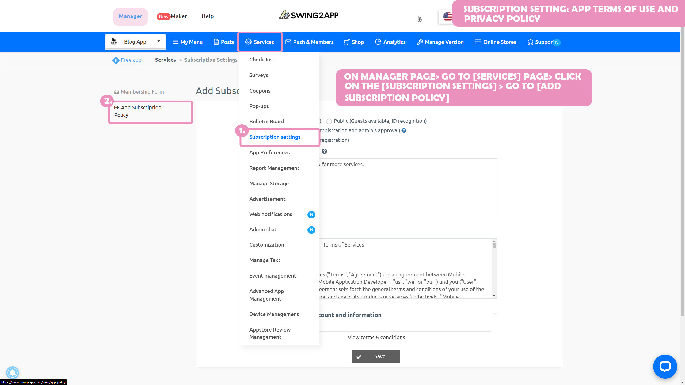

# App Terms of Use And Privacy Policy

**What is the Privacy Policy? What are its Terms of Use?**

These are the terms and conditions that mention what information we collect from users of the app (personal information) and what mandatory usage policies are for the app.

This is a mandatory setting and must be entered into the mobile app.



This information consists of, what data is collected from the app users, for what purpose we need their data, the period of use of personal information, the person in charge of personal information protection (person in charge), etc, must be provided to the user in accordance with the Information and Communications Network Act.

Because a swing2app app is created by the user as a developer thus, these policies must also be put into the app by the user.&#x20;

Users should modify and set the Terms of Use as per their App Service.

Swing2App provides the ability to <mark style="color:red;">write the terms of use and privacy policy on the app subscription policy page so that users can edit and write the contents themselves.</mark>

 (1) (1).PNG>)

**Where and how do the App Terms of Use and Privacy Policy look like?**

**1)Go to the manager page – select \[Check the subscription settings] and you can check the contents.**

The feature is present by default when the app is created, so the user doesn't need to create it from scratch.

You can change the terms of use and the contents of the Privacy Policy of your app as per requirement.

2\)When you release your app to the Play Store or the App Store, you have to also include the privacy policy URL in the release information field.

Because it is a mandatory registration, those who release apps to the Store must also complete and submit the applicable terms.

###  **1.** Go to the App Subscription Policy page

<mark style="color:blue;">**App Manager Page → Service option →Subscription settings→ \[Add Subscription Policy]**</mark> Go to the menu.

***

###  **2.** Fill out the Terms of Service and Privacy Policy

On the App Subscription Policy page, in addition to the terms of use, **you can edit your app's privacy and sign-up notice.**

\*App Registration Policy: For detailed usage methods such as how to create a private app and how to modify the app sign-up message, please refer to the manual.

**☞ **<mark style="color:blue;">**Check the App Subscription Policy Manual**</mark>

You can check the 'Terms of Service' and 'Privacy Policy' sections in the \[Add subscription policy] option.

When you create an app with Swing2app, you must fill out the Terms of Use and Privacy Policy information.

**As you can see in the image, Swing2app has a default policy example for those who are not sure what to put in the policy section.**

If you don't modify this menu, our default message will be reflected in the App Terms of Use.

Please check the contents and modify them for your app service.

For each question, you can select the button on the right to write the content.

\*Note: The \[Name of the person in charge of the app, contact information], etc is written as an example, so please modify it as per the information of the actual administrator\~!

After modifying the contents on that page, click on the \[Save] button.

<mark style="color:red;">**★ If you're new to apps, be sure to update after you Set the Policy to reflect modified content in your app.**</mark>


There are 7 items in the privacy policy that the user must modify as per the app's services.

This default information was updated in November 2017, so it is not up to date.&#x20;

★ The mobile application must also provide a privacy policy\~!!

This is a policy officially put forward by the Korea Internet & Security Agency and the Broadcasting and Communications Commission.

If you violate it, you may be fined under the Information and Communications Network Act, so be sure to fill it out!!


### **​**​ **3. Ge**t the privacy policy URL

You can also check the terms and conditions of service you have written by the URL. Please select **\[View Terms of Service URL]** at the bottom.&#x20;

&#x20;

As shown in the image above, a new web page window with terms and conditions will appear.

Just copy the URL address from the Internet address bar and submit it where required.


**Why do I need a URL?**

The URL is required for Google Play Store and App Store app registration.

When uploading the Google Play Store and One Store -You must include the privacy policy URL in the Store Listing.

So users who create an app with swing2app must use this link of the applicable Terms of Service!!

Therefore, do modify this information carefully as per your app service terms.

(Please note that if you use the trade name or app name as it is without modifying it, you may run into problems.)

To learn how to apply the link to the Privacy Policy on the Play Store, please refer to the manual below.

☞<mark style="color:blue;">\[How to apply the Google Play Store Privacy Policy]</mark>


### **​**​ 4**.** App launch screen- Check the Terms of Service and Privacy Policy

At the bottom of the registration menu, there is a **View Terms and Conditions** button.

Select the button to see the terms of service you entered in the app subscription policy.

### **​**​ 5**.** Application of Privacy Policy by Store (Play Store, App Store)

Let's see how the app privacy policy you wrote above is applied on the Play Store and App Store!!

**1) Play Store**

Apps released on the Play Store can be found in the **Developer Contact menu – Privacy Policy.**

When selected, the page created in the Swing2App App Subscription Policy – Terms of Use will be displayed on the screen.

**2) App Store**

Apps released on the App Store can also be found in the **Information box – Privacy Policy menu.**

When selected, the page created in the Swing2App App Subscription Policy – Terms of Use will be displayed on the screen.


<mark style="color:red;">**Instructions**</mark>

1\) Push, WebView prototype app is a web app created by linking the user's website (homepage) to the app.

Therefore, you can submit the link to the privacy policy provided on the user's homepage.

The terms and conditions provided by Swing2App are applicable only to the user's app created with a regular prototype app (slide, footer, top, etc.).

2\) Please modify the Terms of Use and policy before submitting your app for store upload.

Swing2app is not responsible for problems caused by not entering content or problems caused by entering content that is different from your app service.

Therefore, please check it carefully and modify it.

3\) Terms of Service and Privacy Policy are provided together.

Since the Terms and Conditions provide all the information about personal information, please modify and apply it with the Terms of Service to complete the Privacy Policy.

4\) The default terms and conditions provided by the Swing2App are the services provided to users who create apps with Swing2App\~!

We are receiving more and more reports of people who don't build an app with a swing2app but only take the URL of the terms and conditions and use it as a link to the privacy policy for their app.

**Kindly do not use our default policy for your app! If you do so, It will be considered an unauthorized theft of the program.**

**Therefore, those who continuously use our unique Usage Policy URL will report it to Google for action.**

If you receive this report on Google, it can result in the deletion of your app.&#x20;




