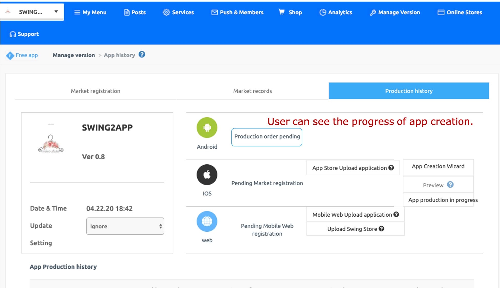

# Manual on How to Create an App In MakerV3

###  STEP1 Basic Information

**Step 1 \[Basic Information] is the step of entering the basic information required to create the app. In this step, you need to register the app name, icon image, splash screen image, etc.**

When you finish entering the information in the app creation wizard screen, the page below will open.

**1. App Name:** Enter your app name.

**2. App ID:** Apply a unique ID to the app you created. After entering, check for duplicate confirmation!!

**3. App icon:** Register the app icon image

**4. Standby screen:** Register a splash screen image that will be displayed for 1-2 seconds when the app is launched.

**5. Save:** After you are satisfied with your app creation, select the \[Save] button to save the work.

###

### App icon, standby image registration

**\*Click on the \[Upload App icon/Splash Screen Image] button, and a pop-up will appear where you can set and modify these images.**

**​**

**1)Upload icon**

Icon image size: **1024px\*1024px**

(1)Click on the Upload Icon Button

(2)Select the Upload Image button in the file attachment window.

(3)After registering the image, click on the Apply button.\

**2)Upload the waiting screen**

Standby Screen Image Size : **2282px\*2282px**

(1)Click on the app splash screen upload button

(2)Select the Upload Image button in the file attachment window.

(3)After registering the image to be used as the standby screen, click on the Apply button.

***

Check out the icons image creation guide for a more detailed explanation.

Also, for more details, check out the splash screen creation guide.

To get the best results, be sure to design and apply the image as per the guide.

<mark style="color:blue;">****</mark>[<mark style="color:blue;">**Go to the icon image creation guide**</mark>](../maual/appbasic/appicon.md)<mark style="color:blue;">****</mark>

<mark style="color:blue;">****</mark>[<mark style="color:blue;">**Go to the splash screen image creation guide**</mark>](../maual/appbasic/apploading.md)<mark style="color:blue;">****</mark>

.PNG>)

### <mark style="color:blue;">****</mark> <mark style="color:blue;">****</mark>** STEP2** Prototype

**\[STEP2 Prototype]** is the step of determining the overall design and style of the app's UI design and color.

**1. Select a prototype: Select the prototype that determines the design of your app's UI.**

\*Swing2App offers a total of 7 prototype designs.

**2. Basic styles and options**

Select Color Set: Sets the app and color of the UI design.

It offers a color combination consisting of 3 sets which are the main background colors, text colors, and theme colors.

Once you have selected the desired combination, you can see the UI changing colors in real-time through the virtual machine.

**3. Advanced styles and options**

This feature allows you to set additional color options and design styles that you can add to the prototype UI.

This is not a required setting, users can modify if they want to.

**4. Custom settings**

**​**


<mark style="color:orange;"><mark style="color:red;">What if none of the combined colors present in the preset are not as per your interest? In that case,  please use the detailed settings.<mark style="color:red;"></mark>


If the desired color is not present, the user can select the color directly in \[Detailed Settings].

In addition to the fixed color combinations, the detailed color setting is an option that allows the user to select and apply their own colors.

**\*If you have applied both the prototype and the skin color during the design phase, save it and go to the next step.**

.PNG>)

### **** **STEP3 Page**

**\[STEP3 PAGE] is a step to create categories and menus for the app.**

The Home option is to set the main home screen of the app.&#x20;

On the left area, you can set menus of the app.

We'll show you how to apply the home screen and menus of the app.

****

### **1.** How to apply the home screen

The Home screen is the main screen that is visible when you launch the app. You can set your home screen easily as per your requirement.

Menus provided by the Swing2App for the Home screen – You can apply menus such as weblinks, swing templates, user pages, bulletin boards, images, and more.

In this guide, we'll apply industry-specific templates.

We'll show you how to modify and apply the menu to the home screen.

Click on the \<Home> option from the menu category on the left side of MakerV3 page.

1\) Enter the name of the home screen, which will be shown at the top of the main screen. After typing, click anywhere on the screen or press the Enter button to reflect it directly to the virtual screen.

2\) Page Design: Click on the Page template option and then click on the New button to create a template.

\*Since you don't have any template created, you must first go to the Page Template Creator to create a template page.

****

<mark style="color:green;">**\[Template Page Editor Tool]**</mark>

To learn how to create a template page, please check out the production manual below!

**☞** [<mark style="color:blue;">**Find out how to create and operate a template page**</mark>](../maual/pagemenu/template-page.md)<mark style="color:blue;">****</mark>

<mark style="color:blue;">****</mark>

**After creating the template, please return to the app maker screen.**

3\)When you click on the Refresh button, the template you created will pop up on the screen.

4\)Hover your cursor over the template, **\<preview, apply, manage>** options will pop up

If you want to check how the template looks before applying it to the app, select 'Preview', select the 'Apply' option to apply the created template to the app, and choose the 'Manage' option if you wish to modify your created template. &#x20;

5\)Click on the \[Save] button and check the template applied to the home screen on the virtual machine screen.

### **2.**Menu Management

<mark style="color:green;">**1)Add and delete menus**</mark>

The default menus listed in the category on the left can all be modified easily.

You can delete and add menus that you don't need, and organize them into the menus accordingly.

When you hover your mouse over the menu, the trash can-shaped icon and the \[+] shaped icon, pops up.

<mark style="color:red;">**\*Delete menu: Select the trash can icon**</mark>

<mark style="color:red;">**\*Add menu: Select \[+] icon**</mark>&#x20;

Like this, you can easily delete and add menus.

<mark style="color:green;">**2)Menu Customization**</mark>

(1)first, add a menu.

(2)Enter a menu name.

(3)Menu icon: Uplaod icon as per your requirement. \*Not required

(4)From Page Menu option- Select which feature you wish to apply to your menu.

\*In this guide, we have applied the 'Bulletin Board'. feature

Click on the UI KIT option-> Select Board-> Select the board style you want to apply and then click on the Apply button.

(5)Click on the Save button to save all the changes.

You can cross-check on the virtual machine to see if everything is applied properly.&#x20;

<mark style="color:green;">**3)Change Placement of the menu**</mark>

**​**You can easily change the placement of menus by the easy dragging method.

Select the menu and drag it to where you want to move it.

Like this, you can change position of menus, from a sub to a top menu and vice versa.

.PNG>)

### <mark style="color:green;">****</mark> <mark style="color:green;">****</mark> STEP4 Creating an App

Once you've finished building your app, complete the process by clicking on the \[App creation] button.

<mark style="color:red;">\*STEP1 Basic should be 100% complete to complete app production successfully.</mark>

Even after you finish the app creation process, you can freely modify your app at any time.

So complete app production and preview it on your mobile without worrying about any incomplete menu as you can modify and update your app unlimited times.&#x20;

1\)Once you're satisfied with your app, click on the Save button

2\)Click on the \[App Creation] button.

3\)Click on the \[Make] button in the Update Options pop-up window.

<mark style="color:red;">\*User can select Update type and update notification display option.</mark>

<mark style="color:red;">Since this is your first time building an app, we recommend you go with the default setting of update.</mark>&#x20;

.PNG>)

### <mark style="color:red;"></mark> <mark style="color:red;"></mark> **STEP5** Complete App Creation&#x20;

****

Once you click on the \[App creation] button, you'll get redirected to the App Production History page on the  Manager page.

The status of each platform will be marked as 'Pending Production Order', and it'll change to complete after 5-10 minutes. Then you'll receive apk file of your app via registered mail.&#x20;

On this screen, a \[Swing2App Preview] pop-up window will appear.&#x20;

It's a feature that allows you to preview the app through a swing2app preview screen before it is reached its final stage of creation.

\*View on the web: Select the \[Watch directly on the web] button to preview apps created on virtual machines on the web.

\*Preview on your phone: After downloading the official Swing2App app – App Preview menu – log in with your swing account or scan the QR code shown in the pop-up window and you can preview the app on your phone!&#x20;

****

After 5-10 minutes, the platform-specific status will change to "App Creation Complete!"&#x20;

When the production is complete, the **APK file** (the file that you can download your app from) will be sent to you via Swing2App subscription email.

**​**\*APK you can't open this file on your PC, so make sure to check it on your phone.

\*APK files can only be installed on Android phones. (iPhones are not supported.)

<mark style="color:blue;">****</mark>[<mark style="color:blue;">**See how to install apps created using app preview on your phone**</mark>](../swingpreview.md)<mark style="color:blue;">****</mark>

<mark style="color:blue;">****</mark>
