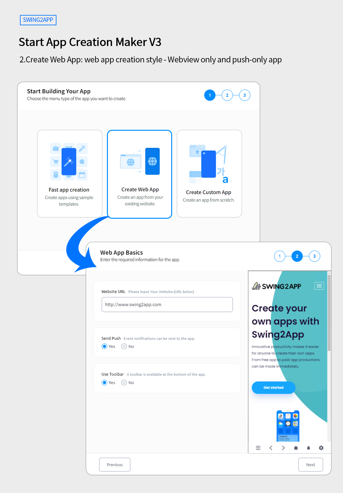

# Start App Creation With MakerV3 Screen

On MakerV3 App Creation Screen -> Choose the app type that you wish to create.

Before you start app creation, first choose what style and type of app you want to build.

On the App Creation Wizard screen, you'll see 3 different ways to create an app.&#x20;

Choose any one of the provided options accordingly.&#x20;

### .png>) App creation wizard screen- options provided are:

\-Create apps by using a sample template (normal prototype)

\-Create an app from your existing website (Webview and push-only prototype)&#x20;

\-Create an app from scratch (normal prototype)

The App Creation Wizard is the screen that only pops up when you create a new app or add a new app. You won't see it during app production.

After selecting one of the methods and entering the basic information that goes into the app, the  App Creation Maker screen will open.

Check the manual to see the app creation method for each option type.

 (1) (1).PNG>)

### .png>) Method 1. Fast app creation

It's about building an app using a sample template. You can build it as a regular prototype app.&#x20;

**If you choose this option, then the next step will be to choose the type of template you want to use.**

**In the next step, register the app name, icon image, and splash screen image, and you're done with the basic design settings!**

**You can now start building the app on the App MakerV3 screen.**

If you want easy app creation without working on the page-specific design and menu configuration from scratch, then this option is best for you. Here you can easily create an app by choosing a template with all the industry-specific designs.

Template pages are easy to modify. You can change images, titles, colors, and linked pages of the template.

Choose a template for your app according to your requirement and start building your app.&#x20;

<mark style="color:green;">**\*The design UI tool configured in the template itself cannot be modified.**</mark>

Each sample template has its own prototypes. You can easily modify the menus of the sample template prototype. If you wish to change to a different menu prototype other than provided template prototype, in that case, you need to create all menus from scratch.&#x20;

<mark style="color:green;">**\*Unlimited updates available.**</mark>

Since you can modify and update the app unlimited times, feel free to modify and experiment with templates and prototypes.

 (1) (1).PNG>)

### &#x20; Method 2. Create Web App

The second method is the web app creation style.

If you have a website and wish to convert it into an app, you should choose this option. To create a web app you just need to input your website link. For web apps, we provide two types of prototypes (Webview only and push-only).

So if you wish to create a web app, choose the second option of the app creation wizard screen.

**After selecting a web app, you can select the basic information required for the web app - the website address, and whether you want to use push notification.**

**In the last step, register the app name, icon image, and splash screen image, and you're done with the basic design settings!**

**​**

<mark style="color:green;">**\*If you wish to have a push notification feature in your app then select the Push-Only prototype and use the Push-Only function. If you keep the push option unchecked, the app created will be a Webview app.**</mark>&#x20;

<mark style="color:green;">**You can also later modify the Push usage option on the app makerV3 screen.**</mark> &#x20;

<mark style="color:green;">**\*In addition, the toolbar menus provided in the web app can also be selected and modified on the app makerV3 screen.**</mark>&#x20;

 (1) (1).PNG>)

###  Method 3. Create Custom App

The third way is to build and organize the app from scratch. You can create menus, pages, icons, etc for your app from the scratch.&#x20;

If you don't find any sample template design suitable for you, or if you want to customize the UI and other features of your app by yourself, choose the third method and start creating your app!

​

**If you choose this option, then the next step will be to choose a prototype style and the color of your app.**

**In the next step, register the app name, icon image, and standby image, and you're done with the basic design settings!**

**You can now start building the app on the App MakerV3 screen.**

**​**

<mark style="color:green;">\*You can modify and update your app unlimited times, so if you want to change anything that you chose initially, you can easily modify it within the existing app.</mark>

<mark style="color:green;">\*You can choose the template feature in this option too.</mark> &#x20;

<mark style="color:green;">Therefore, you can freely combine and create regular app creation styles + template styles, etc.</mark>

**​**

So, select the app type that you wish to create and modify it accordingly.

For a general app creation manual, please visit the link below.

[Check out the V3 App Authoring Manual ](guide.md)

