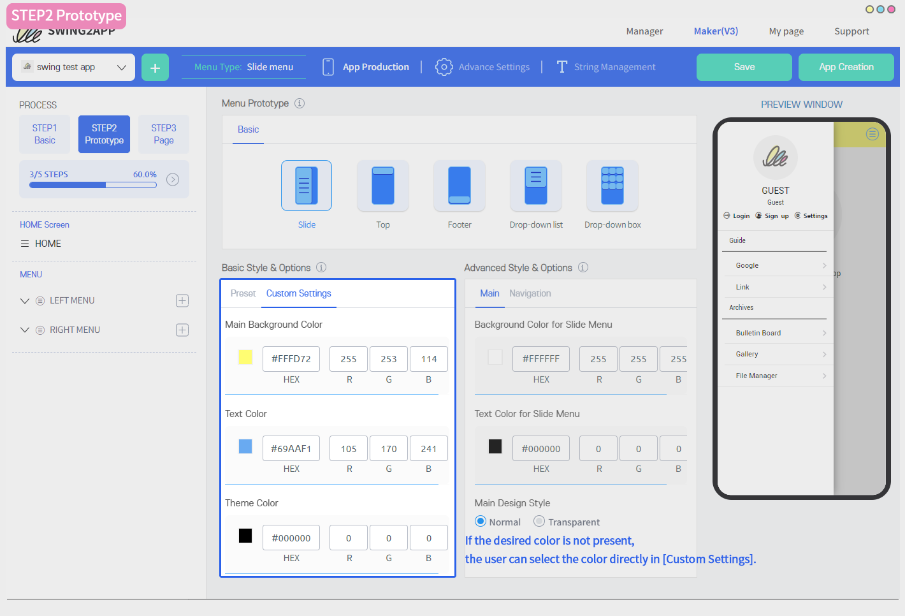

# STEP2 Prototype

### App Creation STEP2–  Prototype&#x20;

The App Maker V3  Manual will show you how to edit your app in step 2- prototype.

**\[STEP2 Prototype] is the step in which you can decide the overall design and style of the app's UI design and color.**

.PNG>)

### STEP2 Prototype&#x20;

**1. Select a prototype:** Select the prototype that determines the design of your app's UI.

**2. Default style and options:** Select the color of the UI design and app.

**3. Advanced styles and options**

&#x20;**** This feature allows you to set additional color options and design styles that you can add to the prototype UI.

\*This is not a required setting.

4\. When you are satisfied with the changes made in step2, click on the **\[Save]** button to save your work.

.PNG>)

###  Check the prototype style

The normal app prototype style is available in 5 different designs.\*The webviews and push-only prototypes are excluded.

You can preview each prototype by selecting them, virtual machine on the right (preview screen) will show how the prototype UI style will look on the app.&#x20;

.PNG>)

###  Basic styles and options – Color settings

**Select Color Preset: To Set the skin color of the UI design.**

Skin Color offers a color combination consisting of 3 sets of main background colors, text colors, and theme colors.

Once you have selected the desired combination, you can see the UI changing colors in real-time through the virtual machine.

.PNG>)

###  Basic styles and options – custom settings

<mark style="color:red;">What if none of the combined colors present in the preset are not as per your interest? In that case,  please use the detailed settings.</mark>

If the desired color is not present, the user can select the color directly in \[Detailed Settings].

In addition to the fixed color combinations, the detailed color setting is an option that allows the user to select and apply their own colors.

**Detailed Settings** – Enter the color code in the HEX field or you can click on the color square box to select the color you want to use.

After selecting a color, click the mouse cursor on the empty space to reflect the colors in real-time on the virtual machine.

.PNG>)

###  Advanced styles and options

This feature allows you to set additional color options and design styles that you can add to the prototype UI.

**\*This is not a required but an optional setting.**&#x20;

**Advanced Style & Option** – Here you can modify the background and text color of the prototype.

You can enter the color code in the HEX field or click on the color square box to select the color you want.

The main design style can also be changed from basic to transparent.

<mark style="color:blue;">**Main Design Style – Transparent setting**</mark>

If you set the main design style to transparent, the bar area shown at the top will disappear. In other words, it will change to a transparent area.

When selecting the transparent option, you can utilize the top bar area 100%.

It is recommended to apply the template pages, image pages, etc with the home screen.

**Related Articles**

* [STEP1 ](https://wp.swing2app.co.kr/documentation/v3manual/step1-basic/)<mark style="color:blue;">Basic Information</mark>
* <mark style="color:blue;">Registering a push icon image</mark>
* <mark style="color:blue;">Set menu permissions: How to use access rights</mark>
* <mark style="color:blue;">How to use disable app menus</mark>
* <mark style="color:blue;">How to register a menu icon image</mark>
* <mark style="color:blue;">Push App Toolbar - How to Use and Function Introduction</mark>
