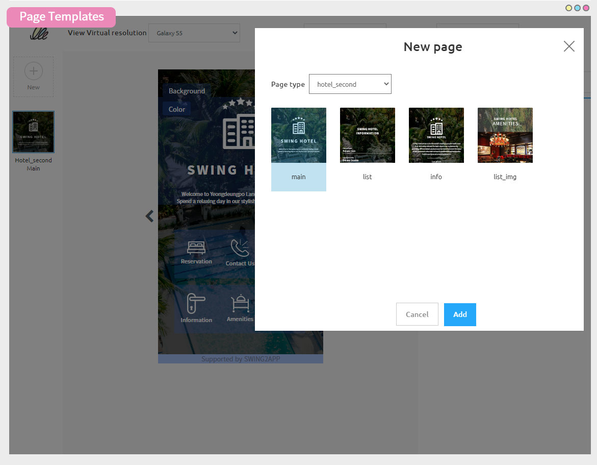
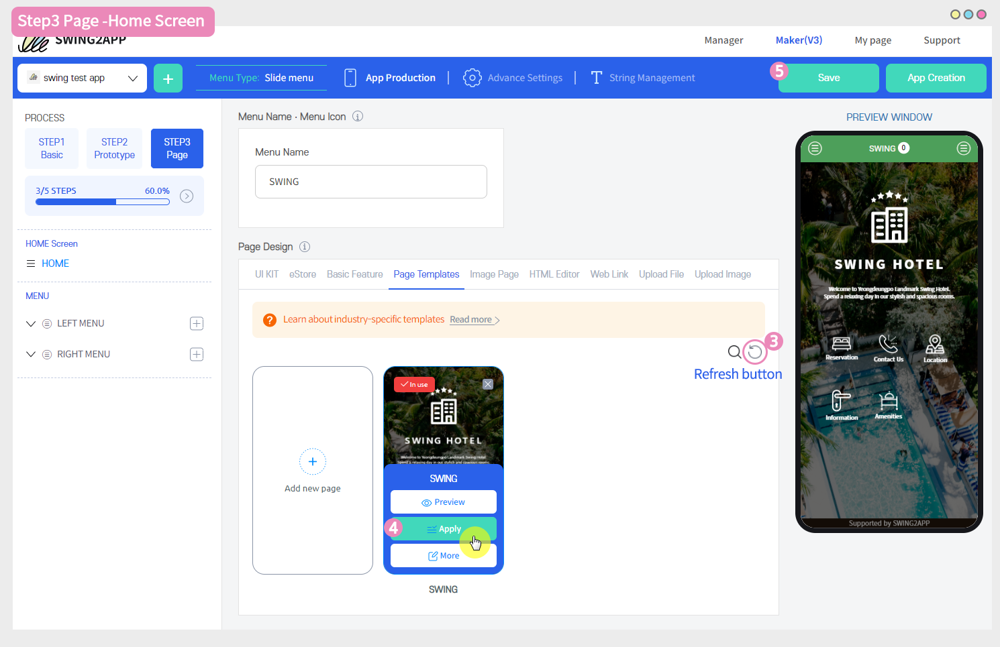

# STEP3 Page

The App Making V3 Authoring Manual shows you how to create STEP3 page steps.

**\[Page STEP3] is a step to organize the contents of the app in earnest by creating categories and menus in the overall app tool that we have created earlier.**

 (1) (1).PNG>)

### STEP3 Page

You can see the menus you need to apply in the Screen Settings category on the left.

We'll show you how to apply the home screen and how to apply the main menu.

 (1) (1).PNG>)

###  **1.**How to apply the home screen

The Home screen is the main screen that is visible when you launch the app, and you can configure how the main screen will be displayed by the user themselves.

Menus provided by the Swing-to-App – You can apply menus such as weblinks, swing pages, user pages, bulletin boards, images, and more.

In this guide, we'll apply industry-specific templates.

Select \<HOME> from the category on the left

1\) Enter the name that will be shown at the top of the menu name input screen.

After typing, click the cursor once or press the Enter button to reflect it directly to the virtual machine.

2\) Page Design: Select an industry-specific template and then select the New button.

\*Since you don't have any pages created, you must first go to the Page Template Creator to create a template page.

​

#### \[Template Page Authoring Tool]

To learn how to create a template page, please check out the production manual below!

**☞**[ <mark style="color:blue;">**Find out how to create and operate a template page**</mark>](../../maual/pagemenu/template-page.md)

**After creating the template, please return to the app creation screen.**

3\) When you select the Refresh button, the template you created will pop up on the screen.

4\)Hover the mouse cursor over the template to **\<preview, apply, manage>** menu will pop up.

If you want to check before applying the app, select 'Preview', 'Apply' to apply the app, and 'Manage' for modifications.

Select the Apply menu.

5\) Select the \[Save] button to check the template applied to the home screen on the virtual machine screen.

 (1) (1).PNG>)

###  **2.** Menu Management

**1)Add and delete menus**

The menus listed in the category on the left can all be modified to include the menus that you initially set in the Swing To app.

Therefore, you can delete and add menus that you don't need, and organize them into the menus you want.

When you hover your mouse over the menu, the trash can-shaped icon, the +shaped icon, pops up.

**\*Delete menu: Select the trash can icon**

**\*Add menu; + Select icon**

It's very easy to delete and add menus.

**2)Apply menu**

(1)Add a menu.

(2)Enter a menu name.

(3)Menu icon: Please enter only if you apply the icon as an option. \*Not required

(4)Select which menu you want to apply in the page design.

\*In this guide, we have applied the 'Bulletin Board'.

Select UI KIT Select Board Select the board style you want to apply and then select the Apply button

(5)Select the Save button.

The virtual machine allows you to check if the bulletin board is well reflected.

**​**

**3) Move the menu**

Menus can be moved by dragging with the mouse.

Select the menu with your mouse, grab it, and drag it to where you want to move.

The position you are dragging completes the menu movement. – Can be configured as a sub or top menu.

**Related Articles**

* [앱 홈화면 제작방법](https://wp.swing2app.co.kr/documentation/v3manual/home/)
* [STEP2 디자인](https://wp.swing2app.co.kr/documentation/v3manual/step2-design/)
* [STEP1 기본정보](https://wp.swing2app.co.kr/documentation/v3manual/step1-basic/)
* [푸시 아이콘 이미지 등록하기](https://wp.swing2app.co.kr/documentation/appmanage/pushmember/pushicon/)
* [메뉴 권한 설정: 접근 권한 이용방법](https://wp.swing2app.co.kr/documentation/v3manual/permission-setting/)
* [앱 메뉴 비활성화 이용방법](https://wp.swing2app.co.kr/documentation/v3manual/menu-hiding/)
