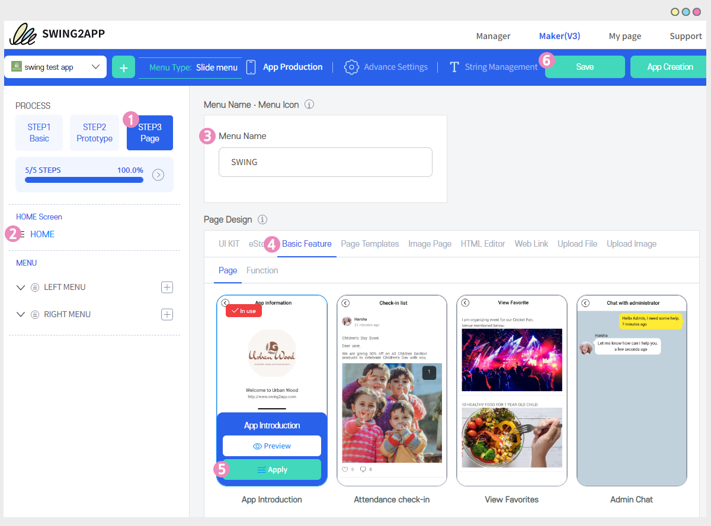

# How to Create a Home Screen For an App

 **Varieties in which you can create a home screen for an app**

1\. Apply an image

2\. Apply bulletin board

3\. User Page - Image Page

4\. User Page - Web Template

5\. User Page – HTML Editor Page

6\. App Introduction Page

**\*Please do not apply web links (websites) to your home screen. If you wish to connect the website with the home screen then please create it in a webview or a push-only prototype and not in a regular prototype.**

**Home screen creation can be created by selecting the HOME button → the HOME screen setting → the STEP3 page → the App Maker Maker.**

You can create a screen by choosing from the different features that come with the page design.

 (1) (1).PNG>)

###  **1**. Home screen - Apply image

The first way to apply the Home screen is to upload an image.

​**App launch screen) Image applied to the home screen**

\
​ **How to apply**

1\)Go to the STEP3 Page option

2\)Click and select \[HOME] menu

3\)Enter the menu name: Enter the name that will be visible at the top of the home.&#x20;

\*If you don't rename it, it will appear as the app name.

4\) From the page design, go to the \[Upload Image] option and Click on the \[Image Upload] button.

5\)When the Attach File window appears, select the image file you want.

6\)Click on the \[Apply] button

7\)Click on the \[Save] button at the top of the screen and you're done!


\*The images are different in size than the size of the cellphone, so there is no exact recommended size.

However, if you want to make the phone screen more or less full, please work with \*Horizontal Size: 1080px and Portrait 1980px to 2200px.

\-Portrait varies depending on the mobile phone model, so please adjust the size a little bit by looking at the vertical app screen.

\- Since it is resized to the mobile screen in line with the horizontal screen, the vertical length can be a little bit longer for each phone, resulting in scrolling.


 (1) (1).PNG>)

###  **2.** Apply bulletin board

The second way is to apply the bulletin board to your home screen!

 **App launch screen) Home screen with bulletin board applied**

\*Note: Writing is not provided when applying the bulletin board to the home screen.

This means that the home screen only provides a detailed article view of the list of bulletin boards, and you cannot write posts on the bulletin board applied to the home screen.

​ **How to apply**

1\)Go to the STEP3 Page Menu&#x20;

2\)Click and Select \[HOME] menu

3\)Enter the menu name: Enter the name that will appear at the top of the home.&#x20;

\*If you do not change the name, it will be displayed as the name of the board.

4\)In the page design, select UI KIT –> Board.

5\)Select the bulletin board and click on the \[Apply] button.

\*Hover your mouse over the bulletin board screen to see the Apply button.

6\)Click on the \[Save] button at the top of the screen and you're done!

If you don't have a board to attach on the home screen, create one first and then apply it to your app.

Click on the \[Add New Page] option takes you to the Manage Board screen where you can create and edit board pages.

 **App Manager-Bulletin Board Screen**

 (1) (1).PNG>)

###  **3.** User Page – Apply Image Page

The third way is to create an image page and apply it to the home screen.

​ **App launch screen) Image page applied home screen**

​  **How to apply**

1\)Click on the STEP3 Page Menu&#x20;

2\)Click and Select \[HOME] menu

3\) The menu name does not need to be changed.&#x20;

\*The image page name is the name saved by the Image Page Creator and is displayed at the top of the home screen.

4\)Select the Image Page from the page design.

5\)Select the image page to apply to the home screen and select the \[Apply] button.

\*Hover your mouse over the image page screen to see the Apply button.

\*If you don't have a page created, please create it by pressing the \[Add new page] button.

6\)Press the \[Save] button at the top of the screen and you're done!

If you don't have an image page that you have created, create an image page first and then apply it to your app.

Selecting the \[New] button takes you to the Image Page Maker screen.

You can create an image page in the page creation editor tool, and then apply it in your app.

​ **Image Page Maker Screen**

 (1) (1).PNG>)

###  **4.** User Page – Apply a web template page

The fourth method is to create and apply a user page - a web template page.

 **App launch screen) Home screen with web template page applied**

&#x20; **How to apply**

1\)Click on the STEP3 Page Menu

2\)Click and Select \[HOME] menu

3\) Enter the menu name: Enter the name that will be visible at the top of the home.&#x20;

\*If you do not rename the menu, it will be displayed as the name you saved when the template page was created.

4\) Under Page Design, select a Page template option.

5\) Select the template you want to apply to the home screen and click on the \[Apply] button.

\*Hover your mouse over the template page screen to see the Apply button.

\*If you don't have a template page created, please create it by pressing the \[Add new page] button.

6\) Click on the \[Save] button at the top of the screen and you're done!

If you don't have an image page that you created, create a template page first and apply it to your app.

Selecting New above takes you to the Template Page Editor Tool.

You can create a template page in that Editor tool, and then apply it in your app.

 **Template Page Editor Screen**

 (1) (1).PNG>)

###  **5.** User Page – Apply HTML Editor Page

The fifth way is to create and apply a user page - an HTML editor page.

 **App launch screen) HTML Editor Page applied Home Screen**

&#x20; **How to apply**

1\)Click on the STEP3 Page Menu&#x20;

2\)Click and Select \[HOME] menu

3\)Enter the menu name: Enter the name that will be visible at the top of the home.&#x20;

\*If you do not rename the menu, it will be displayed as the name you saved when you created the editor page.

4\) In the page design, choose HTML Editor.

5\) Select the editor page that you want to apply to the home screen and select the \[Apply] button.

\*Hover your mouse over the editor page screen to see the Apply button.

\*If you don't have a page created, please create it by pressing the \[Add new page] button.

6\) Press the \[Save] button at the top of the screen and you're done!

If you don't have an HTML editor page you've created, create one first and apply it to your app.

Click on the \[New] button will take you to the HTML Editor Page Editor Tool screen.

You can create an editor page in that editor tool, and then apply it in your app.

 **HTML Editor Page Maker Screen**

 (1) (1).PNG>)

###  **6.** Apply the App Introduction Page

The app introduction page is the home screen that is the default setting as the home screen when you first build your app in a swing2app app.

Therefore, users can use the app introduction page as it is, and they can change the home screen in various styles according to the above method\~!

If you use the home screen in a different style and then apply the home screen back to the app introduction page, please apply it in the following way.

 **App launch screen) Home screen with app introduction page applied**

 **How to apply**

1\)Click on the STEP3 Page Menu&#x20;

2\)Click and Select \[HOME] menu

3\) Enter the menu name: Enter the name that will be visible at the top of the home.&#x20;

\*If you don't rename the menu, \[App Information] will automatically display as the app name.

4\) In the page design, select the \[Basic Functions] – \[Page] menu.

5\) Select 'App Introduction' and then click on the \[Apply] button.

\*Hover your mouse over the App introduction screen to see the Apply button.

6\) Click on the \[Save] button at the top of the screen and you're done!

> **The introduction, description, address, email address, phone number, website address, etc. listed on the app introduction page can be modified and used in \[Advanced Settings].**

You can modify the items on the About App page from the Advanced Settings menu of the app creation page.

By selecting App Service Information, you can edit the app description, phone, email, address, app description, website address, etc. as shown on the home screen.

**\[How to modify it]**

**1)Select the \[Advanced Settings] menu at the top of the app creation page**

**2)Settings: App Service Information**

**3)You can modify it by clicking on the \[EDIT] button.**

**4)After modification, click on the \[Save] button and it will be reflected in the app.**

When you create your first app, you need to click on the \[App Creation] button to reflect it. When you make any modification to the app you've created, it is automatically reflected in the app when you save it.

**​**

 **How do I delete content and delete banner buttons?**

If you want to clear all the banner buttons, click on the \[RESET] button for each item and then click on the \[Save] button to remove the banner from the app.

 **If I edit the introductory text of the app and save it, won't it be reflected immediately?**

App Introduction Title Phrase Modification will be reflected only if you save it on the first 1 modification and then press the \[App Creation] button to update it to the new version.

After 1 modification, just save it and it will be automatically reflected in the app from then on.

**★Entering the site address is linked with the \[Share] icon button at the bottom and the site link address in the middle.**

Therefore, if you enter the site address, the sharing button and the site address will be displayed together.

If you delete it, it will be removed along with the share button and the site address.

★**The representative image of the app introduction page is displayed in conjunction with the app icon image.**&#x20;

**\*Separate modification and removal are not possible.**

***


**Instructions for applying the home screen**

**1) Home Screen – Applying a web link is not recommended.**

\-When you link a website on the home screen, the new screen may not open and might show an error, or the site may not open in the app due to the security settings within the site.

\- For webpages that need to be opened in a new window, they can look weird on the app screen. (Screen configuration of pop-up windows, etc.)

Therefore, please use only the menus mentioned above on the home screen.

\*\*Also!! There's a site that prohibits embedding when applying web links.

\*Naver, the following portal sites, and the sites provided by the portal, YouTube, social media sites (Instagram, Facebook), etc. are the representative sites that have been banned from embedding!

In particular, the Naver blog or the next café that you run may not be able to connect properly to your home because it is blocked by Naver and the next itself.

In general, shopping mall sites may also not be applicable inside the app due to a secure server such as payment.

\* Apps applied to websites with such external security should not be released on the Play Store or App Store.

\*If the web link is linked to the app menu and checked in 'View in a new window', it can be used without problems.

**2) For those who want to build an app by linking through a website – we recommend that you build it as a webview app or a push-only app.**

It is a style that is created by linking the web browser to the app as it is in the form of a web app.

If you set up a link to the site on the main home screen of the app, events such as going back will not work properly because they behave differently from the website's page history.

Especially for shopping mall sites, the same security behavior as the purchase will not work properly when applied to a regular prototype app.

So if you want to use your website as your main one, you can create it by applying it as 'WebView' or 'Push-Only' in Design Theme - Prototype.

**3) The home screen can be freely modified by using the menus.**

You can apply an image page, or a template page, and then freely change to another menu.

If you just click on the \[Save] button, it will be automatically reflected in the app as well, so you don't need to update it separately.

**4) The home screen has the main screen set to the 'About the App' page.**

It's a guideline-setting screen for first-time creators.

Therefore, in addition to the app introduction page, we recommend that you change the home screen to another menu and use it.

Above, I told you how to create a home screen.

There are a lot of different menus that you can make as home screens, so try to modify your home screen in different styles\~!

We recommend that you modify it to other menus in addition to the default set of app introduction menus.

**\*Users who create in the style of push-only, and webview are created by applying the website link to the app, so they don't have to create a home screen separately. ^^**


***

***
