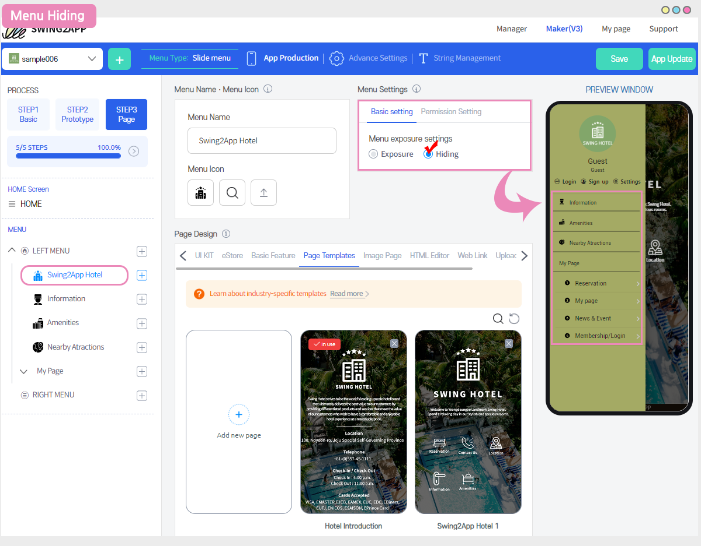
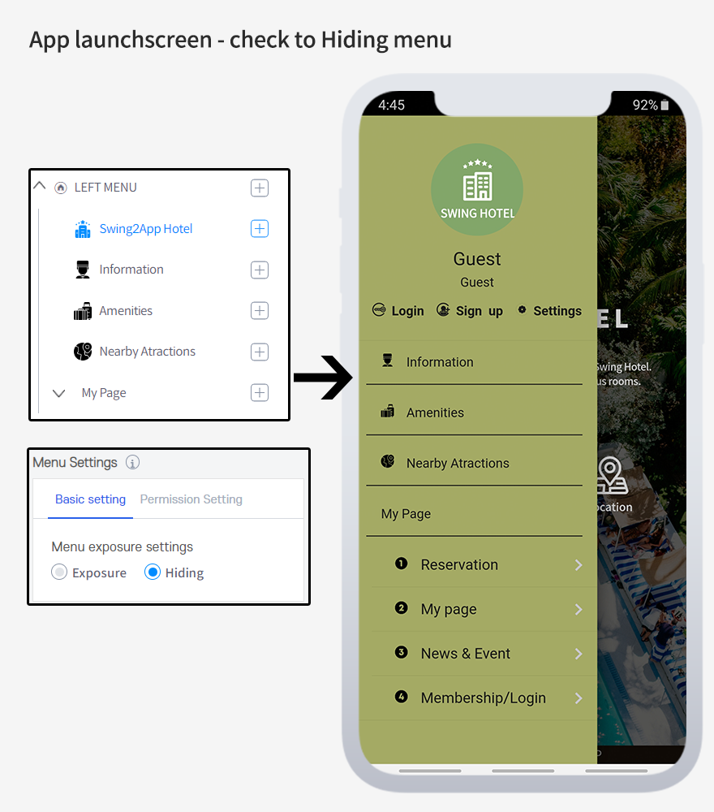

# How to use: Menu Exposure Settings

When you create a menu, you can create it by choosing whether to **Exposure / Hiding** the menu, unlike the previous one, which was unconditionally shown in the app.

**This means that if you have content that is not yet available to users or that has been done less, you can Hiding the menu.**

Hiding menus will not be visible in the app, and if you change to Exposure, the app will automatically show them.

It's very simple to use, so please check the manual below to find out how to use it.

.PNG>)

### **** **Menu settings: How to use the Hiding function**

​The menu disable function is available in the App Creation V3 - STEP3 page step.

After adding the menu on the maker screen, **check the menu to 'Hiding' in the right menu settings - preferences - and save it.**

On the right virtual machine (preview), you can see that the menu is not visible right away.

'Hiding' is a feature that actually creates a menu, but **doesn't apply it to your app, so that it doesn't look visible to app users.**

So on the App Maker screen, only the administrator who is creating the app can see it.

When the production is complete, and you reopen the app, you can change the menu to 'Exposure' and save.

You don't need to re-create the app, just save it, exit the app, and relaunch it to see the menu.

.PNG>)

### App launchscreen - check to Hiding menu

You can run the app to see if the menu is actually invisible in the app.

After checking the "Swing2App Hotel" menu as "Hiding", you will see that when you launch the app, you will not see the menu, only the other active menus.

It's a feature that makes it invisible to apps, so you can take advantage of it properly when the task isn't done yet

Since no updates are required, you can always comfortably modify them and incorporate them back into your app.


<mark style="color:red;">**\[Instructions]**</mark>

The menu Hiding function is an addition to the V3 version and is not available in the V2 version.

If you use this feature, you can switch to the V3 version.

Be sure to proceed with the initial update at the time of the transition.


**​**
