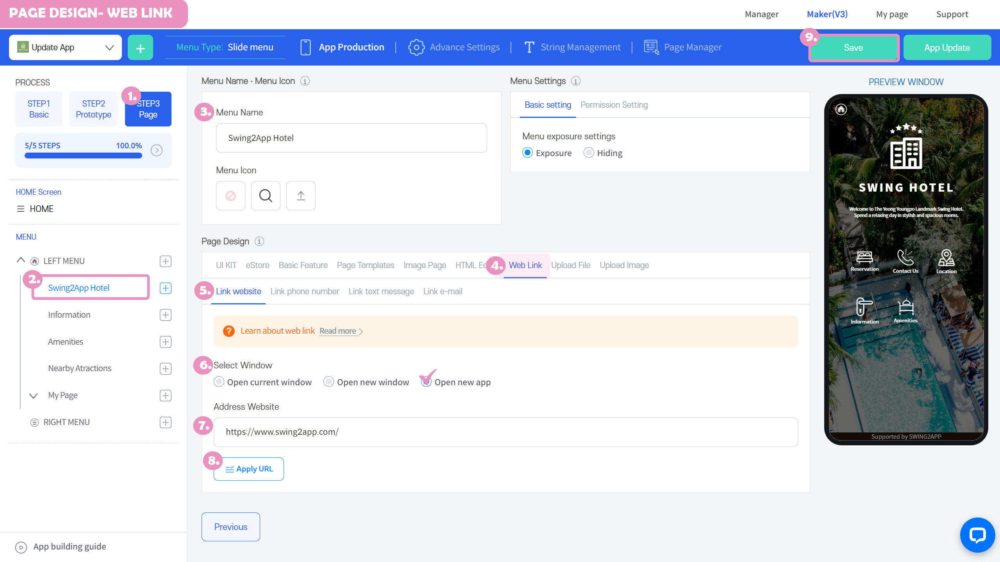
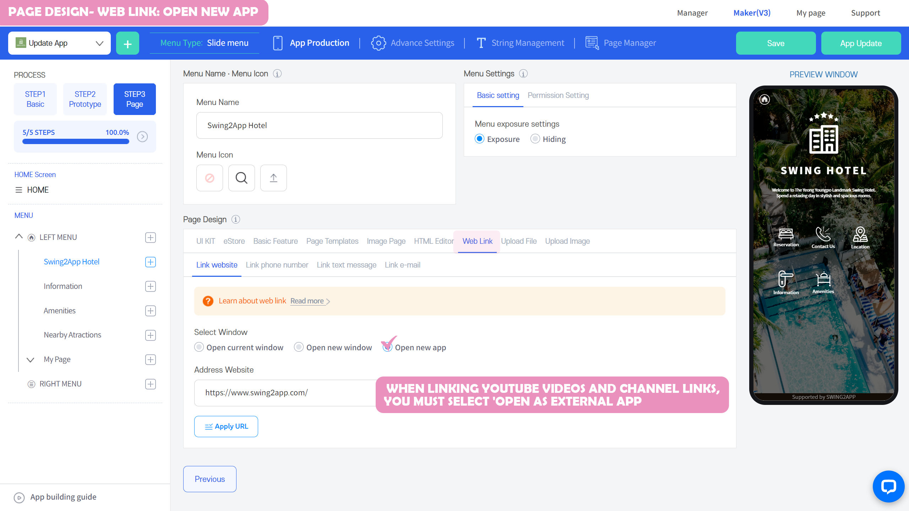
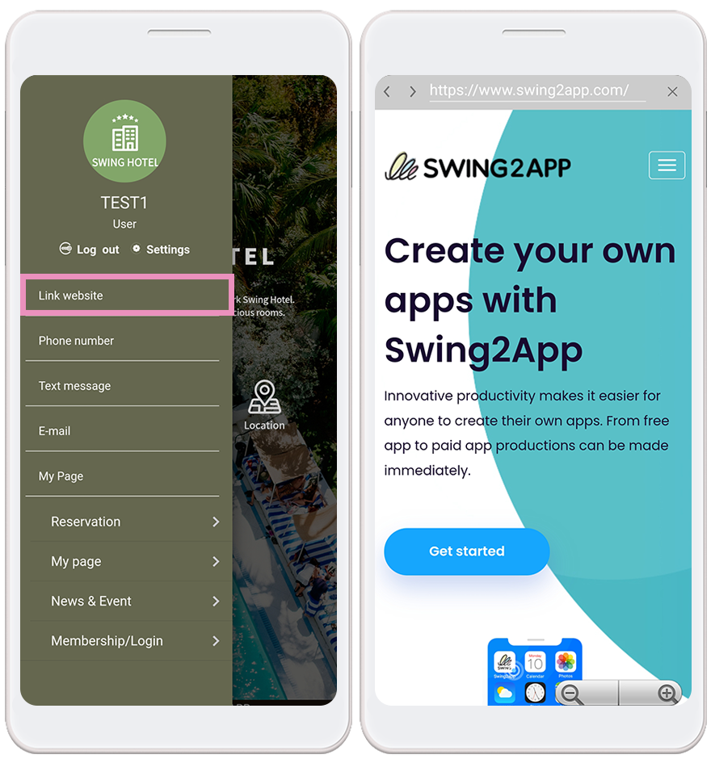
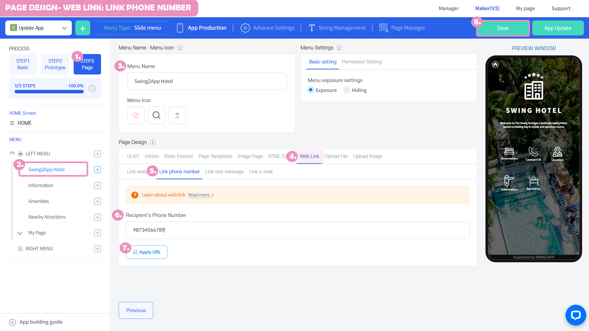
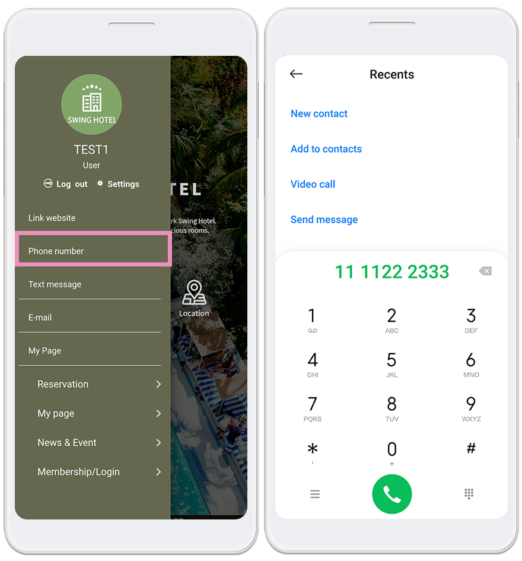
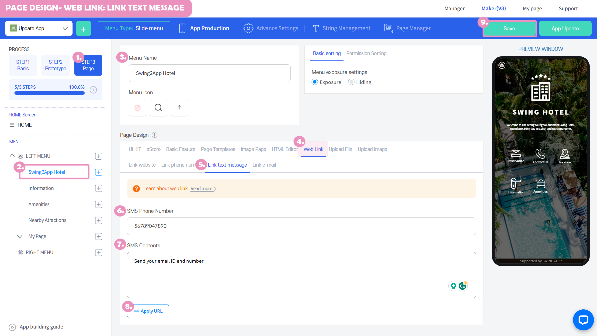
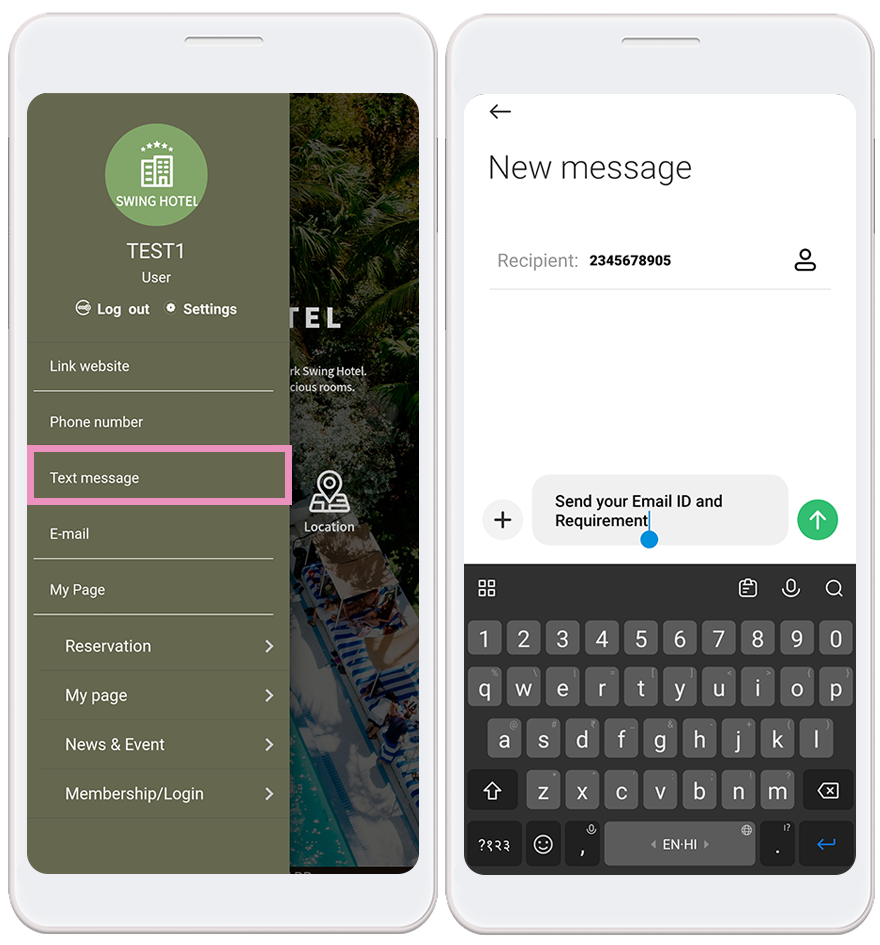
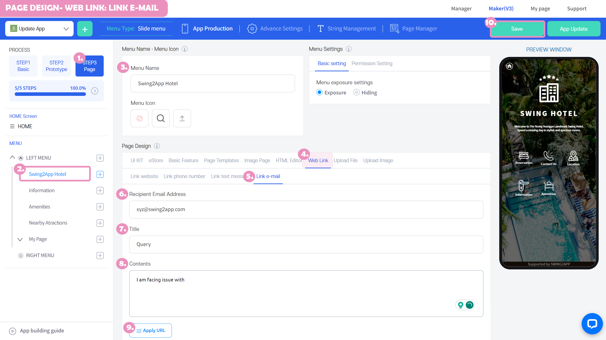
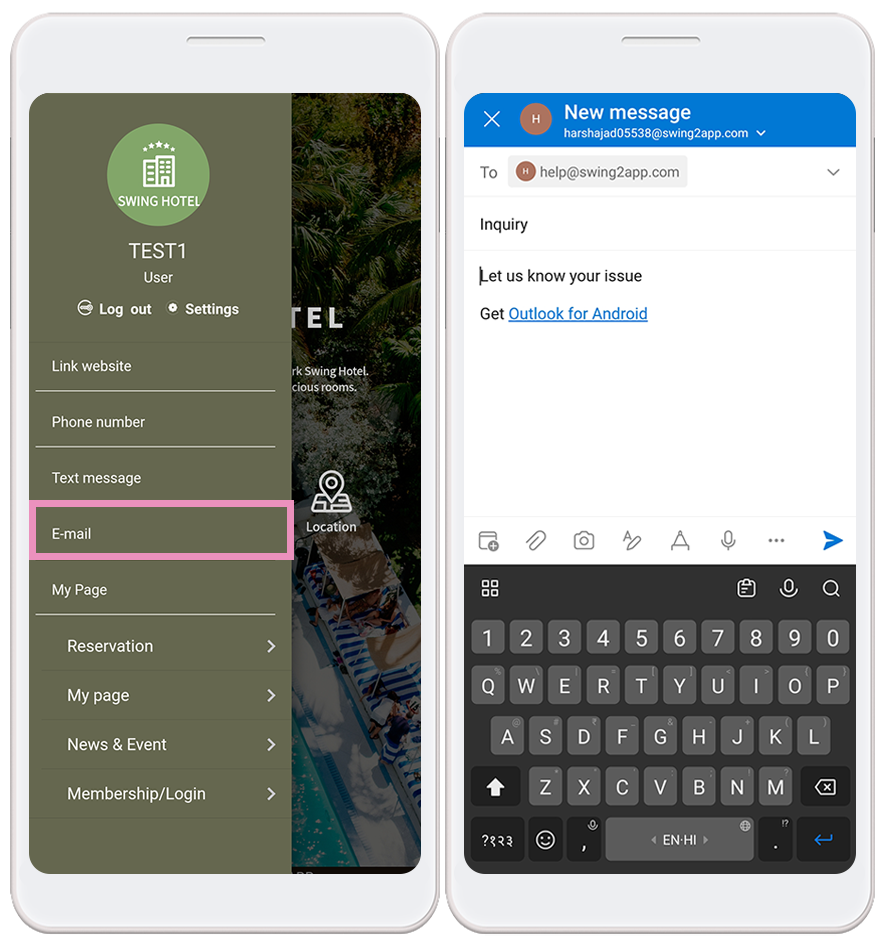

# Page Design- Web Link

**Link Wizard: How to apply your Internet address, phone number, text, or email address**

The link feature provided by Swing2App allows you to apply a generic website URL and phone number, text message number, and email address.

Creating an App – Step 3 Page – Page Features: We'll show you how to use links.

###  **1.**Apply an Internet address (site URL) link

Move the app creation screen

1\)STEP3 Go to the page step.

2\)Create a new menu. (+ Select the shape button to add a menu)

3\)Enter the menu name

4\) Select \[Link] from the page design.

5\) Select \[Internet Address].

6\)Select Window Opening: Select \*\*'Open in New Window'\*\*.

7\)Website Address: Enter your URL address. Please include a hyperlink (http://)

8\) Select the \[Apply URL] button.

9\)Press the \[Save] button at the top of the screen to apply it to the app.


\*If you select the Preview button, you can check how the page will look with a web preview (virtual machine).

\*After applying a page, you can also check how the page is applied to the app through a virtual machine.

\*Menu icon during the production phase, menu settings are not required.

In the manual, we proceeded without any input, and please apply additional if necessary when creating the app.


* [x] <mark style="color:blue;">**What are \[Open in New], \[Open as New App], and why do I need them?**</mark>

Websites are sometimes set up to prevent web links from being retrieved from the outside because of the security of each site.

Sites that are prohibited from embedding may result in an app refusing to connect or causing an error when you enter a link.

**☞ An optional feature that comes up to solve this problem is 'Open in a new window'.**

**It's not a style of opening links within the app, it's about popping up a new window in the app so that the site can open without problems!!**

The same goes for opening it as a new app. What makes it different from the view in a new window is the structure in which the app is launched and the link is opened.

**There are links that run the app. For example, Instagram, Facebook, YouTube, Kakao, etc.**

This will generate a link address, but for web addresses that are opened using the original app, please select "Open as a new app"

**\*Important\*** When linking YouTube videos and channel links, you must select 'Open as external app'. \_ Google Policy Content

**Therefore, when using a web link, be sure to check 'popup' in a new window.**

**Even websites that are not secured should be selected to view in a new window so that you can use them more reliably in the app.**

***

####  App launch screen - Apply Internet address Screen

In the Link Wizard, I linked the 'Internet address' and launched the app.

When you select the WebLink menu, you will be taken to the website page that has been applied.

***

**I'll launch the app to see how the view in a new window and the view in the external app are different!**

 **Open in a new window**

I've linked the URL of the homepage.

Selecting the menu takes you to a new webpage and launches the site. It's a concept that opens a new Internet window.

Press the screen X button or the back button to return to the app.

***

 **Open as a new app**

The YouTube link was linked to "View as an external app."

As the YouTube app launches, you will be taken to the linked video link.

###  **2.** Apply your phone number

Move the app creation screen

1\)STEP3 Go to the page step.

2\)Create a new menu. (+ Select the shape button to add a menu)

3\)Enter the menu name

4\) Select \[Link] from the page design.

5\) Select \[Dial a phone number].

6\) Please enter the recipient's phone number.

<mark style="color:red;">\*Enter the number that will take you to your physical phone.</mark>

<mark style="color:red;">\*Please enter only the number ' – ' Please do not enter special characters!!</mark>

7\) Select the \[Apply URL] button.

8\)Press the \[Save] button at the top of the screen to apply it to the app.


\*If you select the Preview button, you can check how the page will look with a web preview (virtual machine).

\*After applying a page, you can also check how the page is applied to the app through a virtual machine.

\*Menu icon during the production phase, menu settings are not required.

In the manual, we proceeded without any input, and please apply additional if necessary when creating the app.


 **App launch screen - Apply phone number screen**

In the link wizard, I connected the 'phone number' and launched the app.

When you select the Make a call menu, the phone is connected to the number you applied.

###  **3.** Apply a text message number

Move the app creation screen

1\)STEP3 Go to the page step.

2\)Create a new menu. (+ Select the shape button to add a menu)

3\)Enter the menu name

4\) Select \[Link] from the page design.

5\)Select \[Send Text Message].

6\)Enter the SMS outgoing phone number.

<mark style="color:red;">\*Enter a number where you can receive actual text messages.</mark>

<mark style="color:red;">\*Please enter only the number ' – ' Please do not enter special characters!!</mark>

<mark style="color:red;">\*Entering SMS content is optional.</mark>

7\) Select the \[Apply URL] button.

8\)Press the \[Save] button at the top of the screen to apply it to the app.


\*If you select the Preview button, you can check how the page will look with a web preview (virtual machine).

\*After applying a page, you can also check how the page is applied to the app through a virtual machine.

\*Menu icon during the production phase, menu settings are not required.

In the manual, we proceeded without any input, and please apply additional if necessary when creating the app..


 **App launch screen - Apply text message number screen**

In the Link Wizard, I linked the 'text message number' and launched the app.

When you select the Send Text menu, you can send a text message to the number that is applied.

For the number, please enter your mobile phone number to receive the actual texts!

###  **4.** Apply your email address

Move the app creation screen

1\)STEP3 Go to the page step.

2\)Create a new menu. (+ Select the shape button to add a menu)

3\)Enter the menu name

4\) Select \[Link] from the page design.

5\)Select \[Send Email].

6\)Enter the recipient's email address.

<mark style="color:red;">\*Title content is optional.</mark>

7\) Select the \[Apply URL] button.

8\)Press the \[Save] button at the top of the screen to apply it to the app.


\*If you select the Preview button, you can check how the page will look with a web preview (virtual machine).

\*After applying a page, you can also check how the page is applied to the app through a virtual machine.

\*Menu icon during the production phase, menu settings are not required.

In the manual, we proceeded without any input, and please apply additional if necessary when creating the app..


\
**App launch screen - Apply Email Address screen**

In the link wizard, I linked my 'email address' and launched the app.

When selecting the Send Email menu, you can send mail to the applied email.

**\*On the user's phone, the mail app connected to that phone will be launched to send mail.**

Example) If Google mail is linked, send it after running gmail app / Send it after running Outlook mail when Outlook is linked, etc.

It comes from an email set up for each user's phone.

***


<mark style="color:red;">**\*Link function important guide**</mark>

<mark style="color:red;">**\*\*\*\***</mark>

1.The link function cannot be applied to the home screen (HOME menu).

**Please apply the link function to menus only**.

The home screen is **not recommended because the web link 'View in a new window' does not apply.**

It won't open in a new window, so as we mentioned earlier, we can't fix it if you have security at stake.

If a security program such as payment is activated, it will not be able to be used normally within the app.

So make sure you don't use a web link on your home screen!

In in-app categories except for the home screen, you can launch view as a new window or view as an external app.

2.Even if you apply other web links, there are links that do not apply normally to the menu, or that the site connection is not successful.

**1) Shared web link provided by Google Drive with only certain permissions available**

**2) Web links that are only available within a specific company (links with external web server shield)**

**3)Privacy websites that prohibit other external embeddings**

These sites will not work properly if you link to the app if you get an error or if you see it.

Please refer to the usage.


***

***
