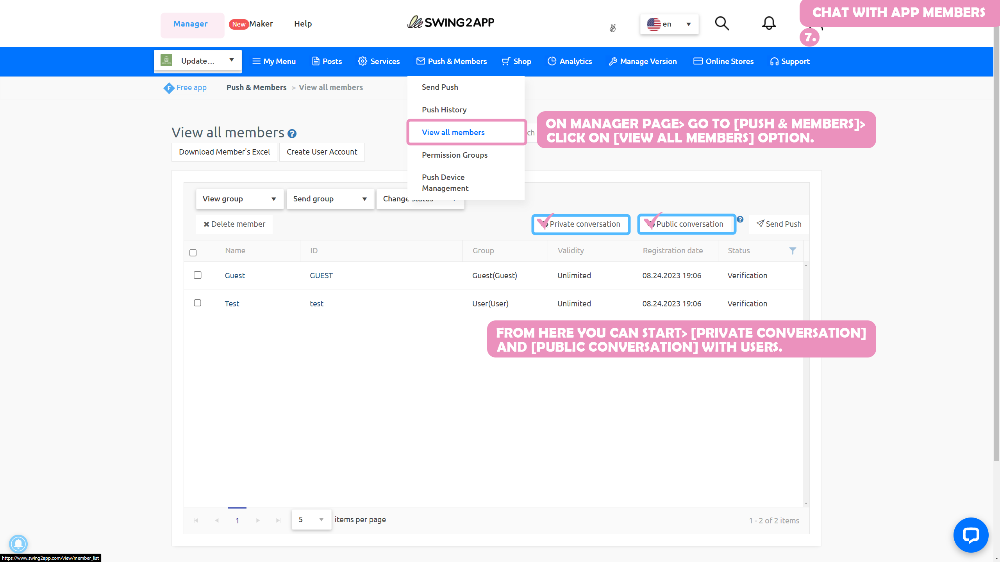

# Page Design - Admin Chat Page

**How to use the 1:1 chat between managers and app members \[Manager Chat]**

It's a feature that allows app admins to talk to members who use the app.

You can send and receive conversations in real-time, like KakaoTalk or Messenger, which can be useful if you need to communicate with a specific member.

\-App managers can select members to chat with.

\-App members can also talk to the manager from the chat room menu applied to the app.

Please check the manual to find out how to use the admin chat (1:1 chat).

***

###  **1.** Apply admin chat to the app

\* You need to apply the \[admin chat] page to the app first, so that both the user and the admin can chat, right?

The admin chat function is provided in the app creation – step 3 – page basics of the page.

Move the app creation screen

1\)STEP3 Go to the page step.

2\)Create a new menu. (+ Select the shape button to add a menu)

3\) Enter the menu name

4\) Select \[Basic Functions] - \[Page] in the page design.

5\) Find the 'Admin Chat' page and select the \[Apply] button.

(Hover the mouse cursor over the page and the Apply button opens)

6\) Press the \[Save] button at the top of the screen to apply it to the app.


\*If you select the Preview button, you can check how the page will look with a web preview (virtual machine).

\*After applying a page, you can also check how the page is applied to the app through a virtual machine.

\*Menu icon during the production phase, menu settings are not required.

In the manual, we proceeded without any input, and please apply additional if necessary when creating the app.


> <mark style="color:blue;">**Add a chat list feature too!**</mark>

The chat list is a menu where you can check your chatting history.

Chat lists must also be applied to the app so that you can still check your conversation history in the list window after the conversation ends.

Move the app creation screen

1\)STEP3 Go to the page step.

2\)Create a new menu. (+ Select the shape button to add a menu)

3\) Enter the menu name

4\) Select \[Basic Functions] - \[Page] in the page design.

5\) Find the 'Chat List' page and select the \[Apply] button.

(Hover the mouse cursor over the page and the Apply button opens)

6\) Press the \[Save] button at the top of the screen to apply it to the app.

###  **2.** App launch screen: Chat room screen

When you view the app launch screen, you receive messages entered by administrators in the chat room, and app members can send and receive text by typing in text.

**How can app users (members) chat with administrators?**

**Users can have a conversation by entering the chat menu in the app, and the conversation list can be viewed in the chat list.**

Please check below how to chat!!


**How can app users (members) chat with administrators?**

Users can have a conversation by entering the chat menu in the app, and the conversation list can be viewed in the chat list. Please check below how to chat!!


###  **3.** How users can chat with the app manager

.png>)

As soon as you enter the chat room menu created above, a chat window will open.

Users are free to enter messages (texts).

### ▶ Chat List

If you want to chat with the manager again after a conversation, you can go into the 'Chat List'.

You can check your conversation list.

Here you can see the list of managers who have had the conversation.

\*The chat list menu is also available on the swing page.

If you use the admin chat feature, please add a chat list to the menu as well.

☞<mark style="color:blue;">**See how to use the chat list**</mark>

***

**How can admins chat with app members?**

**Administrators can have a conversation by selecting members from the member lookup menu provided by the Swing web (app operation page).**

Check out below how admins can chat with app members!!


**How can admins chat with app members?**

***

Administrators can have a conversation by selecting members from the member lookup menu provided by the swing web (app operation page). Check out below how admins can chat with app members!!


###  **4.** How admins can chat with app members

Administrators can chat on the web (swing homepage) or use it in the app.

***

**1) Move the member inquiry page**

Swing Homepage App <mark style="color:blue;">Maker Page → Push & Member → Member Inquiry ->Go to the menu.</mark>

**If you look at the member inquiry page, you can check the \[Dedicated Conversation] and \[Public Conversation] buttons.**

**Select the member you want to talk to on the member lookup page, then select the Chat button and the chat will start!!**


**Private conversation? What is a public conversation?**

The conversation option doesn't matter much to app members. It's a chat option that managers can choose from.

▶ **Dedicated Conversations**

Only the admin you're chatting with can see it.

For other managers, chat pushes don't come in.

▶ **Have a public conversation**

If you have multiple administrators, you can use them when you need to share your conversations.

When you chat to have a public conversation, other managers are also pushed when the app member enters the chat message.


***

Select the person you want to talk to, and then choose the Chat button at the top.

**3) Move the chat list page: Chat window opens**

When you choose to talk, you'll be taken to the chat list page.

The chat window will open.

Admins can enter text and chat with members in the chat room.

​

**\[Chat List Page]**

On the Chat List page, you can see a chat list of all the members you've previously chatted with.

So if you need to talk to a member you've previously chatted with, you can continue the chat again by selecting the member from the chat list page.

**\*For instructions on how to use the chat manager page, please refer to the corresponding manual.**

**☞** <mark style="color:blue;">**\[Go to the chat manager page to see how to use it]**</mark>

> **Additional Information**

If you want to talk back to a member you've previously chatted with in the app, please use the chat list.

The chat list allows you to see a list of members and conversations you've already chatted with.

You can start chatting by selecting the member you want to talk to again.

**Administrators can chat on the web (swing homepage) or use it in the app.**

The app administrator login allows the administrator to communicate with members in the app as well.

###  **5.** Alarm Push Notification - Manager, Member

When you chat, both the app manager – the app member can receive a push for chat message notifications.


<mark style="color:red;">**\*Instructions**</mark>

\*\*\*\*

**1. 1:1 chat is a manager chat, which is a chat feature between the manager and the app member.**

It is available on the app and Swing2App Manager page (web).

\*When using the app: \[Settings- App Manager Menu] After logging in, select the desired user in \[User Management] and chat

\*Please proceed to the homepage using the method mentioned above.

**2. Please apply the chat menu with the operator (1:1 chat) as \[Manager Chat] on the → page of \*App MakerV3 Page → STEP3.**

**3. You can also use \[Group Chat], where you can talk to the administrator and several users.**

To learn how to use Group Chat, please check the manual below!

**☞**<mark style="color:blue;">**\[View Group Chat How-to Manual]**</mark>


***

***
