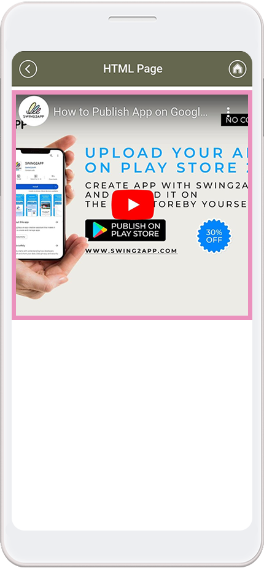
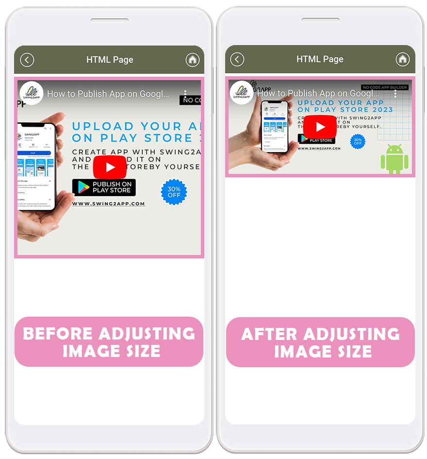

# Page Design - HTML Editor

 **What is an HTML Editor Page?**

One of the features provided by the Swing2App user page is a menu that allows users to create their own web pages.

Just like typing a post on a blog or café, you are free to place and create articles and images.

You can apply a variety of web links, videos, text effects, and more.

The main feature is that the user is free to create whatever style they want.

 **Editor Page Styles:**

HTML editor pages can be created in any style you want.

1\) You can also insert an image and make it look like an image page.

2\) Just like writing a blog post, you can freely place posts and images, and apply video or web link movement.

Therefore, if you think about how to build it in advance, and then work on it, it will be easier to use.

3\) You can create an unlimited number of HTML editor pages!

***

###  Apply HTML Editor Page (app launch screen)

It's an HTML editor page applied to the official Swing2App app.

We'll refer to the editor page above to make the production the same style.

###  **STEP.1** Creating an HTML Editor Page

.png>)

HTML editor page can be created in the App MakerV3 screen.

1\)Go to STEP3 Page&#x20;

2\)Under Page Design option, select \[HTML Editor] feature.

3\) Click on the \[+] button

Clicking \[+] Add new page button will redirect you to the HTML Editor Page editor Tool screen.

Below I'll show you how to create an editor page and how to apply it to your app after it's built.

### **STEP2.** Creating an HTML Editor Page

#### \*\*\*1.\*\*HTML Editor Page Editor

.png>)

The image above is the HTML Editor Page Maker screen.

HTML editor pages have the same style as the editor writing used to write posts.

It's the same as how you write a post, so you can use it without difficulty!

There's a screen where you can write like a blog or a bulletin board.

If you look at the top, you'll find a bar of different optional features for production and writing.


**The page name is displayed as the page title on the app launch screen.**

**Attachments such as images and videos, regular files, and web links can all be attached.**

**And since you can customize the text, you can specify options such as font, color, etc.**

**In addition, you can apply a variety of styles through the editor option bar menu.**


So let's work on it like the editor page of the official app shown above!

**2. Register the video (enter YouTube URL)**

.png>)

1\)For videos, please select the \[Insert Video] icon button in the option bar.

2\) Enter the video URL.

At this time, you can enter the video URL registered on YouTube and you can easily register it.

If you press the third video upload button, you can also attach it as a video file.

3\)Press the insert button to complete the video registration in the text!!


**Query!!**

I entered the video using the above method, but when I look at it in the app, the video screen does not match the horizontal and vertical ratios.


**See app launch)**

So if you want to scale it to fit the screen, you can modify the video size in the following ways:

.png>)

When you click on the registered video, you can directly modify the image size: landscape and portrait length.

Modified it to 380px wide and 200px vertical.

**App launch screen)**

By resizing the video, you can adjust the video thumbnail ratio on the app screen to fit the screen.

**3. Image Registration**

.png>)

1\) Select the \[Insert Image] icon button in the option bar.

2\)Drag & drop the image or click to register the image file in the attachment box.

When you register, the image is applied directly to your screen.

\*At this time, the image will be automatically modified to a horizontal size of 300px regardless of the actual image size.

​The image that is displayed on the web page is adjusted to fit the horizontal surface of the phone, so I have it sized to 300px horizontally.

So the image size is adjusted.

You can edit the image size again!!

.png>)

11\) When you click on the image, an options window will open below. Select the \[Resize] button here.

2\)Please put the size in the width (horizontal) field.

\*If you only add the horizontal length, the height (vertical) will be automatically adjusted to the landscape.

3\)Press the Update button.


Conversely, you can modify the image to the original image size significantly.

On the actual app screen, it will appear full to fit the landscape, so you can use it in the auto-size of 300px, or you can use it in its original size.

Instead, if the image needs to appear smaller on the screen, you can modify the size of the image to be smaller, just like I did.


**4. Registration of text articles**

.png>)

You can input text when you hold the mouse cursor in the body.

From the top options bar, you can select font, size, color, etc, and modify it to the style you want.

**5. Insert a web link**

.png>)

If you look at the Swing2App Official App Editor page for a moment, tap on the image and you'll be taken to a new page!!

On the editor page, you can also insert a web link to each image, text, etc.

Since you can link a web link to the image, you can touch it to go to the page you want.

**1) When you click on the image, an options window will open below. Select the \[Insert Link] button here.**

**2)Enter URL Options window will open anew. Enter the URL (web link address) in the appropriate field.**

<mark style="color:red;">**\*Important!**</mark>** You need to select \[Open in New Tab] to make it run a little more reliably, so be sure to check it!**

**3)Select the Insert button, and the link to the image will be finished linking.**


**★ One minute!**

\- I don't want to link to a website, but I want to make the image go to a specific bulletin board created by the app!

\- I want to go to the image page!

\-It's a shopping mall app, so I want to make you go to the product page!!

If you want to link to a page created by an app rather than an external web link like this, there's a way!!

Please check the details below.


 **Using the Link Wizard**

.png>)

1\) When you click on the image, an options window will open below. Select the \[Insert Link] button here.

2\)Enter URL Options window will open.

Select the 2nd icon \[Link Wizard] button here.

3\)**The Link Wizard pop-up window will open.** You can select from the left menu and add the swing function you want.

\- If you want to put an image page, you can select the user page and apply it.

\-If you want to include a bulletin board, please select a bulletin board and apply it.

\- If you want to go to a specific post, after selecting the post – you can apply it by searching for posts.

In addition to the regular website links, the \[Link Wizard] allows you to go to the pages used within the app!!

**6. Press the Save button when you finish the production.**

.png>)

When the editor page is finished creating, press the Save button and exit.

***

###  **STEP.3** Applying HTML Editor Page to App

.png>)

Go to the MakerV3 screen.

1\)Go to the STEP3 page

2\)Home Screen – Select HOME

3\)Enter the menu name

4\) Select \[HTML Editor] from the page design.

5\) Select the 'Refresh' button on the right to see the page you have created.

6\) Select \[Apply]. (Hover the mouse cursor over the page and the Apply button opens)

7\)Press the \[Save] button at the top of the screen to apply it to the app.


\*I have selected the home screen and applied the page, but I can apply it to the menu in addition to the home screen.

You can also apply a page to a menu.

\*Select the Preview button to see how the page will look with a web preview (virtual machine).

\*After the page is applied, you can also check how the page is applied to the app through the virtual machine.

\*Menu icon during the editing phase, Menu settings are not applicable to HOME and are not required.


***

###  **STEP4.** HTML Editor Page Creation TIP

Here are a few more features you need to create!

**1. Horizontal Line**

.png>)

As you write, there are times when you need something to differentiate between the two topics.

It's usually called a divider line.

If you press the Insert Horizontal Line button in the option bar, the divider is applied to the body.

**2. Full Screen**

.png>)

As you work on the page, the content gets long and the page goes down.

As the page scrolls down, the top options bar disappears from the work view.&#x20;

At this time! **If you select the \[Full Screen] button, which is the last button on the option bar**, the screen is moved to the full screen, and this inconvenience disappears.&#x20;

The options bar is right at the top!! Since it is fixed, no matter how many pages are turned down, it does not disappear from the view of the work, and it is possible to work comfortably ^^

​

**3. Quick Insertion**

If you look at the left side of the body screen, there is a \[+] shaped button.

With the Quick Insert button, selecting it gives you quick access to frequently used options such as inserting images, inserting videos, and inserting horizontal lines.

***

***

###  **STEP.5** Editing HTML Editor Pages (How to Modify**)**

The same can be done by going into the App MakerV3 screen– HTML Editor \[Modify] button.

.png>)

Hover your mouse cursor over the editor page and there is a \[Edit] button.

Select the \[Edit] button and then select the \[Modify] button →.

Go to the HTML Editor Page Editor Tool screen.

Editing the editor page doesn't mean that there is a separate page.

You can update it by going in the same way as the creation page and making changes.
