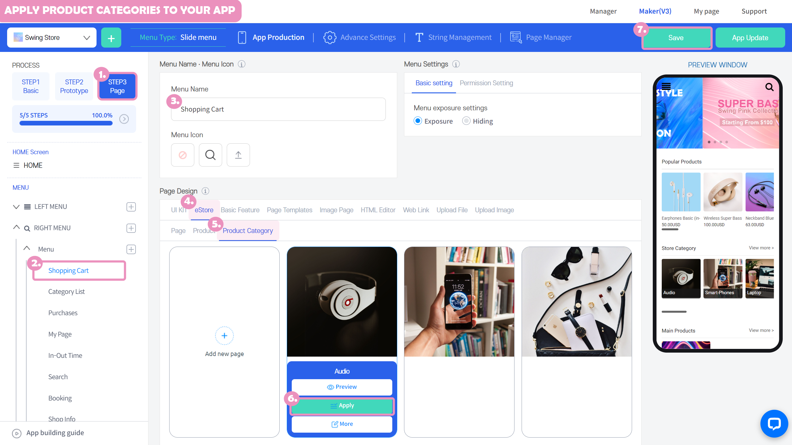
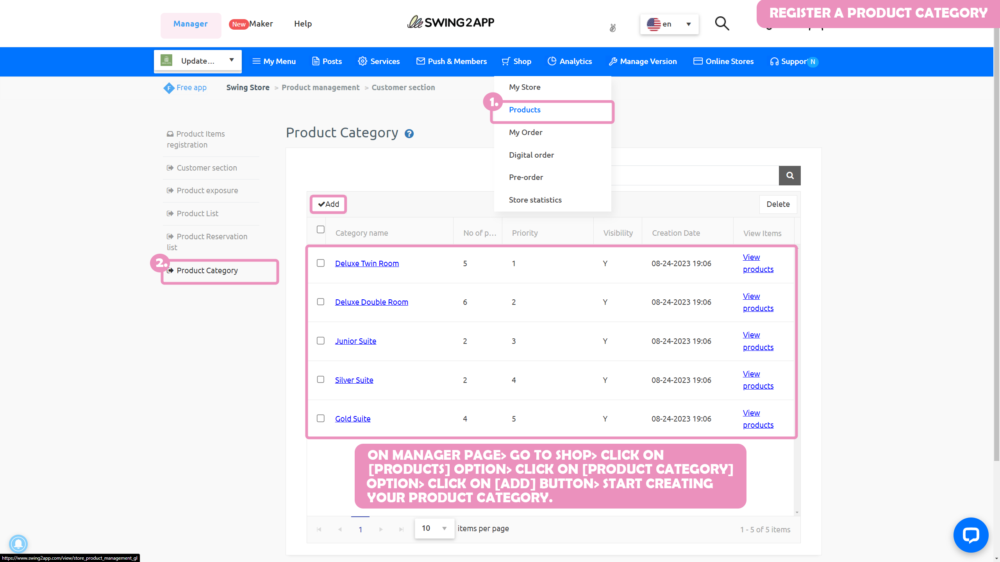
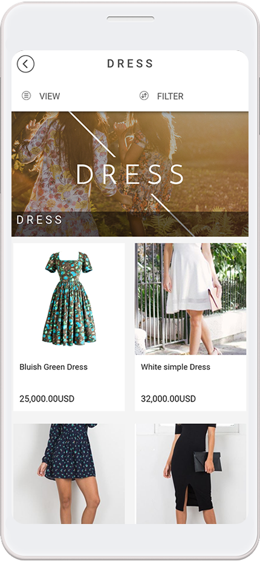

# Page Design - Product Category

**How to use the product category**

It is a menu that is only available to those who use the swing shop (eStore), and it is a page where all the products registered in a particular category are shown.

Please see how to apply the product category to the app and the app launch screen with the page applied.

###  **1.** Apply product categories to your app

The product category page is available in the app creation STEP3 page step - eStore function.

1\)Go to the STEP3 Page Selection

2\)Select Menu or Create a new menu. Click on the \[+] button to add a new menu.

3\) The menu name does not need to be changed.

\*Since the category name appears to be the menu name, even if you enter a name, it will not be reflected in the app menu name.

4\) Select \[eStore] feature from the page design option.

5\) Please select the \[Product Category] option.

\*Categories must be created in advance when registering for Swing Shop products. If there is no product category, it will not be applicable.

6\) Find the category you want to apply and select the \[Apply] button. (Hover the mouse cursor over the page and the Apply button opens)

7\) Press the \[Save] button at the top of the screen to apply it to the app.


\*If you select the Preview button, you can check how the page will look with a web preview (virtual machine).

\*After applying a page, you can also check how the page is applied to the app through a virtual machine.

\*Menu icon during the production phase, menu settings are not required.

In the manual, we proceeded without any input, and please apply additional if necessary when creating the app.


###  **2.**Where can I register a product category?

**After applying for the swing shop,**

App Manager page → Go to \[Shop] option - Click on \[Products] option → You can register the product category in the product category option.

###  **3.** App launch screen) Product category application screen

This is the screen where the 'Product Category' menu is applied to the app.

A product category shows all the products registered in that category.


<mark style="color:red;">**Precautions for using product categories**</mark>

When applying a product category to a menu **– it is only available in the physical and digital product categories.**

Since the calendar (screen where you can select the reservation date) screen appears first, the product screen does not appear when you apply the product category.

Please refer to the use!


**Related Articles**

* [페이지 기능 – 쇼핑몰 기능 페이지](https://wp.swing2app.co.kr/documentation/v3manual/step3-page/swingshop-page/)
* [회원가입 양식 – 가입 항목 추가하기](https://wp.swing2app.co.kr/documentation/appmanage/service/set-membershipform/)
* [상품수정-등록한 상품 수정하기](https://wp.swing2app.co.kr/documentation/swingshop/product-edit/)
* [페이지 기능 – HTML에디터 페이지](https://wp.swing2app.co.kr/documentation/v3manual/step3-page/editorpage/)
* [페이지 기능 – 이미지 페이지](https://wp.swing2app.co.kr/documentation/v3manual/step3-page/imagepage/)
* [페이지 기능 – 업종별 템플릿](https://wp.swing2app.co.kr/documentation/v3manual/step3-page/template-page/)
