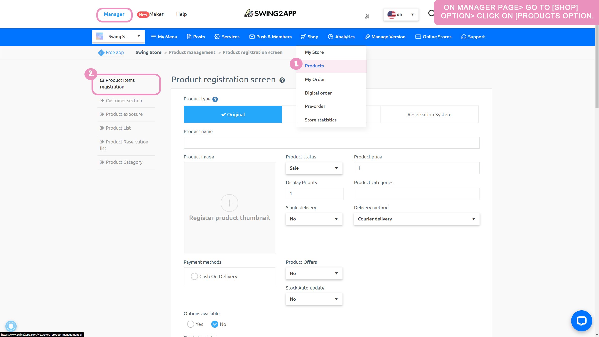

# Page Design - eStore Deals

**eStore function – how to use the product**

It is a menu that is only available to those who use the swing shop (shopping mall), and you can apply the registered products to the app.

Please check how to apply the product page to the app and the app launch screen with the page applied.

###  **1.** Apply products to the app

The product page is available in the app creation STEP3 page step - eStore function.

<figure><figcaption></figcaption></figure>

1\)Go to STEP3 Page&#x20;

2\)Select Menu or Create a new menu. Click on the \[+] button to add a new menu.

3\) Enter a menu name.

4\) Select \[eStore] feature from the page design option

5\) Please select \[Product] option.

<mark style="color:red;">\*Please register your product in the swing shop first. If the product doesn't exist, it can't be applied to the app.</mark>

6\) After previewing the product to be applied, click on the \[Apply] button. (Hover the mouse cursor over the page and the Apply button opens)

7\) Press the \[Save] button at the top of the screen to apply it to the app.


\*If you select the Preview button, you can check how the page will look with a web preview (virtual machine).

\*After applying a page, you can also check how the page is applied to the app through a virtual machine.

\*Menu icon during the production phase, menu settings are not required.

In the manual, we proceeded without any input, and please apply additional if necessary when creating the app.


###  **2.** Where can I register my products?

<figure><figcaption></figcaption></figure>

**After applying for the swing shop,**

App Manager page → Go to \[Shop] option - Click on \[Products] option → You can register products in the product item registration option.

Products can be registered by selecting physical, digital, and reservation systems by type.

**To modify a registered product:**

<figure><figcaption></figcaption></figure>

1\) Shop - In \[Product] Management Selection

2\) Select \[Product List] from the left menu.

3\) Select the product name you want to edit from the product inquiry list.

<figure><figcaption></figcaption></figure>

You will be taken to the Edit Product Item Registration screen.

The product item registration screen and the edit screen work on the same page.

It becomes the registration screen when registering a new product, and switches to the edit screen when modifying an already registered product.

Therefore, **after you modify what you want to edit on that page, select the \[SAVE] button at the bottom of the screen to take effect.**

Instead of needing a separate app update, just select Modify and the fix will be automatically reflected in the app.

If you exit the app and relaunch it, you can see the modifications.

###  **3.** App launch screen) Product application screen

This is the screen where the 'Product Category' menu is applied to the app.

A product category shows all the products registered in that category.

**Related Articles**

* [페이지 기능 – 상품카테고리](https://wp.swing2app.co.kr/documentation/v3manual/step3-page/product-category/)
* [페이지 기능 – 쇼핑몰 페이지](https://wp.swing2app.co.kr/documentation/v3manual/step3-page/swingshop-page/)
* [회원가입 양식 – 가입 항목 추가하기](https://wp.swing2app.co.kr/documentation/appmanage/service/set-membershipform/)
* [상품수정-등록한 상품 수정하기](https://wp.swing2app.co.kr/documentation/swingshop/product-edit/)
* [페이지 기능 – HTML에디터 페이지](https://wp.swing2app.co.kr/documentation/v3manual/step3-page/editorpage/)
* [페이지 기능 – 이미지 페이지](https://wp.swing2app.co.kr/documentation/v3manual/step3-page/imagepage/)
