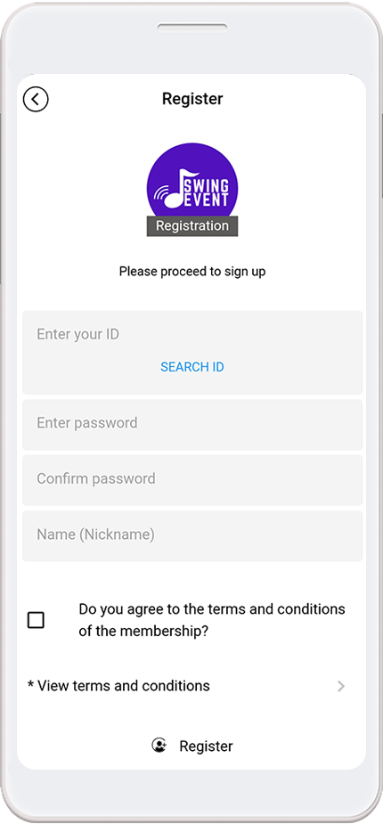
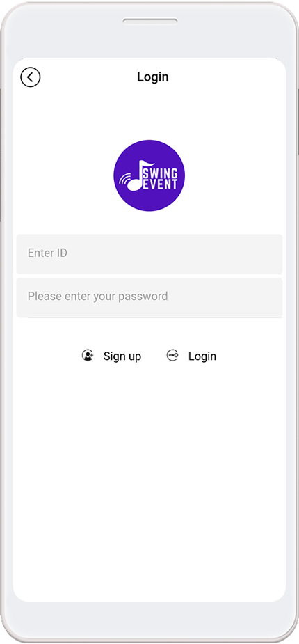
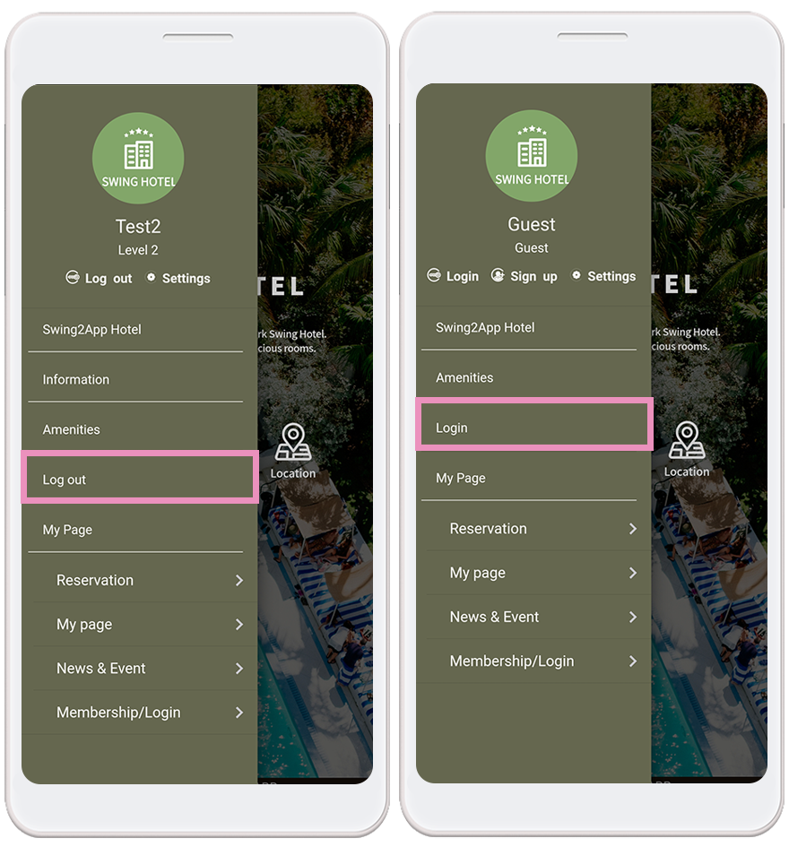
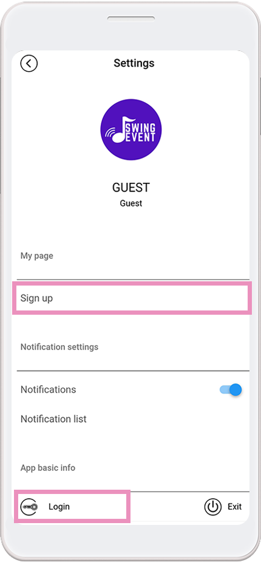

# Page Design - Sign Up, login & Settings Page.

***

**Page design provided by the page step - A swing page is a menu that provides the essential functionality of the app provided by Swing2App.**

Sign up, log in, and setting pages are some of the most common app features.

In addition to these functions, you can select a variety of functions from the swing page design and apply them to your app.

We'll show you how to apply the sign-up, login, and settings pages provided by the swing page design to the app and the app launch screen.

###  **1. Basic Feature->** Page: Sign up

.png>)

Go to the MakerV3 screen.

1\)Go to the STEP3 page

2\)If you don't have any default menus, please create a new one by clicking on the \[+] Add button

3\) Enter the menu name

4\) Select \[Basic Feature] - \[Page] in the page design option.

5\) Find the Signup page and select the \[Apply] button. (Hover the mouse cursor over the page and the Apply button opens)

6\) Press the \[Save] button at the top of the screen to apply it to the app.

\*If you select the Preview button, you can check how the page will look with a web preview (virtual machine).

\*Even after applying, you can still see how the page is applied to the app through the virtual machine.

#### **▶**&#x41;pp launch screen) Registration

This is the app launch screen with the registration function applied.

\*\*Basic Settings Items of Sign up- ID, Password, Password Confirmation, Name (Nickname)\*\* if you do not modify anything.

The items on the registration form can be modified by the operator himself.

\*App Manager page → services option → Subscription settings option → modify the information in the membership form.

You can find out more about how to set up the membership form by checking the manual link below.

**☞**<mark style="color:blue;">**Setting up the membership form**</mark>

***

###  **2. Basic Feature->** Page: Login

.png>)

Go to the MakerV3 screen.

1\)Go to the STEP3 page

2\)If you don't have any default menus, please create a new one by clicking on the \[+] Add button

3\) Enter the menu name

4\) Select \[Basic Feature] - \[Page] in the page design option.

5\) Find the Login page and select the \[Apply] button. (Hover the mouse cursor over the page and the Apply button opens)

6\) Press the \[Save] button at the top of the screen to apply it to the app.

\*If you select the Preview button, you can check how the page will look with a web preview (virtual machine).

\*Even after applying, you can still see how the page is applied to the app through the virtual machine.

**▶ App launch screen) Login**

The app launch screen with the sign-up feature applied.

The ID and password entry screen will be displayed.

**\*In addition to the general ID, the ID field will be changed when setting the email and phone number ID.**

The login screen also displays the ability to sign up.

**Once the login is complete, the login menu will change to 'Log Out'.**

After registering and completing the login, the login listed in the menu name will automatically change to → logout.

***

###  **3. Basic Feature->** Page: Settings

.png>)

Go to the MakerV3 screen.

1\)Go to the STEP3 page

2\)If you don't have any default menus, please create a new one by clicking on the \[+] Add button

3\) Enter the menu name

4\) Select \[Basic Feature] - \[Page] in the page design option.

5\) Find the Settings page and select the \[Apply] button. (Hover the mouse cursor over the page and the Apply button opens)

6\) Press the \[Save] button at the top of the screen to apply it to the app.

\*If you select the Preview button, you can check how the page will look with a web preview (virtual machine).

\*Even after applying, you can still see how the page is applied to the app through the virtual machine.

**▶App launch screen) Settings**

The app launch screen with the settings features applied.

Settings include both Signup and Login options.

So it's okay not to use the sign-up or log-in functions in the menu, just apply the settings to the app.

In addition to these features, we also provide **push-notification settings, notification list checking, app sharing, app version check, and admin login.**

Therefore, when creating an app, we recommend that you apply the setting function to the app and create it!

Administrator login is a feature that allows you to log in as an administrator and operate the app.

You can check the details of how to use the function by checking the manual link below.

**☞**<mark style="color:blue;">**App Manager menu to see how to use the menu**</mark>


**\*Important Information**

1\)Membership signup, login, and settings provided on the swing page are not applicable to the home screen.

It is only applicable to app menus (categories), so please use it only as a menu.

2\) It is recommended that you apply one function of 'login' rather than using membership and login together.

Or use the 'Settings' menu that comes with the registration and login menu.

3\) The membership registration form can be modified on the [<mark style="color:blue;">http://www.swing2app.co.kr/view/app\_policy</mark>](https://www.swing2app.com/view/app_policy) of the \[Subscription Settings] page, and when the ID form is modified, it is reflected on the login screen.

4\)Since the settings page is provided with a fixed content UX, the item cannot be modified like registering.

Available only on the pages provided.

5\) All the features (pages) provided on the swing page are only provided with a fixed design, so style modification is not possible.

Depending on the prototype color change, the background color, etc., can be modified, but the design cannot be changed.


***

***
