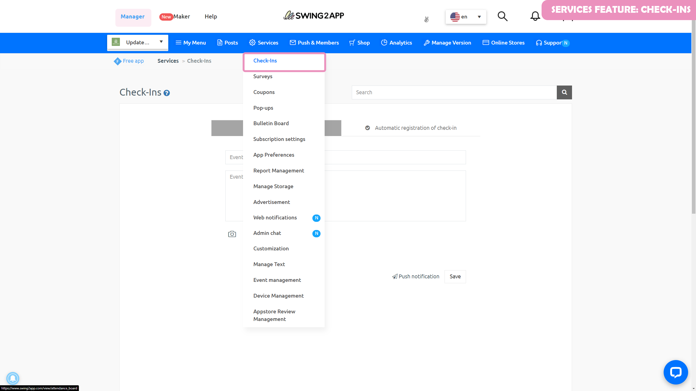
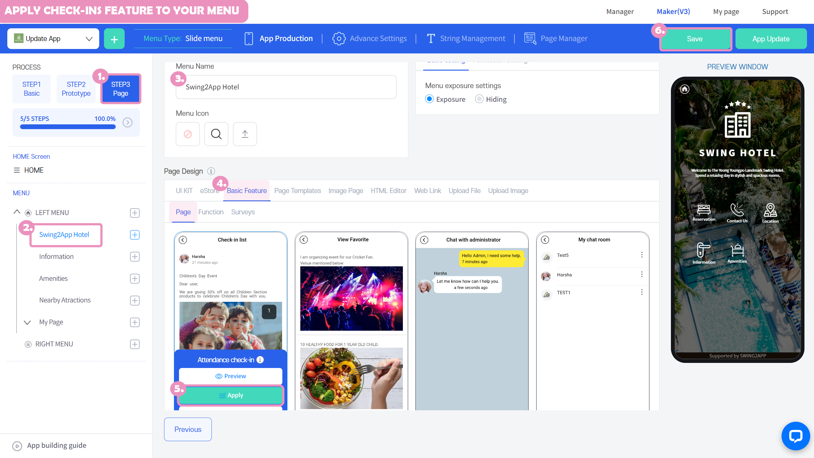
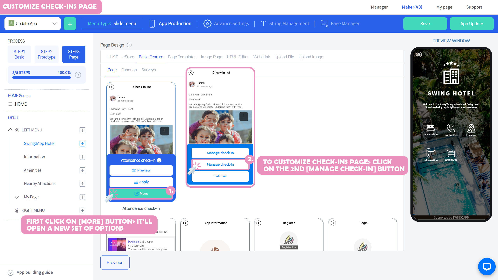

# Page Design - Attendance Check Page

**What is an attendance check?**

**It's a menu that can be used as a community and event, similar to a bulletin board, but with differences in that it has an attendance comment function and a closing function!**

Therefore, the attendance check is available from the service management menu and not from the bulletin board.

Various attendance check events can engage app members.

Check the manual to find out how to apply the attendance check page to the app.

###  **1.**Register for attendance check

Please check the registration method for attendance check through the manual below.

You can create an attendance check page first, and then apply it to your app.

Attendance check registration can be made in App Manager – Service Management. Also, please check the detailed manual.



###  **2.**Apply the attendance check menu to the app

Once the attendance check registration is complete, you will need to apply it to the app, right?

App Creation – On the MakerV3 screen, go to the STEP3 page, we'll apply attendance checks to the app!

Move the app creation screen

1\)STEP3 Go to the page step.

2\)Create a new menu. (+ Select the shape button to add a menu)

3\) Enter the menu name

4\) Select \[Basic Functions] - \[Page] in the page design.

5\) Find the 'Attendance Check' page and select the \[Apply] button.

(Hover the mouse cursor over the page and the Apply button opens)

6\) Press the \[Save] button at the top of the screen to apply it to the app.


\*If you select the Preview button, you can check how the page will look with a web preview (virtual machine).

\*After applying a page, you can also check how the page is applied to the app through a virtual machine.

\*Menu icon during the production phase, menu settings are not required.

In the manual, we proceeded without any input, and please apply additional if necessary when creating the app.


<mark style="color:red;">**\*Quick Menu**</mark>

You can go directly from the app creation to the attendance check page.

Select the \[Manage] button on the attendance check page → Select the \[Manage attendance check] button will take you to the app-operated attendance check page.

If you need to register a new attendance check or make any corrections, you can manage it by going directly from the App Maker.

###  **3.** App launch screen – check attendance&#x20;

Let's launch the app and see how the attendance check is executed in the app!

If you check the attendance check post, you can check the content and image of the post that you entered when you registered for the attendance check.

You can participate by commenting on \[Join Attendance Check Event] at the bottom of the post.

**▶Attendance check event closed**

When you close an event, the app will also display a window called 'Closed Event'.

**▶ Check the app manager dashboard**

App operators can check the comments on attendance check posts on the App Manager Dashboard – Attendance Check page.

\*You can check the confirmation X in the application, and the app operation page in the Swing2App homepage.

Once you have selected your username, you will be able to view your membership information.

***
