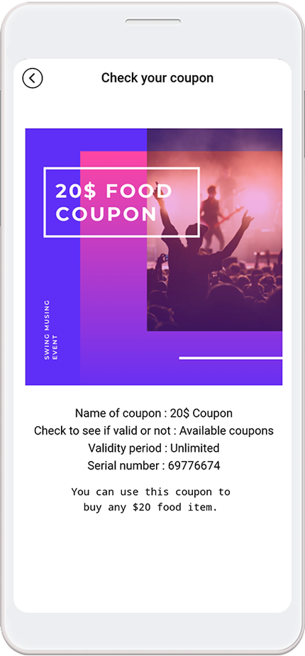

# Page Design - View Coupons Page

**What is the Coupon View menu?**

**Viewing coupons is a coupon lookup page for users where you can view coupons issued by the app and see which coupons have been used.**

When an administrator issues a coupon to a user, the user needs a page where they can see the list of coupons they have received.

The View Coupons menu allows users to see a list of coupons they have received and a list of coupons that have been redeemed.

So if you're running a coupon-issuing app, you'll have to apply that menu in the app's creation, right?

This function is available on page **MakerV3 screen-> STEP3 → Basic Feature→ View coupon page.**

I'll show you how to apply the coupon lookup menu to the app and use it\~!

**Find out how to create and apply coupons!**

The coupon must be registered by the administrator by first creating a coupon for use in the app in the manager screen, and then moving on to the app makerv3 to apply the coupon lookup page to the app.

And in the manager screen of the app, the administrator can issue coupons to the user and process the usage.

**STEP.1 Create a coupon**

Manager page → Services → Coupon → Enter the coupon details to be issued by selecting the \[Add Coupon] button.

**STEP.2 Issuing coupons**

From the coupon management page → select the \[Send Coupon] button → 1) Select the recipient settings → 2) Select the member you want to send push → 3) Select \[Send Coupon] → 4) Push message Subject → 5) Push Message Content → 6) Register Image → 7) Select \[Send Coupon].​

**STEP.3 Processing coupon redemption**

On the Coupon Management page, select 1) \[Use Coupon] button → 2) Enter Coupon Serial Number → 3) \[View and Use Coupon].

Alternatively, you can select the App Manager menu in the app to process coupon redemption.

**☞** <mark style="color:blue;">**\[ Go to the full process manual for creating and issuing coupons]**</mark>

###  **1.** Apply the coupon lookup menu to the app

On the MakerV3 screen.

1\)Go to STEP3 Page&#x20;

2\)Select Menu or Create a new menu. Click on the \[+] button to add a new menu.

3\) Enter the menu name

4\) Select \[Basic Feature] from under the page design.

5\) Find the 'View coupon' page and select the \[Apply] button. (Hover the mouse cursor over the page and the Apply button opens)

6\) Press the \[Save] button at the top of the screen to apply it to the app.

\*If you select the Preview button, you can check how the page will look with a web preview (virtual machine).

\*Even after applying, you can still see how the page is applied to the app through the virtual machine.

###  **2. App launch screen**

After launching the app, select the \[Check My Coupon] menu, and the coupon lookup page will open.

When the app issues a coupon, the coupon you received appears in the list of available coupons.

\*If there is no coupon issued, the message "Coupon does not exist" will be displayed.

When you select a coupon from the coupon list, the window switches to full screen so you can see the coupon details in more detail.

**- Check the coupons used**

If the coupon you receive is used by the administrator, you can see that it has been used in the \[Used coupons] list.


Have you checked how to use the Coupon menu?

On the app makerv3 page, you can apply the Page Basic Feature - View Coupons menu to your app to see the coupons that users have received.

**How to create coupons, issue them to users, and process them for use, please check the manual below for the whole process\~!!**

**☞** <mark style="color:blue;">**Go to Create and issue coupons**</mark>


**Related Articles**

* [페이지 기능-관심글 보기](https://wp.swing2app.co.kr/documentation/v3manual/viewfavorites/)
* [페이지 기능-게시물 검색 기능](https://wp.swing2app.co.kr/documentation/v3manual/postsearch/)
* [페이지 기능-회원가입, 로그인, 설정](https://wp.swing2app.co.kr/documentation/v3manual/join-login/)
* [푸시, 웹뷰앱 초간단 앱제작방법](https://wp.swing2app.co.kr/documentation/v3manual/push-webview/)
* [업데이트 유형별 앱 실행화면](https://wp.swing2app.co.kr/documentation/v3manual/update-type/)
* [앱 업데이트 방법](https://wp.swing2app.co.kr/documentation/v3manual/app-update/)
