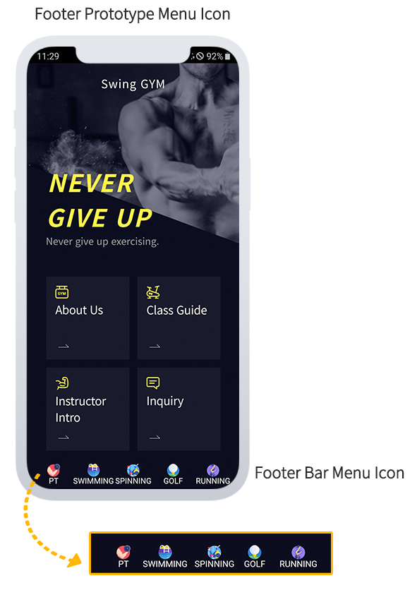
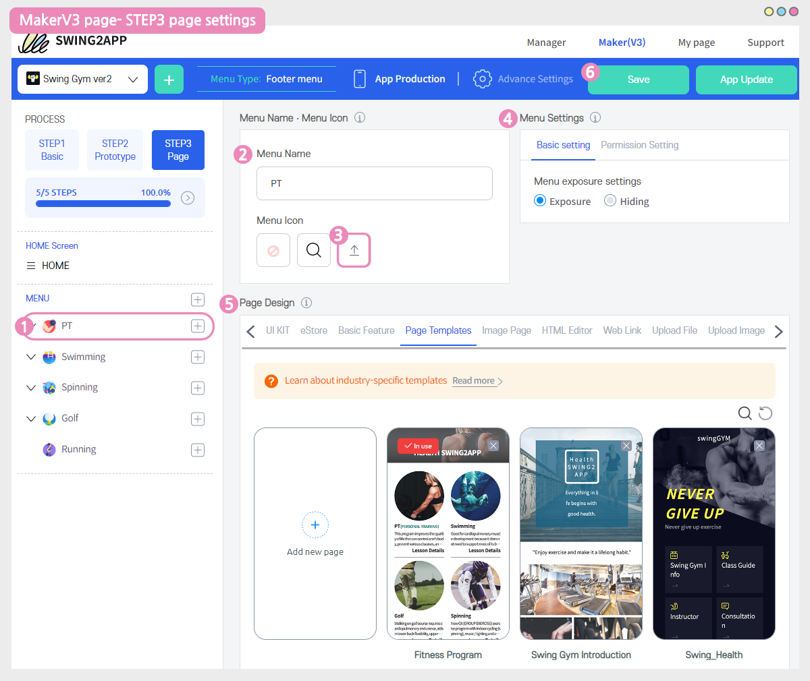
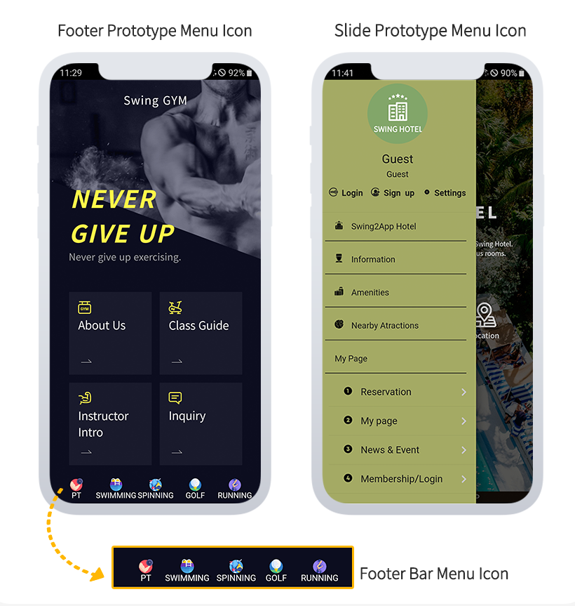

# Registering a menu icon image

**How to register a menu icon image**

When you create a generic prototype app, you can register an icon in the menu.

(When creating a push-only app, there is also an icon menu in the toolbar, and you can register an image from that menu as well.)

In addition to the built-in icon image in the app MakerV3 screen, the user can register and use the desired image themselves.

Check out the manual to see how to organize the menu and how to register icon images.

 (1) (1).PNG>)

### .png>)App launch screen) icon image Check registered apps

​It's a footer prototype app.

If you look at the bottom footer bar, you can see that the icon image is registered in the menu.

<mark style="color:blue;">In the previous MakerV2 version, the icon could only be selected as an image provided by Swing2App.</mark>

<mark style="color:blue;">In the MakerV3 update, if you have an icon image you want to add, you can upload the file directly and use it.</mark>

Below we will show you how to register an icon image in the menu.

 (1) (1).PNG>)

###  Registering a menu icon image

The menu icon image can be applied in step STEP 3 of the page.

1\)Select menu (You can create a menu by selecting the \[+] button)

2\)Enter the menu name

3\)Select the third \[Upload] button from the menu icon.

4\)In the file attachment window, select the image you want to register on the icon.

5\)The menu settings were used exactly as the set values.

(If you need the corresponding function, such as menu activation, permission setting, etc., please apply the modification)

6\)In the page design, please apply the page to connect to the menu.

In this manual, you created an industry-specific template in advance and applied it.

7\)Select the Save button to finish.

\*Save will be automatically reflected in the app as well. You don't have to re-create the app.

​STEP3 Page steps simply need to be saved after you work, and they are automatically reflected in the app, so no updates are required.

You can also check it on a virtual machine, but most of all, you have to make sure that the image is displayed in the app!!

We recommend that you run the app on your mobile and test it.


**\*Icon images can only be applied to squares of the same width\*height length, and sizes should be at least 20px to 512px or less.**

However, since it is an image that is displayed on a mobile phone with a high resolution, it is recommended to register at least 100px so that the size is not too small.

If the image resolution is low, the image quality may appear poor in the app.



**\*You can design the image you register for the icon yourself, or you can download and use the image for the icon from the icon site.**

However, when using images taken from external sites, please be careful if they are copyrighted.


​

 (1) (1).PNG>)

###  App launch screen) to check the icon image

The screen on which the icon image is applied to the menu is applied.

I've registered an image for each category.

It is well displayed on the screen without breaking the resolution.

In addition, I registered an image of a menu icon in an app that prototyped slides.

I think it would be nice to put an icon image to fit your prototype.

**\*Icon images can only be applied to squares of the same width x height length, and sizes should be at least 20px to 512px or less.**

The image size I registered is 512\*512px.


<mark style="color:red;">**Instructions**</mark>

The icon image registration function is an addition to the MakerV3 version and is not available in the MakerV2 version.

If you use this feature, you can switch to the MakerV3 version.&#x20;

Be sure to proceed with the initial update at the time of the transition.


