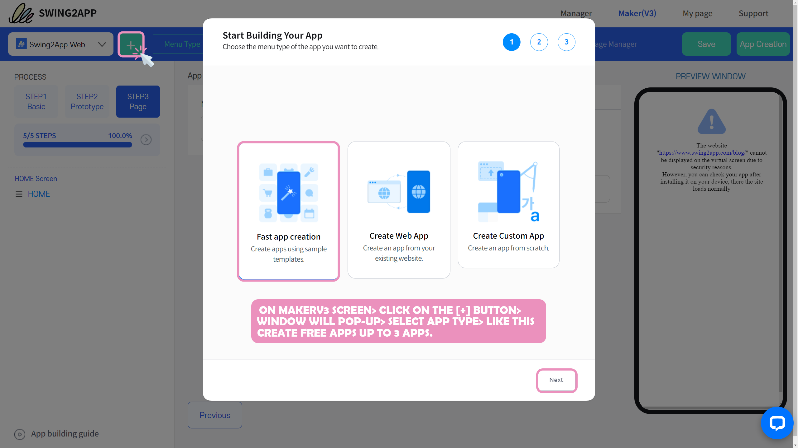
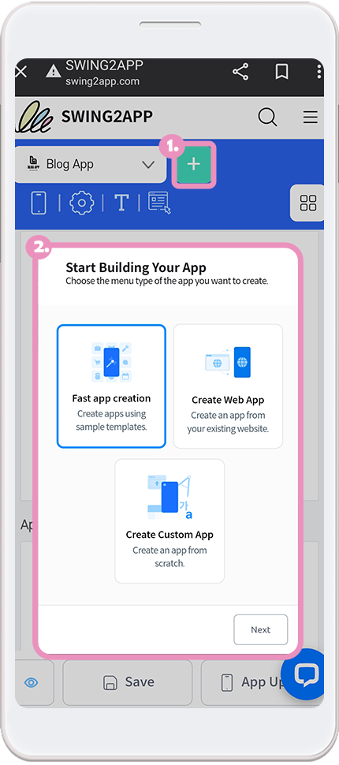
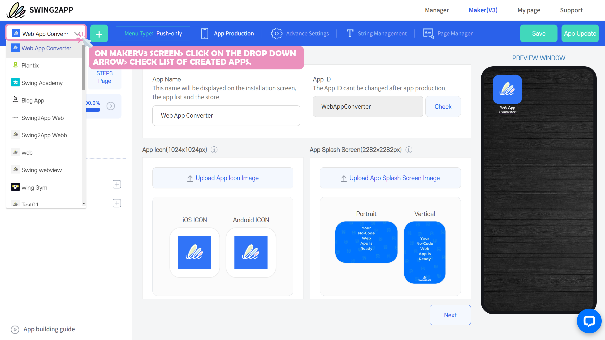
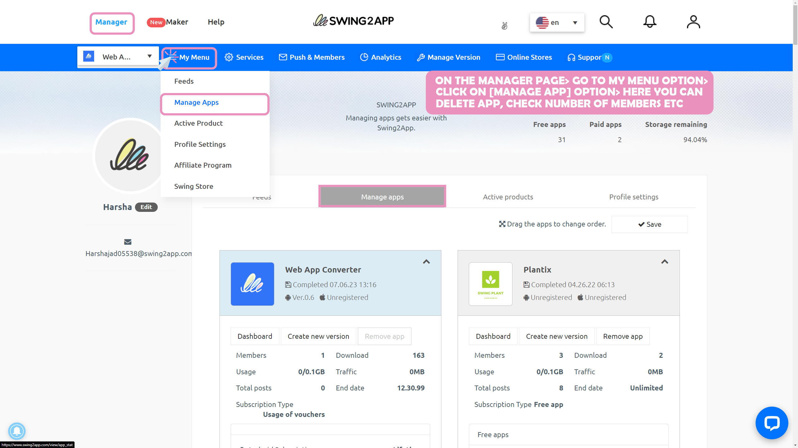

# How to create an additional app

### How to create an additional app

Swing2App lets you create and manage multiple apps in one account!

**+Free swing2app users can create up to 3 apps in one account**

**+Paid swing2app users can create up to 10 apps in one account.**

We'll show you how to create additional new apps in your account.

***

## \*\*\*\* **1.** PC Version – Create additional apps

**First, let's access the PC version of the Swing2App homepage and add the app\~**

<figure><figcaption></figcaption></figure>

**After logging in to the Swing2App homepage, go to the \[MakerV3] screen.**

There is a button that looks like **\[+]** at the top of the App Maker screen.

You can use this button to create a new app. After you'll click on this button, **the App Creation Wizard pop-up window appears.**

After you select a new app style (type), the app makerV3 screen will pop up and you can proceed with the app creation step by step.

***

## \*\*\*\* **2.** Mobile version – Create additional apps

**Did you know, In addition to the PC version of the site, the Swing2App can also be used on mobile to create an app!**

**We'll also show you how to use \[Add App] to create a new app on your mobile.**

Accessed the Swing2App site on my mobile and it will take you to the app manager page.

On mobile, you **can create additional apps by pressing the + button next to the app name.**

When you click on the add button, **the \[App Creation Wizard]** window will pop up just like the PC version.

The rest of the app production method is the same.

***

## \*\*\*\* **3.** See the list of apps you've created

**Where can I find a list of apps created by Swing2App as well as newly added apps?**

<figure><figcaption></figcaption></figure>

**We've provided a list of apps in the upper-left corner of the Swing2App MakerV3 dashboard.**

Click on the drop-down arrow button with the mouse to open a list of apps.

You can see all apps created by you in your account.

To switch from one app to another, simply select the app from the list and it will take you to its app creation screen.

### **▶**&#x4D;anage your apps

<figure><figcaption></figcaption></figure>

<mark style="color:blue;">**Go to App Manager Page-> My Menu-> Manage apps**</mark> option for information on all of your apps.

On the Manage Apps page, you can uninstall (delete) apps, change the order of apps, check expiration dates, and view simple information such as the number of members.

***
