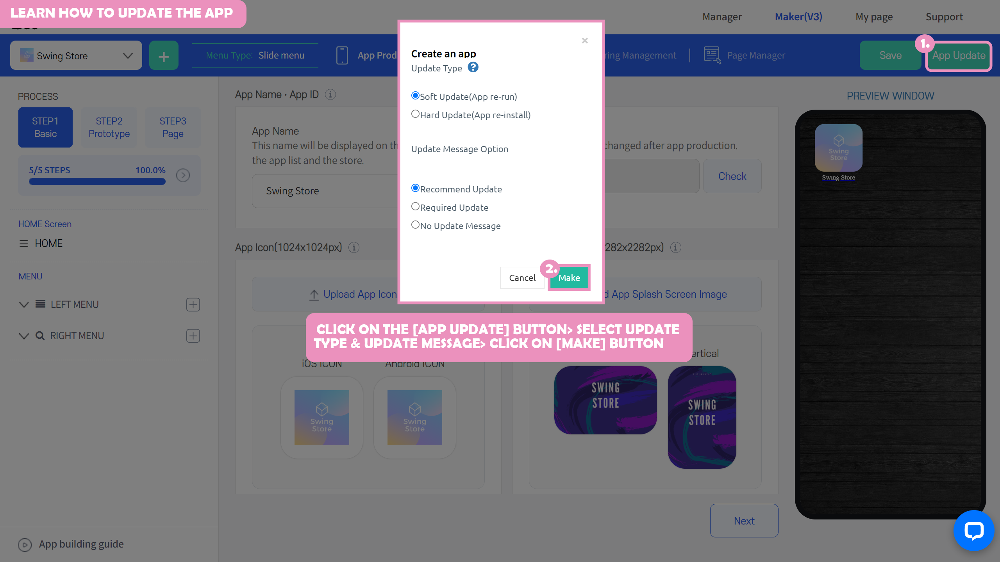
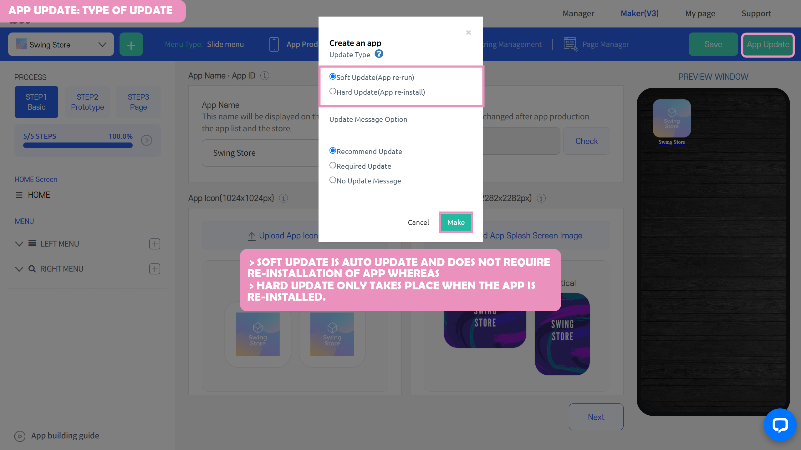
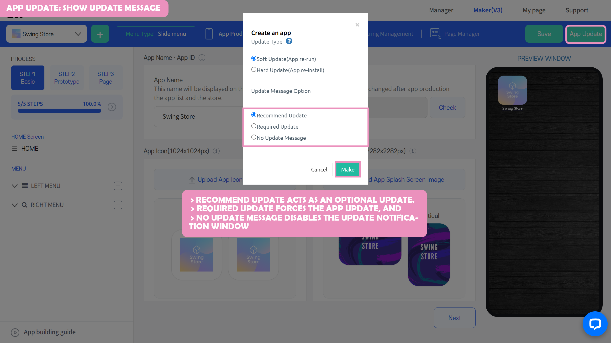

# How to update an app

**How to update your app: Guide to updating your created app**

In Swing2App, you can freely modify and update the app design, content, etc for unlimited times.

**-When modifying the app basic information and design theme, you can create the app in a new version by clicking on the \[Save] button, and then clicking on the \[Update App] button.**

After you click on the \[Update App] button, you can choose the update type and select you you want to show an update notification.

**-Page menu and app manager contents can be automatically reflected in the app even if you just save it.**

<figure><figcaption></figcaption></figure>

###  How to update an app

**★ In Swing2App, you can modify and update your apps unlimited times!!**

If you modify the page menu content on the app maker page, just press the \[Save] button and it will be reflected directly in the app.

When modifying the app basic information and design theme content, you must update the app to the new version by pressing the \[Update App] button.

→ When requesting the creation of an app, please select 'App Update Type' and 'Show Updates option' to proceed with the update.

You will be able to see modified content after confirming the update requirement message within the app.

###  Swing2App App Update Important Content

<mark style="color:red;">**\*This is important, so please check it first!!**</mark>

**1.Step 3, Page Menu during the app creation phase to modify the contents and use all the features of the app operation.**

→ just press the Save button and it will be automatically reflected in the app and you will not have to re-create the app.

**2. Step 2 during the app creation phase \[design theme] – Change prototype, change skin color**

→ Press the \[Update App] button to recreate it.

→ Apps not released on Store \*Update Type: Select Soft Update. Select Hard Update if your app is released on the Play Store, App Store, etc. (see below)

→ Users whose apps have been released to the Play Store, App Store, etc. will need to update the new version of the app within the Store after the new version of the app is created.

★ \[Soft Update] is displayed when the app is produced 3 or more times. Only 1 to 3 times can be updated hard.

**3. Step 1 of the app creation phase \[Basic Information] – Change the app name, standby screen image, icon image**

→ Press the \[Update App] button to recreate your app. \*Update Type: Select Hard Update

→ Users whose apps have been released to the Play Store, App Store, etc. will need to update the new version of the app within the Store after the new version of the app is created.

###  Play Store, App Store Update Guide

**1.If you need a Store Update**

\=> App Basics, Design Themes

If you modify the app name, icons, standby image, and design theme, you will need to make the Hard update and then update the newly created version of the app to the Store.&#x20;

\=>If you modify the Store information other than your app (store launch app name, app description, screenshot image, etc.), you will still need a Store update.

**2.All app operation functions and page menus do not need updating.**

Menu and content modifications and registrations are all automatically reflected in the app as long as you save them.

**\*Important\* Please check when updating apps released on the Play Store and App Store!**

**The type of update provided by the Swing2App app: Soft updates are not the official update method provided by Google.**

**Users who have had their app released on the Play Store are encouraged to proceed with a hard update → without using a soft update and then update the new version of the app within the Store**

When making a soft update, you can receive sanctions such as the deletion of apps according to the rules of the Play Store and App Store.

Swing2App does not take responsibility for this option, so be sure to check the contents before proceeding.

If you have not launched your app on the store and you are a free user, in that case, you can proceed with the soft update.

***

## App update type, display options

***

### **1.** Update Type

<figure><figcaption></figcaption></figure>

**1) Hard Update**

A hard update is **a type of update that you download by reinstalling the updated app.**

**\*Hard updates can be selected when modifying the app basics in Step 1.**

**2) Soft Update**

The Soft update does not require you to reinstall the app, it is an updated style that is automatically downloaded within the app.

**\*Soft update can be used to modify the design theme in step 2, and when modifying the basic information of the app in step 1, you must choose Hard Update.**

**\*For those who have the app released on the Play Store, please select Hard Update (App Reinstallation) instead of soft when modifying the design theme!**

***

### **2.** Show Updates option

<figure><figcaption></figcaption></figure>

The \[Update message option] is for how you want users to see updates.

**If you need want to make updating the app mandatory before user can use the app, select the 'Required update' option.**

**If you want to make an update optional, then select the 'Recommended update' option.**

**1) Recommended Updates**

Ask the user if they want to update, and only the user who selects OK will proceed with the update. (Optional update)

**2) Required Updates**

Forces the update without the user’s selection**.**

**3) Don't show updates**

Disable the update notification window. (You can set it up when you are doing app testing, etc.)

***

###  **3.**App launch screen: Update type

Depending on the type of update, let's see how the update works in the actual app.

#### <mark style="color:blue;">**1)**</mark><mark style="color:blue;">Soft Updates &</mark> <mark style="color:blue;"></mark><mark style="color:blue;">**Recommended Updates**</mark>

.png>)

In this type of update, the message window will **pop up asking users if they want to update the app.**&#x20;

**The user must select 'OK' for the update to proceed.**

Because the recommendation is for the update to progress by the user, if you **select 'Cancel', the update will not proceed.**

For soft updates, you don't have to reinstall the app, update will be **downloaded from within the app and will be updated automatically.**

<mark style="color:blue;">**2)**</mark>** **<mark style="color:blue;">**Soft Updates & Required Updates**</mark>

.png>)

Because it's a soft update, you **don't have to reinstall the app, it's downloaded from within the app and gets auto-updated.**

When selecting the display **option as 'Required',** **a pop-up will appear to inform the user that an update is taking place.** &#x20;

***

<mark style="color:blue;">**3)**</mark><mark style="color:blue;">**Hard Update & Recommended Updates**</mark>

.png>)

**Hard update, on the recommended selection, a message window will pop up asking if you want to do the → update, and the user will have to select 'OK' before the update will proceed.**

If you **choose to 'Cancel'** because it is optional, the update will not proceed.

In case of a hard update, unlike software**, it moves to the mobile phone device and installs the new version of the app again.**

It will install the update of the existing application and install it again by overwriting it with the new version of the app.

**\[Reinstall Progress]**

***

<mark style="color:blue;">**4)**</mark>** **<mark style="color:blue;">**Hard Updates & Required Updates**</mark>

.png>)

Hard Update, if you choose Required, **the update will proceed immediately if you click OK.**

The same hard update will **go to your phone device and reinstall the new version of the app.**

It will install the update of the existing application and install it again by overwriting it with the new version of the app.

**\[Reinstall Progress]**

### <mark style="color:red;">\[Instructions]</mark>

You can freely edit the app created by Swing-to-App even after making the app.

**Page menu steps – Contents such as menu modification and content registration are automatically reflected in the app by simply pressing \[Save], so you do not need to update them separately.**

**In addition, the various functions provided by the Manager page can be applied and immediately reflected in the app.**

**- What needs to be updated?**

**\*App Basics – Modify app name, icon, standby screen image**

**\*Design Themes - Prototypes and skin color modifications require app updates.**

Therefore, press the \[Update App] button to recreate the app in a new version.

The modifications are reflected accordingly when you are updated to a newly created version.

<mark style="color:red;">**\*Important\***</mark>** Soft updates are not officially provided by Apple and Google.**

Therefore, **users who have released an app to the Play Store or the App Store are advised not to use the soft update, but to proceed with the → Hard Update, and then update the newly created version of the app to the Store.**

When making a soft update, you can receive sanctions such as the deletion of apps according to the rules of the Play Store and App Store.

The Swing2App does not take responsibility for this option, so be sure to check the contents before proceeding.
