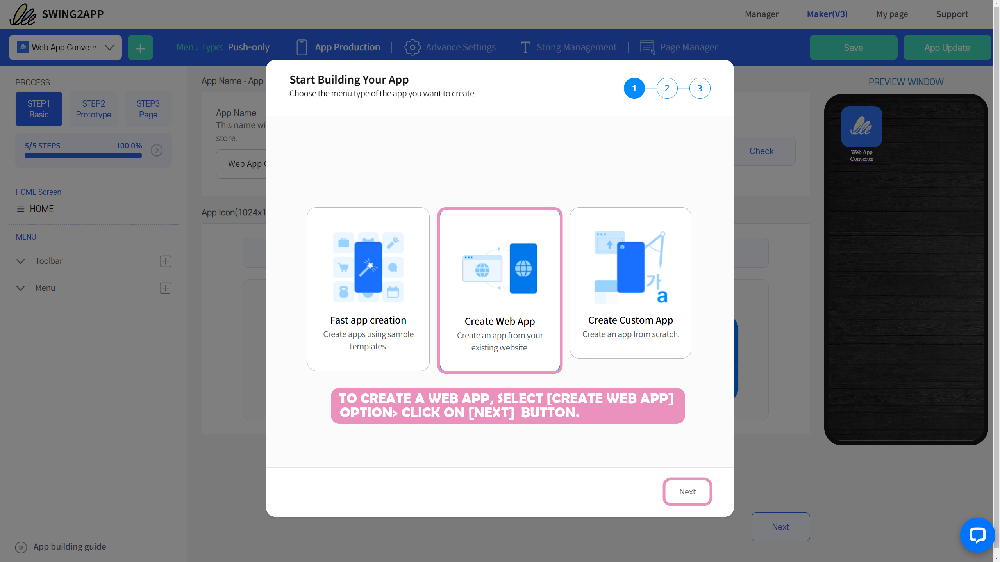
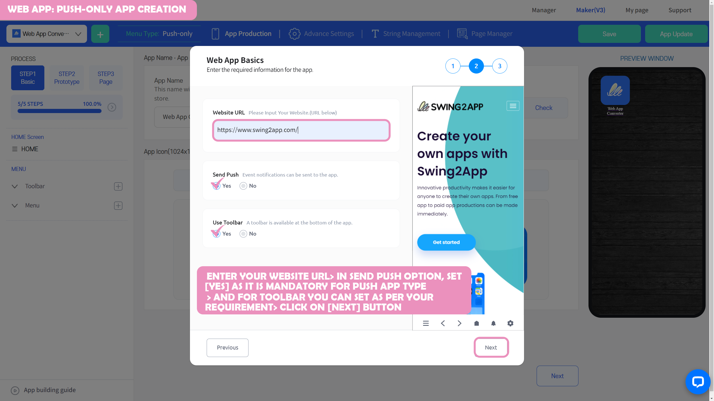
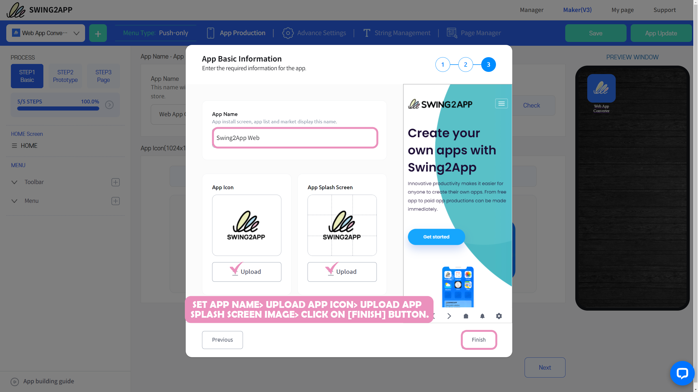
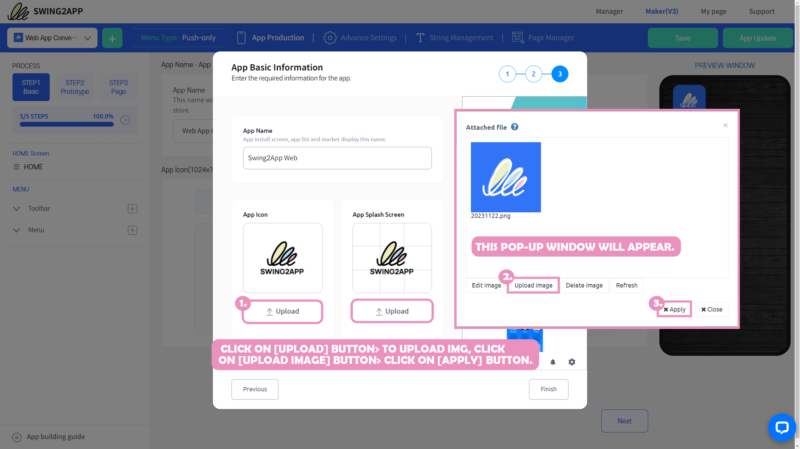
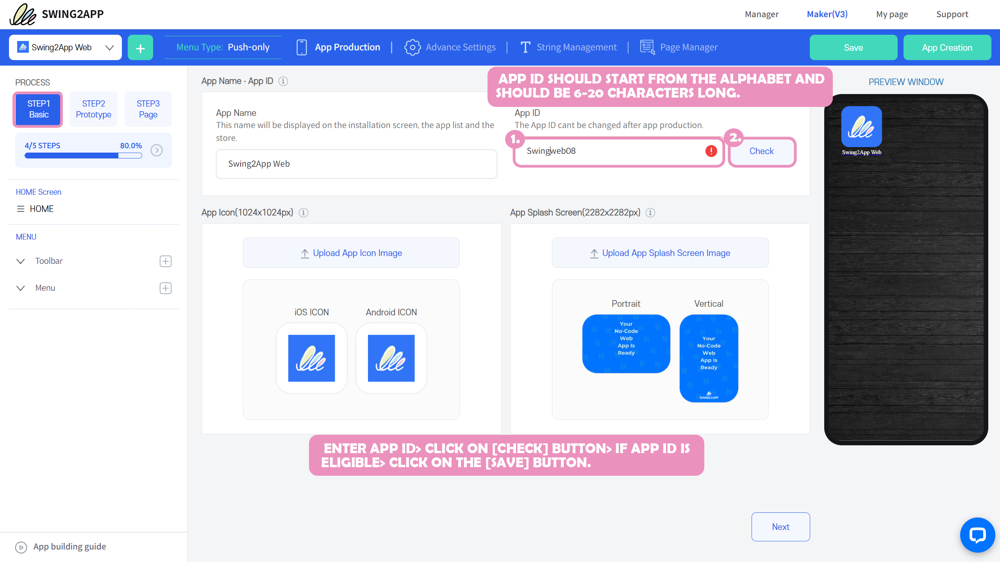

# Pushapp manual

**App Maker V3 Version –**&#x20;

> **What is a push app?**
>
> Push App is a web app production platform created by attatching a link to a mobile web URL such as a homepage.
>
> Because the website works within the app as it is, you can create the same app as the web.
>
> Unlike a webview app, the biggest feature of a push app is that it allows you to send push notifications to users who have installed the app via Swing2App platform!

***

## **STEP1.** App Creation Wizard

When you first create an app in a Swing2App or build additional apps, the App Creation Wizard splash screen (a pop-up window) pops up first.

Here, you choose what type of app you want to build, then enter the basic information and you'll be taken to the App maker.

**​**

<mark style="color:blue;">**1.App Creation process: Select a web app based on the website**</mark>

<figure><figcaption></figcaption></figure>

For push apps, please select the 2nd method of creation, "Web App Based on Website".

This is a style that creates a website by applying it to the app as it is.

Select the \[Next] button.

<mark style="color:blue;">**2.Enter web app basic information**</mark>

The next step is to enter the basic information, where you enter the basics needed to build a web app.

<figure><figcaption></figcaption></figure>

**1) Enter the website address (URL).**

This is the site link you want to apply to your app, and be sure to include a complete hyperlink.

After entering the link address, a single click on the mouse cursor in the empty space will be reflected.

You can check if the applied site is popping up well with the preview window (virtual machine) screen on the right.

**2) Check whether the push function is enabled**

Push is a feature that allows you to send push notifications to your users via Swing2Appp who have installed your app to send information about announcements, and promotional reminders from the app.

**Since we will be making it a push app, please check the use of the push option as 'Yes'.**

If you check whether to use the toolbar or not, the toolbar will be visible at the bottom of the app screen, and if you check 'No', the toolbar area will not be visible in the app.

So make sure you set it to match your app's style.

Select the \[Next] button.

​

<mark style="color:blue;">**3.Enter app name, icon, standby screen image**</mark>

<figure><figcaption></figcaption></figure>

The final step is to **register the app name input, app icon, and standby image.**

App names, icons, and splash screen images can all be modified again in the App maker.

If the image isn't ready yet, you can just enter the app name and press the Submit button.

Icons and images that will fit on the splash screen can be reapplied in the App maker.

​

<mark style="color:green;">**–> How to upload icon and splash screen image**</mark>

<figure><figcaption></figcaption></figure>

On the app icon and the splash screen, select the \[Register] button and the file attachment window will open.

You can upload an image here and apply it.

\- Icon image size: **1024px\*1024px**

\-Standby screen image size: **2282px\*2282px**

When the image upload is complete, select the \[Apply] button.

When the App Creation Wizard registration is complete, the App Maker screen opens.

If you look at the app creation process on the left, you can see the steps on the STEP1 Basic Information, STEP2 Design, and STEP3 Page.

Step by step, enter your content and you're done.

**\*When the STEP progress reaches 100%, it means all step inputs are complete.**

**​**

### Basic Information

<figure><figcaption></figcaption></figure>

**STEP1 The contents in the basic information have already been registered in the App Creation Wizard except for the app ID.**

If you modify the app name, you can re-enter it.

If you modify the app icon, splash screen image, or register a new one, you can complete the registration on that screen.

1\) Enter App ID <mark style="color:red;">**\*The app ID is the unique identifier of the app and cannot be changed after setting.**</mark>

2\) Enter the app name

3\) App icon image **(1024px\*1024px)**

4\) App standby image registration **(2282px\*2282px)**

5\) Select \[Save] button

**​**

**\*App icon image, splash screen image: Please create an image according to the size listed on the screen first, and then register.**

**For icons and splash screens, please first look at the Production Guidelines Manual and create them!**

<mark style="color:blue;">**Go to the icon image creation guide**</mark>

<mark style="color:blue;">**Go to the splash screen image creation guide**</mark>

**\*App name, icon, and splash screen images, except for the app ID, can be modified and updated without limitation.**

**When modifying the app basic information, you need to press the \[App Update] button to update to the new version**.

**​**

<mark style="color:red;">**\*Information**</mark>

If you modify the STEP1 Basic Information menu again after the app is created, you will need to update the app again before the app will reflect the changes.

For example, if you changed the name of your app, save → after the change → press the Update App button to recreate it as a new version.

If it's released on the App Store or Play Store, you'll need to resubmit updates to that Store as an updated version of the app.

The STEP3 page step will enter a link to the website that applies to your app, which you have already registered in the App Creation Wizard.

If you want to edit the site address, please re-enter it in the appropriate step. If you don't have anything to modify, just save it.

1\)Enter your website address

2\) Address setting: Choose whether to set the first run address

\*First Run Address Line In addition to the website associated with the app, when users install the app that separate web page is only visible the first time.

Check 'No' if you don't use it, or 'Yes' if you don't use it. Please include a complete Hyperlink when entering your site address.

3\)Select the Save button

​

<mark style="color:red;">**\*Information**</mark>

The STEP3 page menu is automatically reflected in the app by simply modifying and saving it. You don't need to update the app (recreate the app).

***

\
**STEP2. Purchase of vouchers and tickets**
-------------------------------------------

There are two types of products that can be purchased in the push app.

You can purchase the product you want from among the two.

&#x20;

**1. Swing2App Basic Pass (Purchase a 1-month pass monthly or purchase a pass for each desired period)**

<figure><figcaption></figcaption></figure>

**-Information of purchase products**–

Manager → Online Stores → Go to the Vouchers & Tickets page. [https://support.swing2app.com/view/shop\_list](https://support.swing2app.com/view/shop\_list)

**▶ Swing Basic Ticket (1 month) $33 + Play Store upload ticket $5 + App Store upload ticket $20**

\-Swing basic type (1 month) product has a 30-day period of use, and if you continue to operate the store app, you must purchase it every 1 month.

\-The upload ticket is an optional product (the cost of uploading the user’s app to the store instead of the swing2app), so you only need to pay once at the time of initial registration.

**\[Recommended pass]**

<figure><figcaption></figcaption></figure>

If you purchase a 6 or 12 months long-term pass, you can use it at a lower price than purchasing a monthly pass.

\-Swing basic pass (12 months) $290, 26% discount from monthly purchase

\-Basic Swing Pass (6 months) $160, 19% discount from monthly purchase

**or**

**2. Push-only Lifetime Paid App (Unlimited use without period limit for one payment)**

**-Purchase product information-**

<figure><figcaption></figcaption></figure>

Manager → Online Stores → Go to the Swing2App plug-in purchase page

 Push-only Lifetime Paid App (Android + iPhone) $550 + Play Store upload ticket $10 + App Store upload ticket $20

If you want to continue using the push app without a period of use, please purchase the ‘Push-only Lifetime Paid App’ product on the swing plugin purchase page.

**Once purchased, no repurchase! No period limit! Unlimited!**

 **Recommended tip**

If you plan to run the app for a long period of time, and if you run the app without a period of use, we recommend purchasing the’Push-only unlimited paid app’ product.

You can purchase products for each platform according to the launch of the Play Store and App Store, so you can use them reasonably.

You can purchase each upload ticket in the same way.&#x20;

Play Store upload ticket $10 + App Store upload ticket $20

**1) View product details**

Before purchasing a voucher or ticket, be sure to check the product details!

If you click the **\[Purchase]** button, you can check the service and usage information provided in the voucher in detail.

Therefore, be sure to check the product before purchasing.

If you are not sure about the contents, please leave an inquiry on the inquiry board. We will help you in detail. ^^

&#x20;

**2) Please check the upload ticket issue and product details.**

\-The upload ticket is an optional product (the cost of uploading the user’s app to the store instead of the swing2app), so you only need to pay once at the time of initial registration.

\*However, if there is an app update, you need to repurchase the upload ticket because you need to update the app on the store.

\-It is up to the user to decide which store to launch, so if you only launch the App Store, you only need to purchase the App Store upload ticket.

\-If the user can directly upload the Play Store, they only need to purchase a ticket and upload it directly. (You do not need to purchase an upload ticket.)

\-Since the App Store is only available as an upload agent, if you plan to release it, be sure to purchase and apply for an App Store upload ticket.

&#x20;

**​3) Please register for Apple or Google developer account. (Before store registration)**

\*0In addition to the cost to pay for Swing2App, the Apple developer account registration fee ($99 for 1 year).

Google developer registration fee (25 dollars, lifetime use) must be made and paid by the user.

\-Google must have a Google developer account in the user account to register

\-Apple is optional for developer account: Select between user Apple developer account registration or Swing2App account proxy registration

***

&#x20;

## **STEP3. Store upload application**

If you purchased both the voucher and ticket above! You must apply for an upload to receive an upload application through Swing2App.

\*After moving to the Manager → Manage Version → Production History menu, select the \[Play Store upload] or \[App store upload] button in the market registration column.

<figure><figcaption></figcaption></figure>

An application pop-up will appear, and you must fill in the contents according to the application form and apply for upload before the upload application is delivered to Swing2App.

\*Please make sure to apply for upload after payment

**☞** [**\[How to apply for play store upload\]**](https://support.swing2app.com/documentation/appmanage/version/playstore-upload/)

**☞** [**\[App store upload application method\]**](https://support.swing2app.com/documentation/appmanage/version/appstore-upload/)

&#x20;

After purchasing all products such as use vouchers, please apply for upload to the Play Store or App Store, and we will act on your behalf to upload your app to the store.

You must check the policies for each store.

**\*Store registration**

***

&#x20;

**STEP.5 Store launch complete (release after review)**

<figure><figcaption></figcaption></figure>

When the application is completed, the Swing2App playstore uploader / Appstore uploader starts the upload process to upload your app to the store.

\*Play Store Review Period: 7 days

\*App store review period: 1 week to 2 weeks

Since the review time is long for each store, you have to wait for the review period after applying for upload.

**-When the upload process starts, we will send you an e-mail with information on policies and important notices for each store.**

**-After the normal release, an e-mail and text message (if a user number is registered) will be sent.**

**-If the screening is rejected, we will inform you of the reasons for refusal and actions to be taken, and re-examination will be done without any additional upload ticket fees.**

When the store launch is complete, you can check the released apps on the Play Store and App Store.

App Store is exposed when searching for the app name immediately after the app is released.

In the Play Store, even when the app is released, the name search does not work right away.

\*Google checks how actively the app is running and converts it into exposure to prevent indiscriminate release even after app release.

Therefore, you need to install a lot of apps and manage reviews, ratings, etc. As time passes, the app name search will be exposed.

Make sure to check the contents of the store policy so that there will be no problems when using the app release.

**By all means! Please check.☞** [**\[Check the store terms and conditions\]**](https://support.swing2app.com/market-policy/)

***

&#x20;

## **STEP4. Sending push from push app**

&#x20;

Push apps can send push messages to users who have installed the app!

Therefore, if the app is created, check the push sending function and familiarize yourself with how to send a push.

**\*Push can be sent from the Manager page → Push & Member → Send push page.**

[https://support.swing2app.com/view/push](https://support.swing2app.com/view/push)

&#x20;

**Please check the manual below for how to send a push app.**

**☞**[**Go to see how to send push in push app**](https://support.swing2app.com/documentation/appmanage/pushmember/pushapp-push/)

***

&#x20;

## **STEP5.Precautions and push app production Q\&A**

&#x20;

**Q.The push app is said to be difficult to release on the App Store and Play Store. Is it correct?**

**–Play Store–**

Web view and push version apps (web apps that link the website) must submit supporting documents (prior notice documents) in accordance with the Google Web View policy.

In order to prove that the site connected to the app is owned by you or the company (company), you must submit a prior notice document such as a business registration card or website domain registration confirmation.

When submitting the documents, you can launch the web view app on the Play Store without any problems.

**–App Store–**

In fact, because Apple does not approve webview apps by policy, it is often rejected in the review and may not be released.

However, there are some apps that are released, so the webview app must be reviewed before you can know whether it is released.

We will appeal to you as much as possible to help launch the App Store, but please understand that we cannot determine whether the user will release the app or not!

\* PC version web other than mobile web will be rejected. The website must be connected to the mobile web.

\*Web apps that have only content for promotion or marketing on the web, have no content, or have restricted users’ participation will be rejected.

\* Please note that even if the store launch is rejected, the fee for use and upload tickets are not refundable for apps that have been registered in the App Store.

&#x20;

**Q. Can I create a push app by connecting to any site?**

When creating a push app, you must be careful, do not use other companies or famous brands’ sites as if you were creating them!

You can only use the website operated by our company and the website you created (using a hosting company).

There are many users who want to link their own Naver blog or Daum Cafe through web view or push.

If these sites are linked to the app, errors or not working properly.

\* These apps cannot be released on the Play Store or App Store. (Rejected due to copyright or brand imitation)

And among web links, there are sites that do not work with the app, that is, embezzlement is prohibited.

\*Portal sites such as Naver and Daum, sites provided by the portal (modoo, Storefarm Web, etc.), YouTube, and SNS sites (Instagram, KakaoTalk, Facebook) are representative sites that prohibit embedding!

Therefore, you need to apply a website (homepage) that can prove that it is the site you created with domain registration information, or a website (homepage) that can be verified with a business registration card if it is made by the company.

&#x20;

**Q. It is difficult to make it yourself, but if you pay the development fee, can you do the above process in Swing2App?**

Yes, if you request the production, we will make it all for you.

From designing icons and standby screen images to creating apps and uploading to the store, we will do everything.

Since app production costs and labor costs for the production agency are incurred separately, we will assist you with consultation if you request.

However, you need to create a Google developer account that will be posted on the Play Store and tell the account.

The Apple developer account is optional for the App Store, but if you use your own account, you must create your own account and tell us.

Accounts are not created in Swing2App.

&#x20;

**Q. Can I remove the toolbar that appears on the push app or change the toolbar design?**

Toolbar can be removed and design cannot be changed.

If you want to change the design, you have to customize it, and you have to request the development of the design you want.

**\[How to remove toolbar]**

\*If you look at the Maker(V2) → Design Theme stage, there is a check box for’Show Toolbar’.

Check ‘Remove Toolbar’ and save it. Please press the app production request.

If you update the app to a new version after making the app, you can use the version with the toolbar removed.

&#x20;

**Q. Can I switch from push app to web view version or update from web view app to push app?**

Yes it is possible. \* Change the prototype to ‘Web View’ in the Maker(V2) → design theme stage, then save and request to create the app again.

When you receive an update to a new version, you can check the prototype changed.

If the app is released on the Play Store or App Store, you can update it to the newly created version as well.

However, among web view app users, users who use the web view unlimited plug-in cannot be changed to push app.

&#x20;

**Q. How do I change the web link address after creating a push app?**

Changing the web link address applied to the app is the same.

**Maker(V2) → Page Menu Step**

**1) Enter the URL address in the web link field → 2) Apply button → 3) Select the save button**

\*Editing the web link address is automatically reflected in the app by pressing the save button.

\*If you run the app again after closing, it will be applied to the changed website.

&#x20;

**Q. Will it change from a push app to a generic prototype?**

After making a push-only prototype → It cannot be changed to a normal prototype (slide, top, footer, drop-down list, drop-down box).

\*If you need to change from a push-based to another prototype, you need to create and create an app.

&#x20;

**Q. Can I apply for free commercial use of push apps?**

The application for the free commercial version can only be applied for apps created with a general prototype, and web view and push version apps are not available.

&#x20;

**Q. In the push app, do the changes or updates on the website are immediately reflected in the app?**

Since yes, web apps are applications that are driven by a website, the screen displayed on the website is reflected in the app as well.

Updates on the web are automatically reflected in the app even if you don’t do anything in the app.

&#x20;

**Q. Can functions that operate normally on the mobile web not be available in the app?**

If there is no problem on the web, the problem does not occur in the app. However, technical errors may occur at any time.

Therefore, if you have any problems while testing before launching the app, please leave it as an inquiry board.

We are helping you by checking the symptoms.

