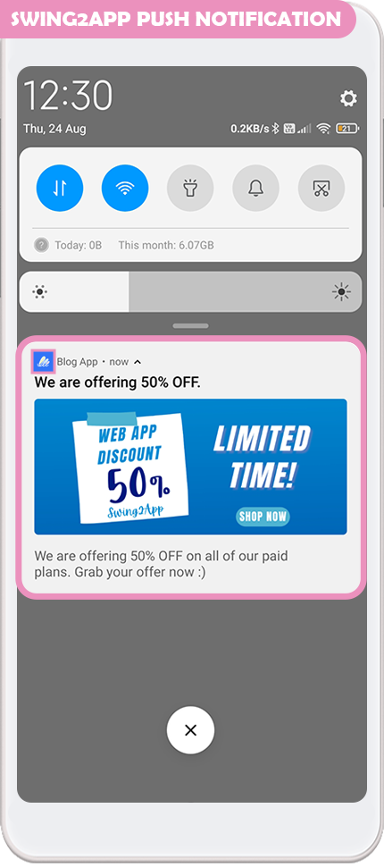
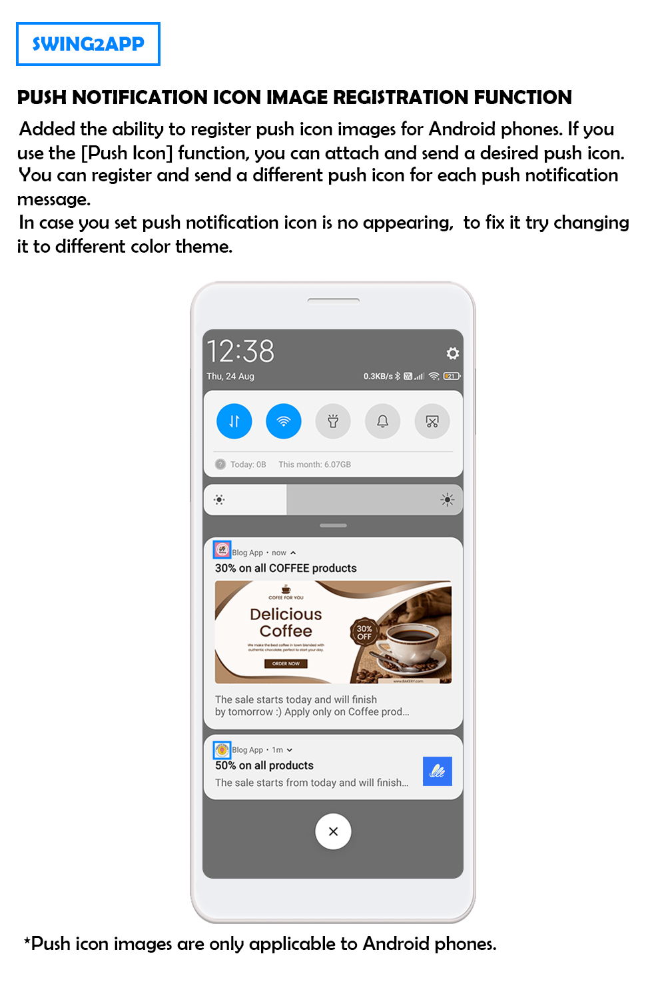
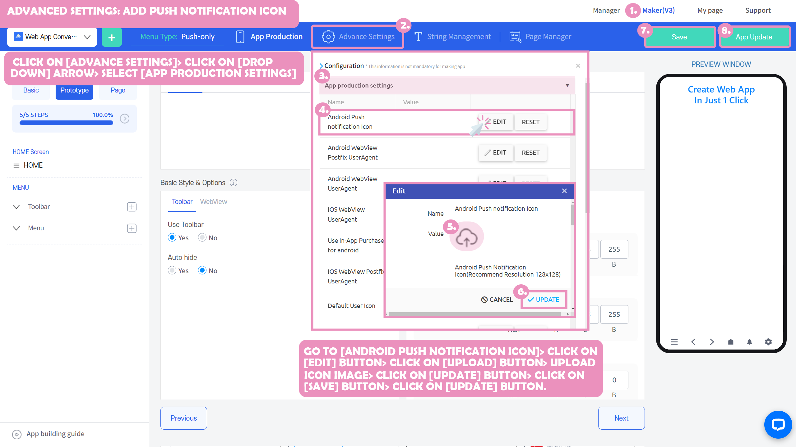

# Registering a Push Notification Icon Image

**How to Apply Push-Notification Icon Image for Android Phone**&#x20;

We're going to show you how to register a push icon image on your Android phone.

> ### What is a push notification? What is a push notification icon image?

Push notification is a feature available in regular prototype apps, and push-only apps.

When users who have installed an app receive notifications, updates, etc., sending a message from within the app is called a 'push'.

When a push is sent, the image that appears next to the subject and message is called the push icon.

At this time, the icon that is displayed when sending the push is automatically set to an image of the app icon and sent out.

When you use the newly added \<Android push icon> function, a push icon is sent to the registered image.

Please check the manual to see how to register a push icon image!

***

###  Push icon image

As you can see on the app launch screen, you can see that in the same application, two different icon images are applied for each push message.

**When you register a push icon image, you can register and send a different push icon for each push notification message.**

**In case you face issues (error of icon image not popping up on Android phones) with your default push icon image, you can fix it by setting a separate icon image for your push notification.**&#x20;

**\* Push icon images are only applicable to Android phones. \_Not applicable to iPhone**

**\*If you don't set a push icon separately, it will be automatically sent as an app icon image. \_Same as Android, iPhone**

​

###  Setting up a push icon image

1\) On the MakerV3 app creation screen

2\)Click on the \[Advanced Settings] button

3\)Click on drop-down icon and Select \[App Production Settings] option

4\)Click on Android Push Icon \[EDIT] button&#x20;

5\)Attach image to register push icon in setting, Check image size (128X128)

6\)Click on \[UPDATE] button

7\)Click on \[Save] button

8\)Select \[App Update] or \[App Creation] button

\*If the app has not been created, \[App Creation] button will be displayed to build the app(1st time), and an  \[App Update] button will be displayed when the app is already created and just needs to be updated.

\- The update is recommended to proceed with a hard update.

\-After receiving the update to the new version, proceed to send the push and it will be sent as a changed push icon image.

\-Apps released on the Play Store will need to be updated to the Play Store again with a newly created version of the app.

​

###  Instructions

1\)This feature only applies to Android phones.

\*The iPhone cannot specify a push icon image due to the nature of the platform.

2\)The push icon can be set in the general prototype app, the push-only app.

The webview app is not available because it does not have a push-sending function.

3\) The use of this function will be reflected in the app only if the app is created again. (App update required)

After setting up the push icon image, create the app (update the app) and check the app with the new version to reflect the updated functionality.

Apps released on the Play Store will need to be updated to a newly created version of the app.

