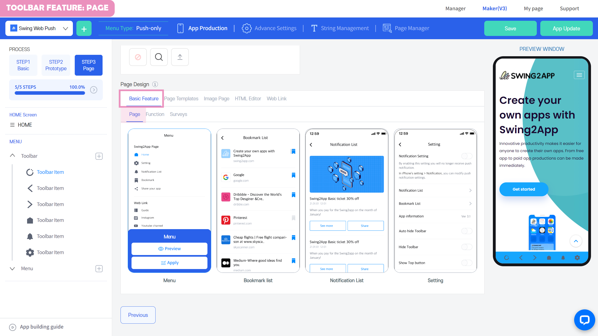
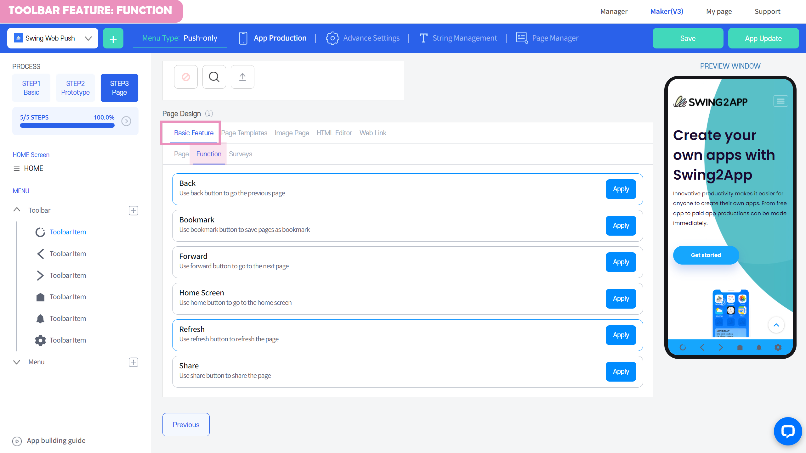
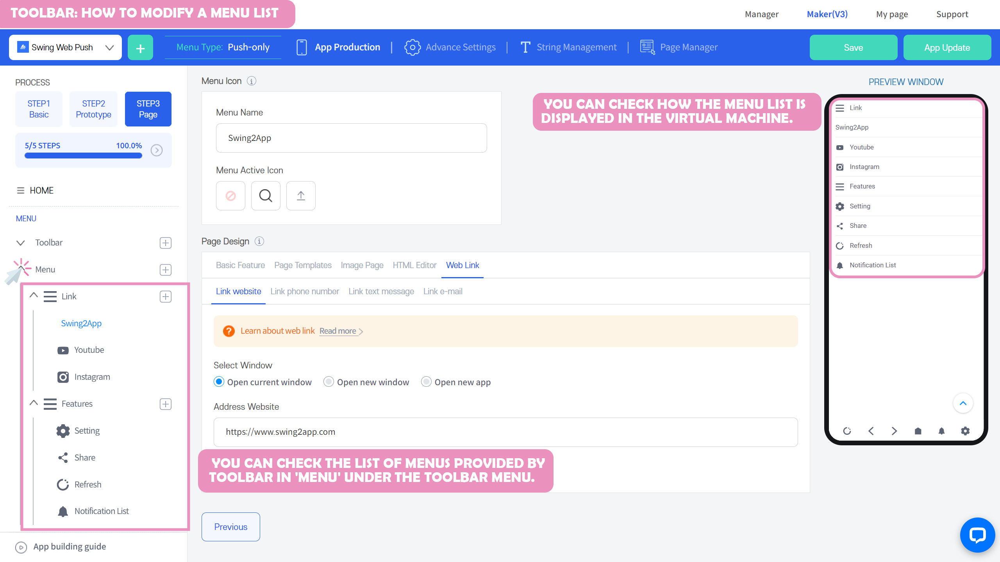
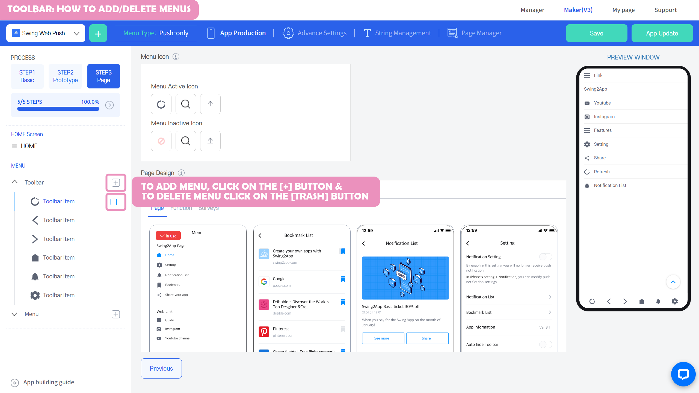
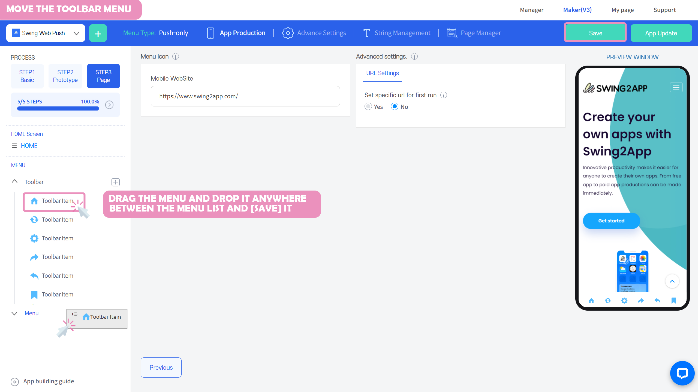
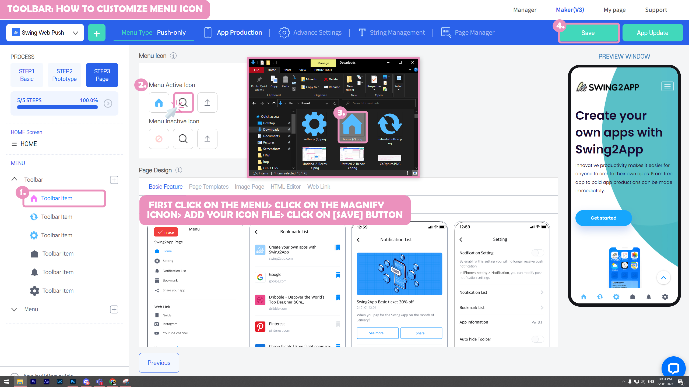
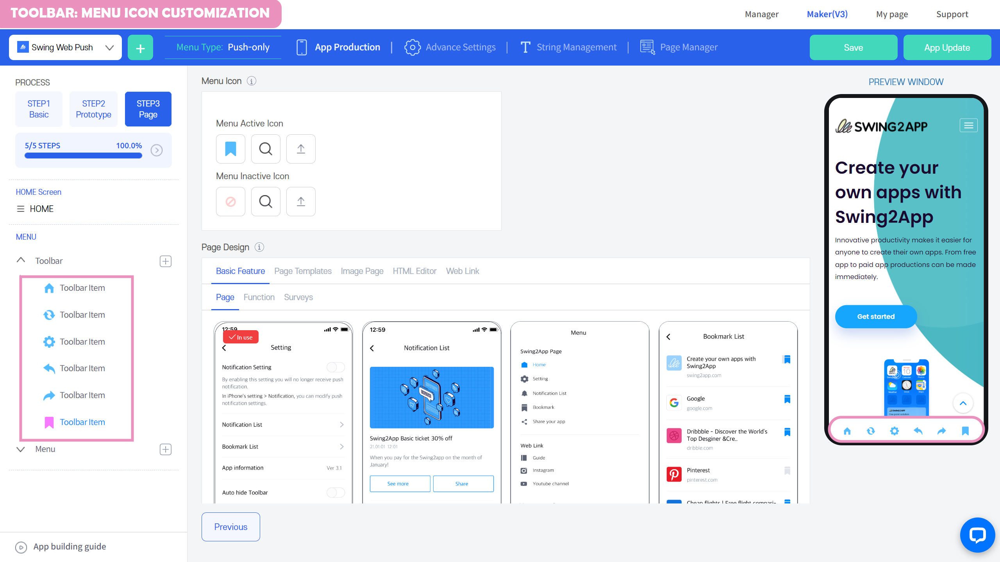
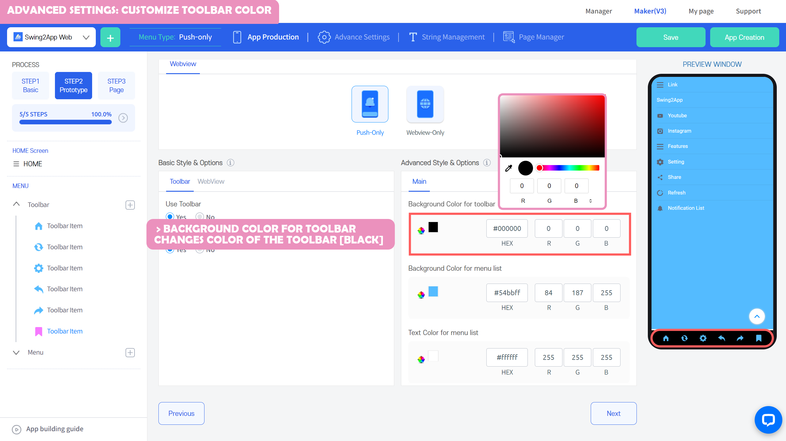
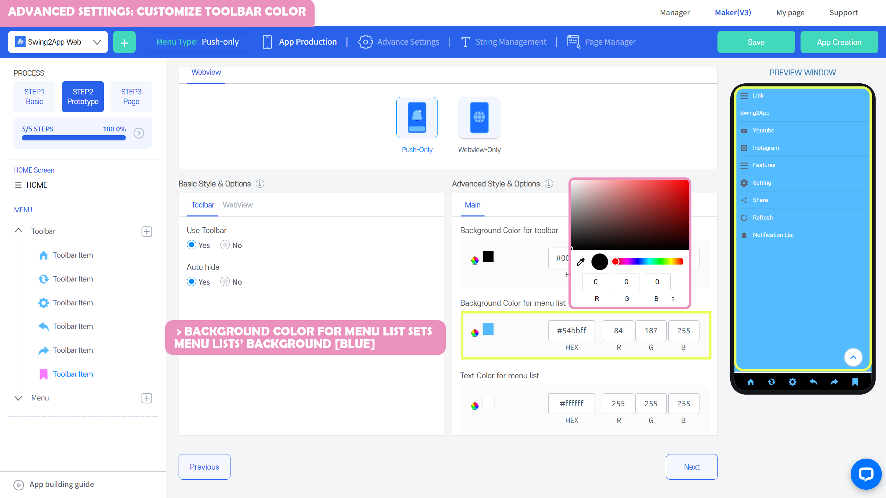

# Push App Toolbar - Introduction: How to Use and Functions

**V3 PushApp Toolbar Function Manual – Function Introduction and How to Use**

​

Here is the Push Toolbar Function Manual.

For push only, you can use the 'toolbar' function when creating apps. (Not available in the webview app.)

A toolbar area is created at the bottom of the app screen to take advantage of its various functions.

The toolbar is a feature only available in push apps, and in the v3 version, the toolbar functionality has been updated a number of times.

Previously you only had to use the toolbar provided, no customization was possible.

In V3, you can configure the toolbar directly with any menu you want, modify icons, modify the design, and customize the toolbar area yourself.

Check out the manual to see how to use the toolbar and how you can apply its features to your app.

<mark style="color:red;">**\[Instructions]**</mark>

1\)The toolbar is a menu is available only in push apps, and is not available in webview apps and general prototypes.

Please use it in the push app!

2\) Existing V2 app users can switch to V3 and update it!

You need to apply the features and update your app so that the changed functionality and design will be reflected in your app.

If the App has been released on App Store or Play Store, please re-evaluate it with the updated version.

3\)The toolbar function is available in the STEP3 page step. These steps do not require an update.

If you modify the toolbar after the initial app is built, it will be reflected directly in the app without having to update it, just save it.

However, if you modify the toolbar design during the STEP2 design phase, the app needs to be updated.

**For the push app creation manual, please go through to the manual below.**

[**https://wp.swing2app.co.kr/documentation/v3manual/push/**](https://wp.swing2app.co.kr/documentation/v3manual/push/)

***

## **​****1.** How to use the Toolbar

.png>)

PushApp STEP3 Page Steps

MENU Settings – Clicking the down arrow on the left side of the Toolbar with your mouse will open the toolbar menus downwards.

The menu is the default set menu, so you can remove the menu or add the menu you want.

With the toolbar menu, you can select the desired menu from a category and apply the page design.

1\)Select Toolbar

2\)Select the menu to modify

3\)Select the icon to apply to the toolbar menu from the active icon

4\)In the page design, you can select the menu to enter each toolbar area.

In addition to the basic functionality of the toolbar, page design can additionally apply templates, image maps, editor pages, and links..

​

<mark style="color:blue;">**–Applying the Refresh function in Toolbar Menu**</mark>

1\)Add toolbar menu + Select icon to add

2\)Active icon: Select the magnifying glass icon and select the icon you want to apply.

3\) Page Design: Select \[Function] from the Basic Functions.

4\)Select the Refresh function \[Apply] button.

5\)Select the Save button and it will be reflected in the app.

Changes can be checked in real-time on the right Preview Window (virtual machine), and can also be checked by launching the app.

​

<mark style="color:blue;">**–**</mark> <mark style="color:blue;">**Basic functions provided by the toolbar**</mark>

> <mark style="color:blue;">Pages: Bookmark List, Menus, Notification List, Settings</mark>
>
> <mark style="color:blue;">Features: Move backward, Move forward, Bookmark, Go Home, refresh, Share</mark>

The above functions are provided natively.

These are the features most used in the Push App toolbar.

The toolbar is provided as a default setting, so you can customize the toolbar yourself by removing unnecessary menus and adding the necessary menus.

​

### How to modify a menu list

The menu list provided by the toolbar can be found in 'Menu' under the Toolbar menu.

You can see how the menu list looks in the Preview Window (virtual machine).

Menus registered in the menu list can also be easily modified by the user.

\- Menu can be added, removed / icon can be set - list background color, list letter color can be modified during the design phase

​

##  **2.** Add, and remove toolbar menus

To add a toolbar menu, select the + **icon to the right of the toolbar to add a new menu.**

Removing the toolbar menu is **deleted by selecting the trash can-shaped icon.**

​

## **3.** Move the toolbar menu

You can change the order of the toolbar menus.

Select the menu with your mouse, grab it, and drag it to where you want to move.

The position where you are dragging completes the menu movement.

​

##  **4. Registering toolbar icon image**

​

It is the new feature in the V3 version of the toolbar, and can be applied by changing the toolbar icon to a different image.

We'll show you how to register an image with an icon.

​

### <mark style="color:blue;">\[App launch screen]</mark>

In addition to the default icons provided when you create your app, as you can see in the toolbar area, you can upload other images to enhance the UI of the toolbar icons.

​

### <mark style="color:blue;">**-**</mark><mark style="color:blue;">Registering toolbar icon images</mark>

1\)Select toolbar menu to apply icons

2\) Select the third upload button from the active icon.

3\)Select the image you want to register in the file attachment window.

4\)Page Design: Basic function – Under Functions, select the "Go Home" menu and then select the \[Apply] button.

5\)Select the \[Save] button and you are done.

​

The toolbar icon registration is complete.

You can see the applied icons through a virtual machine that is reflected in real-time.

After exiting the app completely, you can relaunch it to see the changed toolbar.

\*This feature is reflected by simply saving it, so no updates are required.

​

##  **5.** Toolbar Basic Options, Advanced Options

​

The menu for using the toolbar and setting the style can be found in the STEP2 design step.

Check out the Basic style options, Advanced style options.

​

### <mark style="color:blue;">**1)**</mark><mark style="color:blue;">Basic Options – Toolbar Enabled, Auto-Hide Function</mark>

STEP2 Design Steps

In the default style options, enable the toolbar and set the toolbar auto-hide function.

> \-When checking "Yes" for the toolbar, the toolbar is fixed at the bottom of the app screen.
>
> If you don't use it, the toolbar won't be visible in the app.

> \- Auto-hide refers to the function by which the toolbar disappears for a while when scrolling and moving it down the screen,
>
> Because it can obstruct (hide content) the screen, if you leave it hidden for a while and then scroll up and down the screen again, a toolbar will be created.
>
> If you check that the toolbar auto-hide as "No", the toolbar area is always fixed and visible.

​

### <mark style="color:blue;">**2)**</mark><mark style="color:blue;">Advanced Options</mark>

In the advanced style options, you can set the toolbar-specific colors.

​

**(1)Toolbar background color**

You can select a toolbar background color and apply it to any color you want. (Default: Set to white)

​

**(2)Menu list background color**

You can apply a color that goes into the background of the menu list. (Default: Set to white)

​

**(3)Menu list text colo**r

You can apply a menu list letter color. (default: set to black)

If the STEP2 design menu is modified, the app needs to be updated.

(\*If you check whether to use the toolbar to 'Yes' and then change it to 'No' / Change the toolbar background color, then App Update is required.)

Therefore, after the initial app creation, if you have made any modifications to the design stage, please update it by pressing the \[App Update] button after saving.

If the App Store or Play Store has been released, please re-create it with the updated version.

<mark style="color:red;">**\[Instructions]**</mark>

1\)The toolbar is a menu available only in push apps, and is not available in webview apps and general prototypes.

Please use it in the push app!

2\) Existing V2 app users can switch to V3 and update it!

You need to apply the features and update your app so that the changed functionality and design will be reflected in your app.

If the App Store or Play Store has been released, please re-create it with the updated version.

3\)The toolbar function is available in the STEP3 page. These steps do not require an update.

If you modify the toolbar after the initial app is built, it will be reflected directly in the app without having to update it, just save it.

However, if you modify the toolbar design during the STEP2 design phase, the app needs to be updated by clicking \[App Update].

