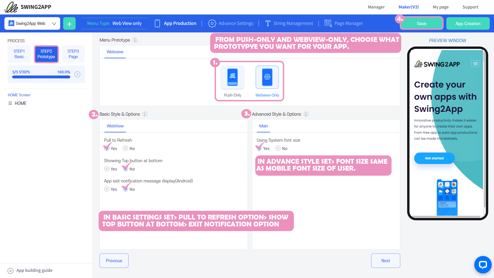
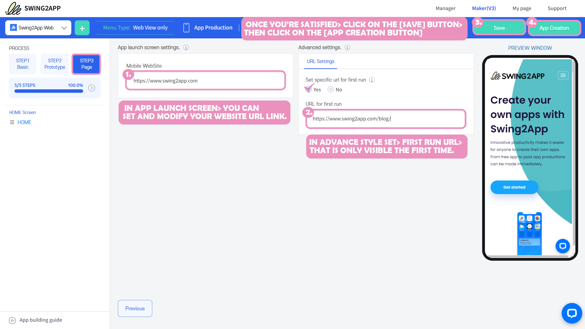
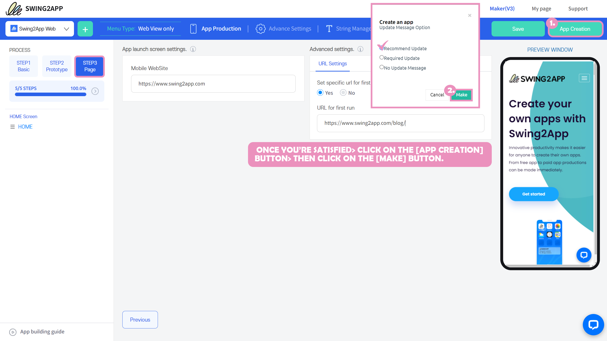
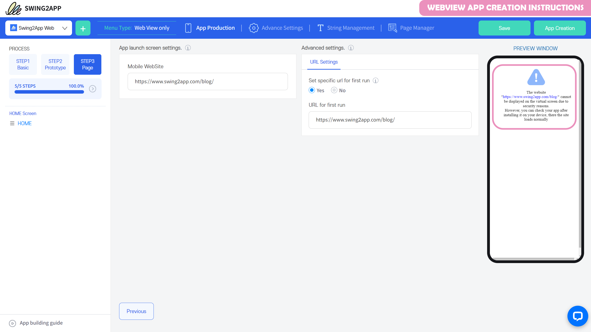

# How to create a webview app

**App Maker V3 Version – Webview App Creation Manual**

> **What is a Swing2App webview app?**
>
> **The webview app is a web app creation platform created by attatching a link to a mobile web URL such as a homepage.**
>
> Because the website works with the app as it is, you can create the same app as the web.

## **Start.** Get started with the App Creation Wizard

**​**

**When you first create an app in a Swing2App or build additional apps, the App Creation Wizard screen (a pop-up window) pops up first.**

**Here, you choose what type of app you want to build, then enter the basic information and you'll be taken to the authoring maker.**

**​**

1. <mark style="color:blue;">**How to create: Select a web app type based on the website**</mark>

<figure><figcaption></figcaption></figure>

For a webview app, please select the 2nd method of creation, "Create Web App".

This is a prototype that creates an app by linking it to the website.

Select the \[Next] button.

**​**

**​**

<mark style="color:blue;">**2. Enter web app basic information**</mark>

The next step is to enter the basic information, where you enter the basic details needed to build a web app.

<figure><figcaption></figcaption></figure>

**1) Enter the website address (URL).**

This is the website link you want to apply to your app, and be sure to include the complete hyperlink.

After entering the link address, a single click on the mouse cursor in the empty space will be reflected.

You can check if the applied site is popping up well with the virtual machine (preview window) on the right.

**2) Choose whether the push function should be enabled**

Push is a feature that allows sending notifications, announcements, and promotional reminders from the app to the users who have installed the app.

Since we are going to create a webview app that does not support Swing2App enabled push, please check the push function as "No".

These additional settings can be modified again in the App Maker, so you can check for "No" here, and change them again later!

Select the \[Next] button.

<mark style="color:blue;">**3. App name, icon, splash screen image upload**</mark>

<figure><figcaption></figcaption></figure>

The final step is to **register the app name, app icon, and splash screen ( idle screen ) image.**

App names, icons, and splash screen images can all be modified again in the App maker.

If the image isn't ready yet, you can just enter the app name and press the Done button.

Icons and images that will fit on the splash screen can be reapplied in the App maker.

​

<mark style="color:green;">**–> How to upload App icon and splash screen image**</mark>

<figure><figcaption></figcaption></figure>

On the app icon and the splash screen, select the \[Upload] button and the file attachment window will open.

You can upload an image here and apply it.

**- Icon image size: 1024px\*1024px**

**-Standby screen image size: 2282px\*2282px**

When the image uploading is completed, select the \[Submit] button.

When the App Creation Wizard registration is complete, the App Maker screen opens.

If you look at the app creation process on the left, you can see the steps on the STEP1 Basic Information, STEP2 Design, and STEP3 Page.

Step by step, enter your content and you're done.

<mark style="color:red;">**\*When the STEP progress reaches 100%, all step inputs are complete.**</mark>

**​**

## **STEP1** Basic

<figure><figcaption></figcaption></figure>

**STEP1 The contents in the basic information have already been registered in the App Creation Wizard except for the App ID.**

If you want to modify the app name, you can re-enter it.

If you want to modify the app icon, splash screen image, or upload a new one, you can do all this on the Basic screen.

1\) Enter App ID <mark style="color:red;">**\*The app ID is the unique identifier of the app and cannot be changed after setting.**</mark>

2\) Enter the app name

3\) App icon image **(1024px\*1024px)**

4\) App standby image registration **(2282px\*2282px)**

5\) Select the \[Save] button

**​**

**\*App icon image, splash screen image: Please create an image according to the size listed on the screen first, and then upload it.**

**For icons and splash screens, please first look at the Production Guidelines Manual and create them accordingly!**

**​**<mark style="color:blue;">**Go to the icon image creation guide**</mark>

<mark style="color:blue;">**Go to the splash screen image creation guide**</mark>

**\*App name, app icon, and splash screen images, except for the app ID, can be modified and updated without any limitation.**

**When modifying the App basic information, you need to press the \[App Update ] button to update to the new version.**

<mark style="color:red;">**\*Information**</mark>

If you modify the STEP1 Basic Information menu again after the app is created, you will need to update the app again before the app will reflect the changes.

For example, if you changed the name of your app, save → after the change → press the App Update button to create it as a new version.

If it's released on the App Store or Play Store, you'll need to resubmit updates to that Store as an updated version of the app.

## STEP2 Design

<figure><figcaption></figcaption></figure>

STEP2 Design – Set the prototype, basic options, and advanced options.

The prototype has already been selected in the App Creation Wizard, so you can move on.

In Webview – If you want to modify it as a push prototype, you can change it and update it.

1. Select Prototype: It is selected as 'WebView Only'.
2. Basic Options

1\) Pull to refresh: This is a function that refreshes when the screen is pulled and released.

2\)Placement of the top button at the bottom of the screen: When the screen is moved down by scrolling, clicking the top button enables the users to move to the top of the screen.

<mark style="color:red;">**\*If there is already a top button in the website to be applied to the app, we recommend that you check it as 'No' and if not, check it as 'Yes'.**</mark>

​

3.Advanced options

You can check whether the system font is being used.

<mark style="color:red;">**\*The system font is the font set on the phone (text size, etc.), and the default setting in the options is checked in "Yes".**</mark>

**For example, if you check the system font usage:**

**If you increase the text size on your phone significantly→ the text displayed in the app will also appear at the text size set on the phone.**

**If you don't use the system font, it will be automatically set to the default in-app font, so it will look independent of your phone's settings.**

Therefore, except for special reasons, <mark style="color:red;">**we recommend that you use it according to the default settings (use system fonts: yes).**</mark>

​

4\)Select the Save button

​

<mark style="color:red;">**\*Information**</mark>

If you modify the STEP2 design menu again after the app is created, you will need to update the app again before the app can reflect the changes.

For example, if you changed the toolbar background color, save → after the change → press the App Update button to recreate the new version.

If it's released on the App Store or Play Store, you'll need to resubmit updates to that Store as an updated version of the app.

## STEP3 Page

<figure><figcaption></figcaption></figure>

The STEP3 page step will enter a link to the website that you want to convert into your app, which you have already registered in the App Creation Wizard.

If you want to edit the site address, please re-enter it in this step. If you don't have anything to modify, just save it.

1\)Enter your website address

2\) Address setting: Choose whether to set the first run address

**\*First Run Address Line In addition to the website associated with the app you can apply an additional website, users can install the app and view this separate web page that is only visible the first time.**

Check 'No' if you don't use it, or 'Yes' if you don't use it. Please include the complete Hyperlink when entering your site address.

3\)Select the Save button

<mark style="color:red;">**\*Information**</mark>

The STEP3 page menu is automatically reflected in the app by simply modifying and saving it. You don't need to update the app (recreate the app)

## **STEP4 Complete App Creation**

All steps have been entered. You can build apps.

1. Select the App Creation button
2. Select the \[Create] button in the App Creation pop-up window.'

The Updates option doesn't affect your production by choosing anything. **Because it's a webview app, the update window doesn't appear in the app.**

So you just have to check any option.

\*WebView App Update: If your app is released on the Play Store/App Store, etc., you will need to upload a new version of the app to get the app updated through the Store.

If your app is for personal use that hasn't been released, you'll need to delete the existing app and reinstall it as an updated version.

The webview app is built in less than 10 minutes.

The finished app can be viewed by using the official Swing2App \[App Preview] or by downloading the e-mailed APK file from your Android phone.

**\*App APK  can be downloaded and viewed only on Android phones. \*You can't check it on your iPhone.**

Creating an app with Swing2App is simple, you just have to follow the steps in this manual.

The App production is free of charge, no extra charges are applied.

​

## **STEP5** Download the app to your Android phone to view it

**​**

\*Webview and apps made with push can only be viewed on Android phones. (You can't check it on your iPhone)

Swing2App Official App – Download the app created by \[App Preview] to check it out.

<figure><figcaption></figcaption></figure>

**1) Download the official 'Swing2App' app from the Play Store. \*If the app is already installed, please update to the latest version.**

<mark style="color:blue;">**PlayStore launch link (URL)**</mark>

**​**

**2) After launching the app, select the \[App Preview] menu at the top of the → category and login with your Swing2App website subscription account (ID, password).**

\*Easy Login User: If you used to log in with Easy Login when you signed up for Swing2App, please select the Naver, Google, and Facebook icons to log in.

\*Note: To log in, you must enter the account you signed up for in the http://www.swing2app.co.kr of the Swing2App homepage. http://www.swing2app.co.kr/

It's not an account signed up for in the official Swing2App app!

**​**

**3) Once you're done signing in, the app preview page will open, where you can see a list of apps you've created.**

**4) You can install the app on your phone by pressing the \[Download App] button.**

**\*The webview app is only available on Android phones. (iPhone not available)**

<mark style="color:green;">**▶ App launch: App preview- Download app**</mark>

Please check the process of downloading the app from the app preview through the image that you are receiving.

**When installing the app, you may occasionally see a Google Play Protect blocking message, but you can ignore it, select Install, and proceed.**

In this way, you can install the webview app on your Android phone and test if it works properly.

If you don't have any issues, you can prepare for the launch of your app on the stores.

When you launch an App Store or Google Play Store app, you need to switch from the free version app to the paid version.

To switch to the paid version, you can purchase a Swing2App Paid Plan.

When creating a webview app, push app, enter the website address, and then;

On the virtual machine (preview window), you will see a message that says 'Please check after installing the app on your mobile phone' or 'The connection has been refused'.

**If the security that prevents external connections within the website you connected to, that is, the prohibition of external sharing and embedding, is enabled, you will see the message.**

Therefore, when you link to a website that has this security setting, you will see a message that says Deny Connection on the web preview screen.

Even if you get these messages, **it doesn't mean you can't build an app.**

**You can check more accurately by simply checking with the app that the screen cannot be displayed on the web for security reasons.**

**Therefore, please save and \[Create App] and download it to the app to confirm.**

If you look at it as an app, you can see that the site works normally with the app.

If the app still refuses to connect, please contact the Swing2App Help.

**\*However, the URL for internal use and the site address used by the company's internal server cannot be connected or be created as a web app.**

## Webview app creation instructions

<figure><figcaption></figcaption></figure>

When creating a webview app or push app, after entering the website address, you can see that the virtual machine (preview window) displays the message "Please check after installing the app on your mobile phone" or "Refused to connect".

**If the security that prevents external connections within the website you are connected to, that is, the prohibition of external sharing and embedding is enabled, you will see the message.**

Therefore, when you link to a website that has this security setting, you will see a message that says Deny Connection on the web preview screen.

Even if you get these messages, **it doesn't mean you can't build an app.**

**You can check more accurately by simply checking with the app that the screen cannot be displayed on the web for security reasons.**

**Therefore, please save and \[Create App] and download it to the app to confirm.**

If you look at it as an app, you can see that the site works normally with the app.

If the app also refuses to connect, please contact the Swing2App Help.

**\*However, the URL for internal use and the site address used by the company's internal server cannot be connected and cannot be created as a web app.**

​

​

## Precautions and Webview App Creation Q\&A

**​**

**Q.Is it true that the webview app is difficult to launch on the App Store and Play Store?**

**–PlayStore —**

WebView and PushVersion Apps (web apps that link to a website) are required to provide supporting documentation (advance notice documents) in accordance with Google's WebView policy.

In order to prove that the site you linked to the app belongs to you or the company (company), you will need to provide a notice document such as a business registration certificate or website domain registration confirmation.

When you submit your documents, you can also launch a webview app on the Play Store without any problems.

**–App Store–**

Web apps such as push apps and webview apps need to be vetted to know if they are released.

A web app doesn't mean it won't be released unconditionally. There are various policy reasons for Apple, so you'll need to get screening feedback to find out.

We will appeal as much as possible to help you launch the App Store, but please understand that we cannot judge whether or not your app is released\~!

Please note that if the Store rejects your app, the cost of the subscription and upload ticket will not be refunded for the app that has been registered on the App Store.

**– These web apps are difficult to release.**

\*Apps that connect to a PC version of a website rather than the mobile web will be rejected. The website must be connected to the mobile web.

\*Web apps that have only promotional or marketing content on the web, that have no substantive content, or that have limited user engagement will be rejected.

\*Shopping mall sells digital products on the web, but web apps that do not use Apple's in-app payment module will be rejected. (Physical products not applicable)

\*In addition to the regular login, we provide simple and social login (Katok, Naver, etc.), but will be rejected if you do not have an Apple login.

If you provide external login and social login functionality, you must also provide Apple login functionality for release.

\* This includes all other cases where the content on the website is not in line with Apple's policies. (Prohibited content: sexual content, tobacco, drugs, excessive abusive language, etc.)

**Q. When creating a webview app, can I connect to any site to create it?**

One thing to be careful about when creating a webview app is that you shouldn't use sites from other third parties or well-known brands like you've created them!

You can only use the homepage that your company runs, the website you created (using the hosting company), etc.

There are many users who want to link their Naver blog or the next café with a webview or push.

These sites will error or will not function properly if you link them to the app.

\* These apps should not be released on the Play Store or the App Store. (Copyright will be rejected on the grounds of brand imitation)

And there's a site on the web that doesn't work with the app, i.e. prohibits embedding.

\*Naver, the following portal sites, and the sites provided by the portal (modoo, storefarm web, etc.), YouTube, social media sites (Instagram, KakaoTalk, Facebook), etc. are the representative sites that have been banned from embedding!

Therefore, you need to apply a homepage that can prove that you created it with domain registration information, and a website (homepage) that can be verified by a business registration certificate if it is created by the company.

**Q. Can the WebView app not send pushes?**

Yes, the webview app cannot send a push because it cannot use other functions of the app.

If you need to send a push, you need to create it as a push version app, not a webview app.

**Q. If it's difficult to make it yourself, but I pay for the development, can I do the above in the Swing2App?**

If you ask us to produce it, we will do it all for you.

From designing icons and splash screen images, to creating apps and uploading them to the store.

\*You can check the production agency fee on the Swing to App Custom Package product page. <mark style="color:blue;">http://www.swing2app.co.kr/view/payment\_list\_by\_recommend\_custom</mark>

However, you will need to create your own Google developer account to upload to the Play Store and let us know your account.

The App Store requires that an Apple developer account be optional, but if you use your own account, you will need to create your own account and tell us about it.

Store Accounts are not created in the Swing2App app.

**Q. Can I switch from WebView to Push Version**&#x20;

Yes you can.

\*During the App Creation →STEP2 design step, please change the prototype to 'Push Only' and save and update the app again.

When updated to the new version, the prototype is changed and verifiable.

If your app has been released on the Play Store, App Store, etc., you can update it to the newly created version as well.

However, users who use the WebView Unlimited product should not be changed.

**Q. How do I change my website address after creating the WebView app?**

The same goes for changing the weblink address applied to your app.

**App Creation→ STEP3 Page Menu 1)Enter the URL Address in the Website Address field → 2)Select the Save button**

\*Modifying the web link address is automatically reflected in the app by simply pressing the Save button.

\*If you exit the app and relaunch it, it will be applied to the changed website.

However, users of WebView Unlimited paid apps will need to save and re-create the app. You will need to update to the new version to be reflected.

**Q. Will the WebView app change to a normal prototype?**

After being built as a webview-based (push, webview) prototype, → cannot be changed to a normal prototype (slides, tops, footers, drop-down lists, drop-down boxes).

\*If you need to change from a webview-based prototype to a different prototype, you'll need to create a new app.

**Q. Can I use a basic subscription and then change it to the WebView Unlimited plugin?**

Yes you can.

If you purchase unlimited plugins for Webmu after using the basic subscription, we will create an unlimited number of settings.

**\*Precautions**

1\) A new version of the app created with unlimited webview requires you to update it back to the App Store and Play Store.

Since the existing subscription app and the WebView Unlimited app are not compatible with each other, users will need to update to the new version so that users can receive the update.

2\) If you purchase and use the Swing2App Paid Plan, and then pay for the WebView Unlimited plugin, there will be no split refund for the remaining period.

Therefore, please use the paid app subscription date and purchase unlimited tickets for WebView.

**Q. Does the WebView app reflect any modifications or updates made on the website directly in the app?**

Because your web app is a website-driven application, the screen you see on your website is reflected in the app as well.

Even if you don't have to do anything extra in the app, updates from the web are automatically reflected in the app as well.

**Q. Can the functions that work normally on the mobile web not be available in the app?**

If there's no problem on the web, the app won't have the problem either. However, technical errors can occur at any time.

So, if you have anything problematic while testing your app before launch, please leave it as an inquiry board.

We are here to help by identifying your symptoms.

​
