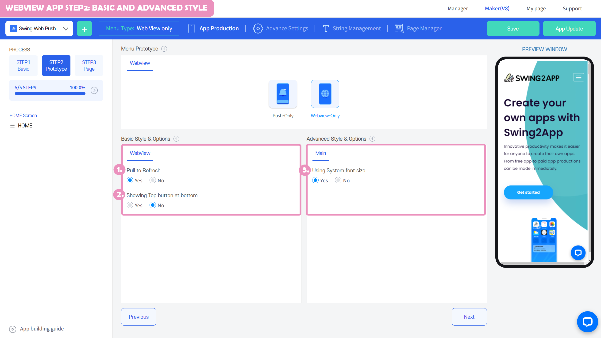
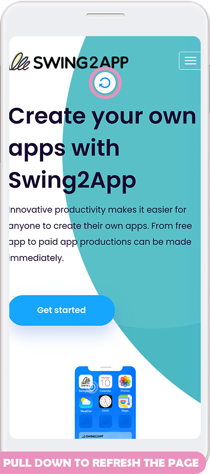
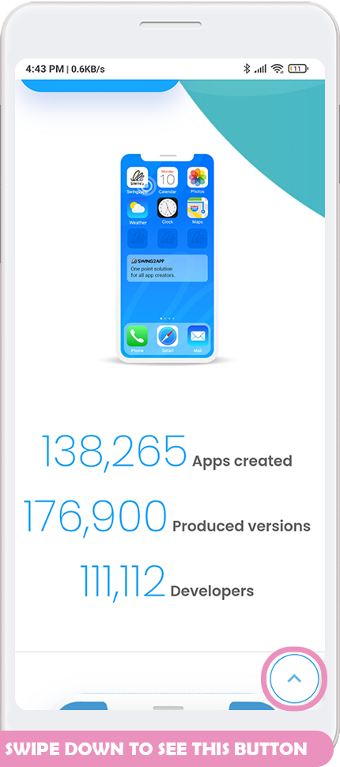
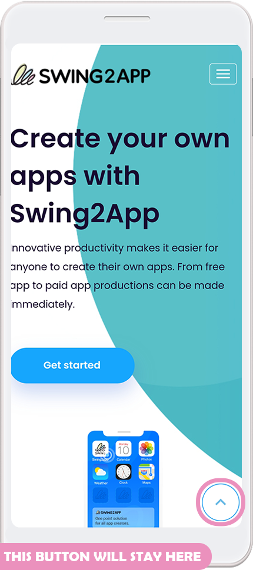
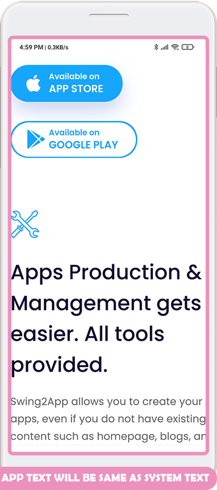

# WebviewApp basic settings and advanced setting options

### Webview app - pull to refresh, top button at the bottom of the screen, use system font

We'll walk you through the basic style options and advanced style options that you can set when you create a webview app.

Prototype: Select WebView Only, you can see the basic style options and the advanced style options in the STEP2 design step.


**-Default style options: pull and refresh, place the top button at the bottom of the screen**

**-Advanced style options: Use system font**


If you check the functions as 'Enabled', save them, and proceed with the creation of the app, the functions will be set up in the app and created.

I'll introduce you below to the Apply App with this feature screen.

## 1. Pull to Refresh&#x20;

### **-**Check with the screen recording

As you can see in the squeezing image, when you pull up and raise the screen with your finger, a new loading icon pops up, and you can see that the screen is switching to a new one.

< pull and refresh> function should be checked and created as 'Yes' when creating a webview app.

Unlike push apps, webview apps can't create toolbars with 'refresh' functionality, so we recommend that you add a refreshable feature on the screen.

Unused and the refresh is not available in the app upon check.

​

## 2. Top button

### -Check with the image&#x20;

As you scroll down, as you can see in the image you are receiving, you will see a top button at the bottom of the screen.

When you select the top button, you will be moved back to the top of the screen.

​

<mark style="color:red;">**\*Precautions for use**</mark>

If the top button is already set and built into the website, the top button will look the same in the app.

So if the top button is already applied to your website, please check the top button placement as "No" when creating a web view app.

If you check Yes, the top button will be shown as duplicate.

**Refer image)**

As you can see in the image, I have a problem where the top button on the website and the top button in the webview app are seen together.

Therefore, please use this function only if there is no top button on the website.

## **3.** Using System Fonts

​

The system font refers to the text style (text size, font, etc.) set on the phone.

<mark style="color:green;">If you increase the text size on your phone significantly→ the text displayed in the app will also appear at the text size set on the phone.</mark>

If you don't use the system font, it will be automatically set to the default in-app font, so it will look independent of your phone's settings.

​

**Refer image)**

If you set the text size to be large on the user's phone, the body text shown in the app will look the same.

\*Text size is not reflected on all webs and is displayed as reflected on the letter HTML page with the embedded browser.

Except for special reasons, it is recommended that you use it according to the default settings (Use system font: Yes).

The use of system fonts is not a very frequent feature.

In the options, the default setting is checked in "Yes", so please make it as it is without modification.

<mark style="color:red;">**Instructions**</mark>

If you modify the STEP2 design menu after creating a webview app, an app update is required.

(It is not automatically reflected in the app when you save, it is reflected only when the app is recreated in a new version)

So, after creating the app, if you modify one of the functions introduced above, please select the \[Save] button - \[App Update] button.

If your app is released on the Play Store or App Store, please resubmit it for review with the updated app.

If you use it privately without a Store release, you can uninstall the app and reinstall it as a newly created version of the app.

<mark style="color:red;">**\*\*Those who switched to V3 for webview apps created by App Maker V2: You will need to update the app again!**</mark>

