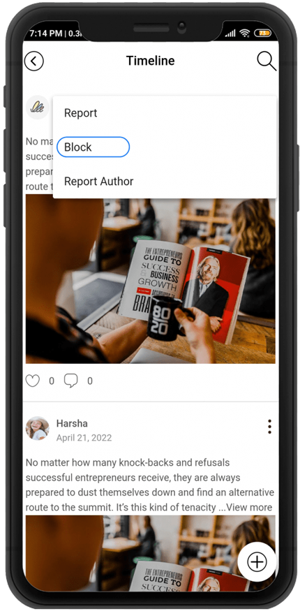

# Block posts

Post blocking is a bulletin board option function that prevents all articles written by the user from being exposed along with the blocked article.

It is not visible only to the blocked user, and it differs from the reporting function in that the text is exposed to other users.

<figure><figcaption></figcaption></figure>

<figure><figcaption></figcaption></figure>

###  <mark style="color:blue;">Blocking posts</mark>

<figure><figcaption></figcaption></figure>

If you look at the top right of the bulletin board – post detail view, there is an icon marked with three dots.

Select ‘Block’ by selecting the corresponding icon.\

When you choose to block, you get a message that says “Do you want to block the user’s post?”

Select OK to complete.

**If you block the text like this, the text will be deleted immediately and will not appear to the user who blocked it.**&#x20;

**In addition, all articles written by blocked users are also set to be invisible.**

Blocking can be used when you don’t want to see a particular user’s writing,

Since the text is not exposed only to the blocked user, it is different from the reporting function in which the text is deleted to all users.

[**▶Go to see the manual for reporting posts**](report-post.md)
