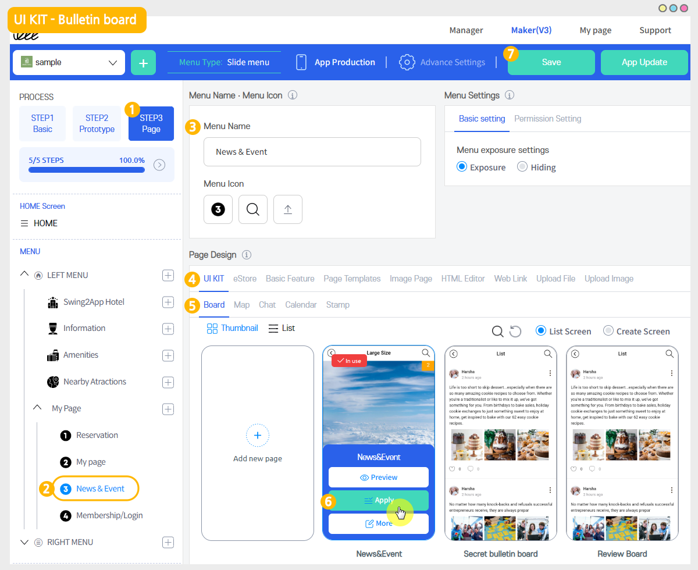
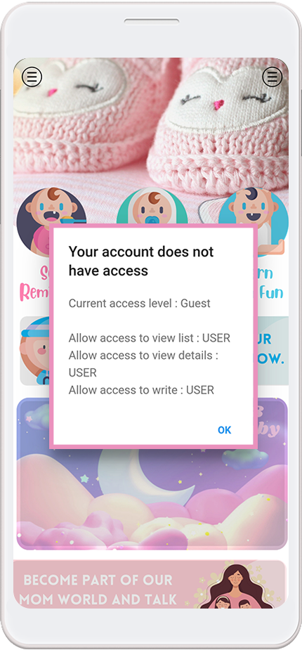

# How to set up Bulletin Board Permission

<figure><figcaption></figcaption></figure>

<mark style="color:orange;">**★ How to use the board permission setting?**</mark>

Access to bulletin boards – you can set different users for writing, detail view, and view lists.

You can make the bulletin board available to all app users! Depending on the app, you may need to set up a group differential for the use of bulletin boards!

**For example**

**Write = Only available for administrators, view bulletin board list/view details = User only**

**Write = Only available to users, view bulletin board list/view details = Guests only**

In this way, you can specify different groups of users depending on the bulletin board.

\* Also, in Swing2App, you can create a new group using a total of 9 levels of permissions, so you can create the desired group and apply it to the bulletin board permissions!!

Setting Bulletin Board permission is very simple!! Please check out how to use it.

<figure><figcaption></figcaption></figure>

## STEP1. Go to Bulletin Board Management

1. Go to **Manager.**
2. Select **Services.**
3. Click on **Bulletin Board.**

\+If you want to create a new bulletin board, click **Create Bulletin Board** button.

\+If you want to edit an existing bulletin board, click the **Settings** button.

Create a new bulletin board and set the permission!

***

<figure><figcaption></figcaption></figure>

## STEP2. Board and Feature Settings Window: Setting Permissions

Click **Create Bulletin Board** button to open the board and feature settings window.

When you get to the bottom of the bulletin board function window, you can check the menu to **Set Board Permission.**

<mark style="color:red;">**★ IMPORTANT!**</mark>

To set options such as bulletin board function, you have to be sure! You must select **Customize** for service use.

If it is not selected as custom, all settings are fixed, so please modify the option values ​​freely after selecting custom.

<mark style="color:red;">**★ Bulletin Board Permissions**</mark>

\*\*It is provided with writing permission, detailed view permission, and list view permission.

<mark style="color:red;">**★ App Usage Groups**</mark>

The basic group of apps created by Swing2App.

It is provided as an administrator, user (the user who has registered in the app), guest (who has installed the app, did not register).

So you can set bulletin board permission: by which group the permission is assigned, the post detail view, and the post list view.

<figure><figcaption></figcaption></figure>

## STEP3. Group Operations TIP

In addition to the built-in groups (administrators, users, guests) in the app, operators can create and add new groups.

For more information on how to create a group and how to apply it to a bulletin board, please check the link below.

**▶** [**Go to permission group settings (create and classify groups)**](../pushmember/member-group.md)

**▶ See how to create a permission group and apply permissions to the bulletin board!**&#x20;

***

<figure><figcaption></figcaption></figure>

## STEP4. Applying bulletin boards to your app

You need to apply the bulletin board created above to the app to be able to use it in the app, right?

**App production V3 version)**

<figure><figcaption></figcaption></figure>

1\)App Creation – STEP3 Select Page

2\)Menu selection

\*If you're not ready to create a menu, create a new one. (Select the + shape button to add menu)

3\) Please enter a menu name.

4\) Select **\[UI KIT]** in the page design

5\)Please select **\[Bulletin Board]**.

6\) Check the board to register, and then select the \[Apply] button. (Hover over the mouse cursor on the page to open the Apply button)

7\) Press the \[Save] button at the top of the screen to apply it to the app.

**App production V2 version).**

<figure><figcaption></figcaption></figure>

On the Swing2App Maker(V2), go to the Page menu.&#x20;

1. From the menu set by default, click the **Add a category** to add a new menu.
2. Edit the name of the added item in **Menu Name.**
3. Select **Bulletin Board** in the **Menu Type.**
4. Click on **Link Wizard**(pencil icon).
5. Select the board from the list of Bulletin Boards in the Link Wizard window.
6. Click on **Reflect.**
7. Click on **Apply** and then **Save.**

<figure><figcaption></figcaption></figure>

## STEP5. App Launch Screen

<mark style="color:orange;">**1. List View: Set User Permissions**</mark>

You’ve set the bulletin board list view to the user.

If you access the app as a guest, a pop-up window will open indicating that you need to log in, as shown in the image above.

​

<mark style="color:orange;">**2.View Details: Set User Permissions**</mark>

Similarly, the app was run as a guest, and I set the ‘User’ permission to the post detail view.

In this case, you can view the list of bulletin boards without restrictions, but if you select a post and try to view the details, you will see a pop-up window that prevents access and requires you to log in.

​

<mark style="color:orange;">**3. New Group Setting**</mark>

In addition to the guest, user, and admin groups, we created several additional groups.

Depending on the group, you can set different permissions to access.

