# Bulletin board type, design style

<figure><figcaption></figcaption></figure>

Swing2App provides various styles of bulletin boards so that users can freely create bulletin boards.&#x20;

Users can check the style and select the bulletin board.

The manual will allow you to design different styles of bulletin boards, so please apply them to the style that you want to operate on the app.

<mark style="color:red;">**★ Where can I create a bulletin board?**</mark>

1. Go to **Manager.**
2. Select **Services.**
3. **Click on** Bulletin Board.
4. Click on **Create Bulletin Board** and you may select the board UI and features in the Bulletin Board and Features setting.

### <mark style="color:blue;">**1. Image Bulletin Board**</mark>

**Display**\
Post Title + Representative Image Thumbnail

**Image board**\
The title of the article and the thumbnail representative image are displayed together.\
On clicking the image, the full content, and image of the post you can check.

**Utilization**\
Use as a bulletin board for reviews, etc.\
Use as a photo album bulletin board\
\*The image board must attach the image.

<figure>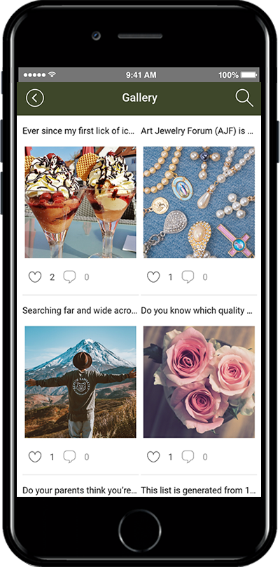<figcaption></figcaption></figure>

### <mark style="color:blue;">**2. Timeline (Free) Bulletin Board**</mark>

**Display**

Part of the post body + representative thumbnail image.

**Timeline (free bulletin board)**

You’ll see some thumbnail-representative images and posts.

If you attach multiple images, the number of images attached will be displayed at the top of the image as a number badge.

<figure>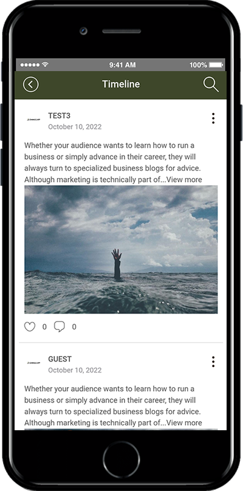<figcaption></figcaption></figure>

**Utilization**

Use posts without style restrictions

Use it as a space for the member community

Use it to write long-texting with images

### <mark style="color:blue;">**3. List Board**</mark>

**Display**\
Post body part + horizontal image alignment

**List Board** \
Some of the text and images of the post.\
The style that is listed and displayed.

<figure>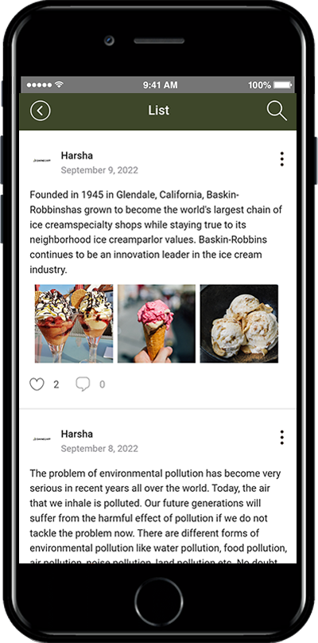<figcaption></figcaption></figure>

**Utilization**\
A style that is more organized than a free bulletin board\
Use your writing and images to be seen at the same time\
Use it to list multiple images

***

### <mark style="color:blue;">**4. Accordion (Notice) Bulletin Board**</mark>

**Display**\
Only post titles are exposed

**Accordion board**\
It is a bulletin board for announcements.\
In the bulletin board list, you’ll see only the title of the post.\
Select the title or click on the arrow icon to see the details of the post You.

<figure>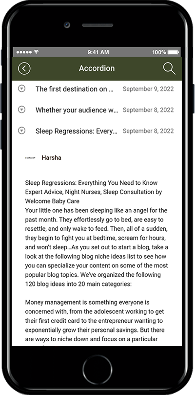<figcaption></figcaption></figure>

**Utilization**\
Use it as a bulletin board to post announcements\
Use it for text content without images

### <mark style="color:blue;">**5. Thumbnail Bulletin Board**</mark>

**Display**\
Show only thumbnails of images

**Thumbnail board** \
In the post list, only representative image thumbnails are displayed.\
The title is not displayed.

<figure>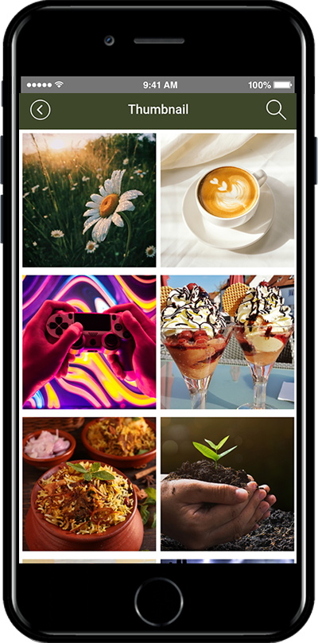<figcaption></figcaption></figure>

**Utilization**\
Existing image board upgrade version\
Use it as a bulletin board where only images are visible

### <mark style="color:blue;">**6. Large Image List Board**</mark>

**Display**\
List of large image thumbnail + bottom posts

\
**Large image size board**\
A large image filled with a wide size is applied.\
At the bottom is the style where the title of the post is shown.

<figure>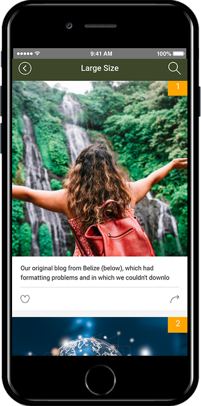<figcaption></figcaption></figure>

**Utilization**\
Use to highlight posts with a large List-type bulletin board upgrade version

### <mark style="color:blue;">**7. Medium image list board**</mark>

**Display**\
Image thumbnail + post title

**Medium Size Board**\
On the left, you’ll see a representative image thumbnail.\
On the right, the title of the post is shown.

<figure>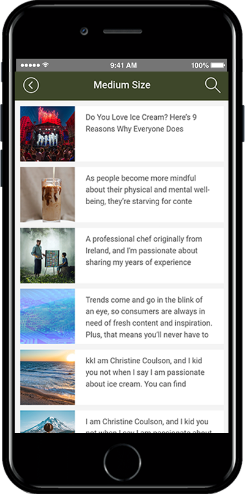<figcaption></figcaption></figure>

**Utilization**\
List edits to upgrade\
Make only images and titles visible, just like a menu board

### <mark style="color:blue;">**8. Conversation boards**</mark>

**Display**\
Conversation Board (group chat room)

**Conversation/Chat Board**\
Used as a group chat room.\
Multiple users can connect and chat.\
Chat between the operator and a large number of users.

<figure>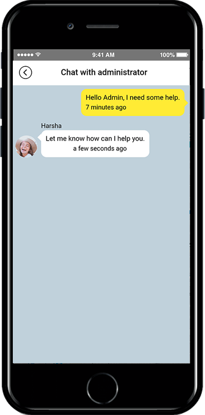<figcaption></figcaption></figure>

**Utilization**\
Real-time group chat with map users\
Multiple chat rooms can be opened\
\*Administrator user’s 1:1 chat is Please use the admin chat menu.

<mark style="color:red;">**\*\[Admin Chat] that allows you to have a 1: 1 chat with the administrator is a function provided on the swing2app page, not on the bulletin board function.**</mark>

**\*How to use**

1. Go to **Maker(V2).**&#x20;
2. Click on **Page Menu.**
3. Select the menu item and click on **Swing2App Page** from the **Menu Type.**
4. Click on **Link Wizard**(pencil icon).
5. Select **Admin Chat** from the list of **Swing function.**
6. Click on **Apply.**
7. Click on **Save.**

***

### <mark style="color:blue;">**9. Stamp Bulletin Board**</mark>

**Display**\
Mobile stamp page\

**Stamp boards**\
Available in the offline store.\
In the function such as a paper coupon to stamp, you can use it as a mobile stamp on the app.\
The app member’s membership number Add and use it.

<figure>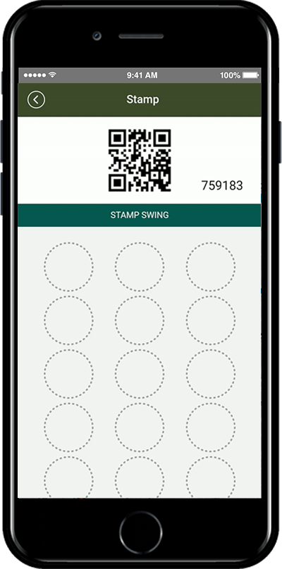<figcaption></figcaption></figure>

**Utilization**\
Use it as a coupon for visiting shops such as cafes and restaurants\
Use stamps for events and promotions

***

### <mark style="color:blue;">**10. Google Map Board**</mark>

**Google Map Bulletin:** Google Maps API

It is an overseas map board that can be used.&#x20;

Foreign-based businesses, overseas shopping mall, etc.

It’s available to all those who need to use an overseas address!

<figure>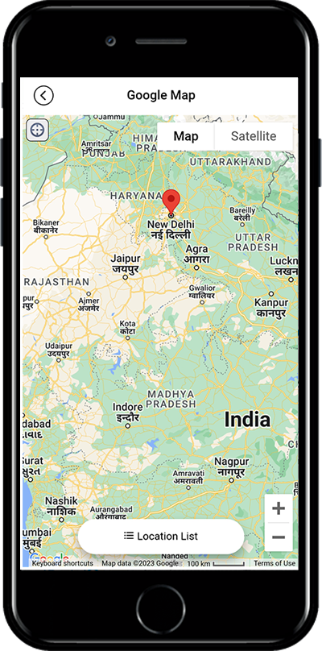<figcaption></figcaption></figure>

<figure>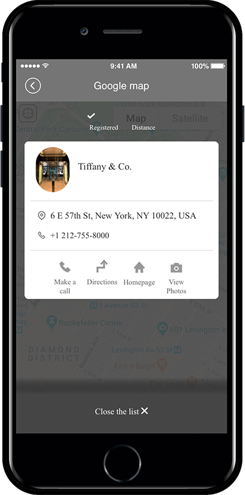<figcaption></figcaption></figure>

<mark style="color:red;">\* To link Google Maps, you need to sign up to the Google Map Platform site and get a key-value called API.</mark>

<mark style="color:red;">Google Maps is not a free service, but a service provided by Google’s platform for a fee.</mark>

Please refer to the posting for more information on how to use Google Maps.

☞ [**\[See how to use Google Map Board\]**](googlemap.md)

***

### <mark style="color:blue;">**11. Calendar Board**</mark>

A calendar form bulletin board where you can check schedules and announcements\
It’s easy to register your calendar for major events.\
For businesses that require reservation management, book by date, and time you can record the status of the status.

<figure>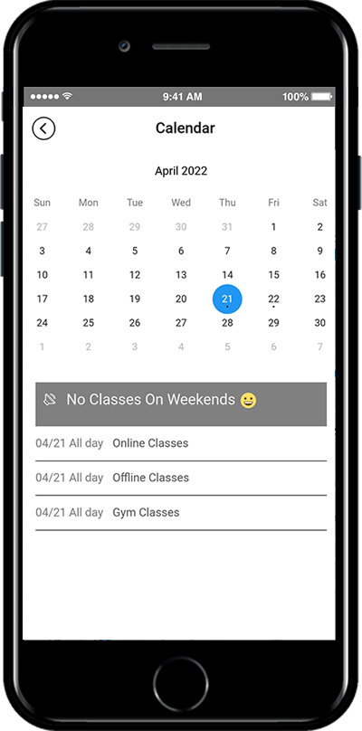<figcaption></figcaption></figure>
