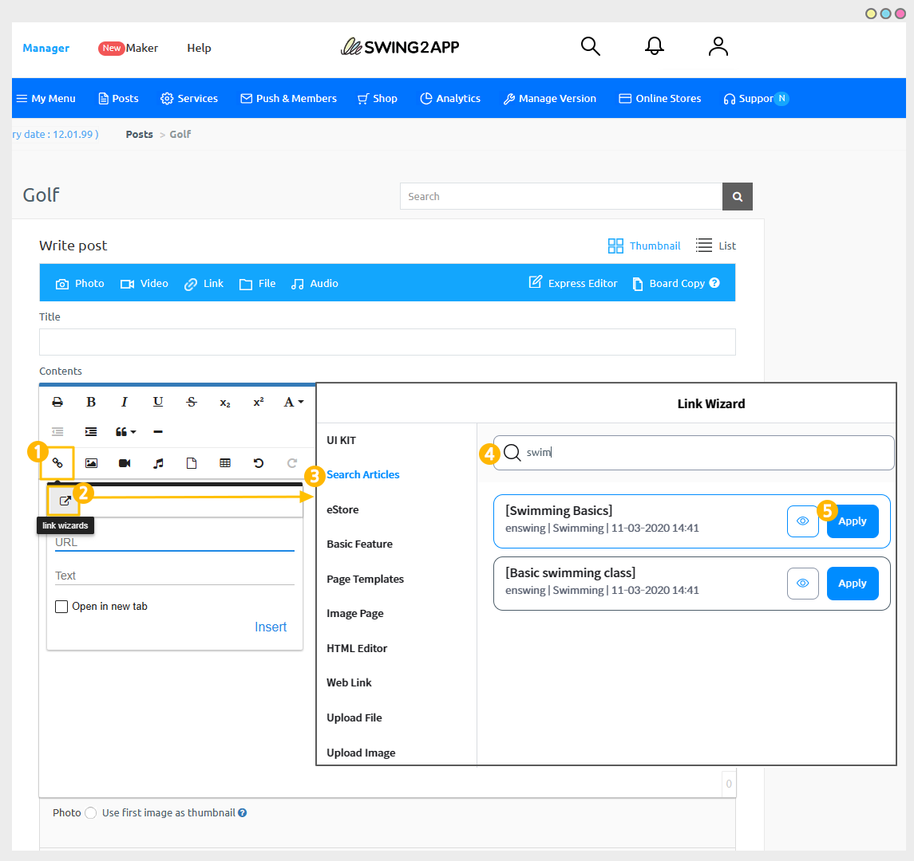
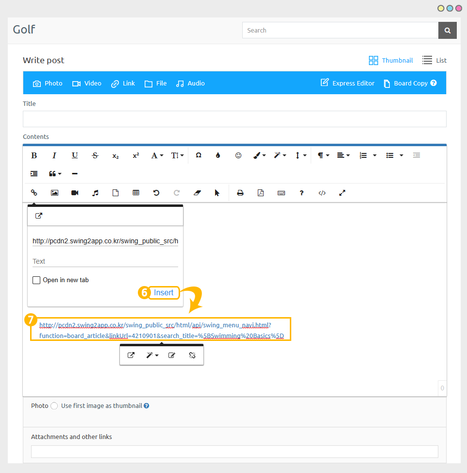
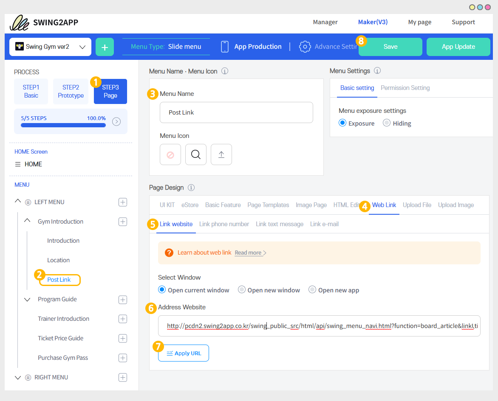
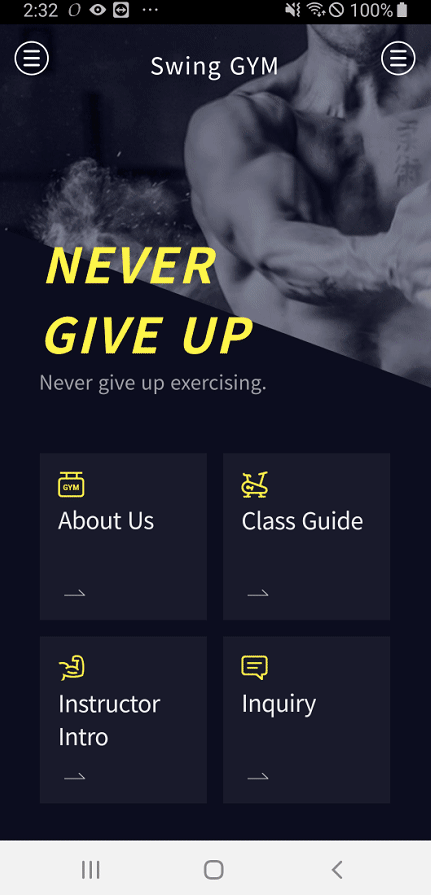

# Create a link for a post

<figure><figcaption></figcaption></figure>

## 1. Create a link in Manage posts

**Select a board from → the app Maker V3 page → Step 3 Page → Select the HTML Editor option**

\*If you want to link a post to a board, then first select the board and then link the post to it.

\*If you only want to create a link and copy it to another place, you can select any board.

(Since you are only creating a link, it doesn't matter which board pick to write post)

<figure><figcaption></figcaption></figure>

1\) Select the \[Insert link] button from the option bar.

2\) Select the \[Link Wizard] button.

3\) In the Link Wizard window, click on \[Search Articles].

4\) Search for the post you want to link to. (Search by post title)

5\) Click on the \[Apply] button.

<figure><figcaption></figcaption></figure>

6\)Click on the \[Insert] button.

7\)On the post creation screen, you can see that a link to the post has been created.

Please copy the link and use it.

<figure><figcaption></figcaption></figure>

## 2. How can I use it?

You can link all posts from the link wizard to the board.

If you link directly from a category, you can't link the post directly, so you can import the created link and apply it as a web link.

### <mark style="color:blue;">1)</mark><mark style="color:blue;">When using app production V3 version</mark>

<figure><figcaption></figcaption></figure>

1\) App Maker V3 screen - Select the STEP3 page

2\) Select Menu.

\*If you haven't created a menu, please create a new one. (Select the \[+] shape button to add the menu)

3\) Enter a menu name.

4\) Select \[Web Link] from the page design.

5\) Select \[Link website].

6\) Paste the link to the post you copied earlier in the website address field.

7\) Click on the \[Apply URL] button.

8\) Press the \[Save] button to finish.

### <mark style="color:blue;">2)</mark><mark style="color:blue;">When using the V2 version of the app production</mark>

**On the Swing app creation page, go to the → page menu.**

1\. Select the \[Add category] button to add a menu to apply the board.

2\. Enter a menu name.

3\. Menu type: Select \[Weblink].

4\. Select the \[Link Wizard] button.

5\. Paste the link to the post you copied earlier in the web link address field.

6\. Select the \[Reflect] button

7\. \[Apply] button

8\. Press the \[Save] button and you're done.

\*Icons are optional.

### <mark style="color:blue;">**3)**</mark><mark style="color:blue;">App launch screen</mark>

<figure><figcaption></figcaption></figure>

When you select the menu, you can see that you are taken directly to the corresponding post page.


<mark style="color:red;">**Warnings**</mark>

1\. The generated post link can only be used within the app. It is not an externally available link.

\*This is a link published by an app, so it is different from a regular website link.

2\. The link to the post is only available in the app.

For example, a link to a post created in app A will only be reflected in app A and cannot be applied to app B or app C.

\*Only available in connected apps

