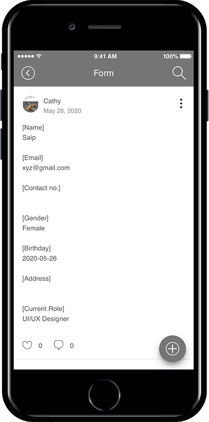

# How to create a Form in Bulletin Board

**▶ What is the bulletin board form?** &#x20;

If you put the questionnaire that the administrator wants, it is a bulletin board function that is provided in the set form.

In other words, if you apply a question item of your choice within the bulletin board, you can create a form that allows users to create an answer that matches the question.

When you receive a job application or receive surveys from users, you can use the corresponding form.

> \*\*Among the functions similar to the writing form is the ability to write a bulletin board.
>
> The writing form is a bit different from the writing style.&#x20;
>
> Post is a style that only posts on the bulletin board without a form.
>
> **☞**[ **For more information on how to write a bulletin board, please refer to the post.** ](bulletinboard-form.md)

***

<mark style="color:blue;">**App Launch screen – Application form screen**</mark>

As you can see on the app launch screen above, when writing a post, the question items are pre-filled like a job application and provided in the form.

Depending on the question, the user can enter and save the answer.

You can take advantage of image attachments and calendar (date setting).&#x20;

<figure><figcaption></figcaption></figure>

## <mark style="color:blue;">**1.**</mark>**  **<mark style="color:blue;">**How to set up the bulletin board**</mark>

1. Go to **Manager** and select **Services.** From the drop-down list select **Bulletin Board.**
2. If you need to create a new board on the board management page, click on  **Create Bulletin Board** button. If a bulletin board is created, click the **Settings** button on the bulletin board.
3. Select **Contribution’s** tab from the **Bulletin Board and Features Settings** window. On the Contribution’s page, enable **Form usage.**

**☞** [**\[Go to see the bulletin board making\]**](create-bulletinboard.md)

<figure><figcaption></figcaption></figure>

## <mark style="color:blue;">**2. Bulletin Form**</mark>

In the bulletin board form, select and add the necessary items. If you need additional questions besides the items, you can add them by customizing them as per requirement.\
1\. **Write Content:** Enter a message explaining how to write the board.\
2\. The minimum **number of image registration:** If image registration is required, enter the desired number. If you do not need image registration, you do not need to use it. If you enter the number of images, app users must register the images accordingly.\
3\. **Item name:** Enter and add any of the desired forms of items to the created form.\
You can select and add the set input information, or select Custom and add the desired item.\
<mark style="color:orange;">★ In addition to the image attached in the response UI form – If you attach a ‘file’, you can register the image in the body of the post.</mark>\
4\. Click **Save.**

**You can select the required items and add them to the bulletin board creation form.**

**If you need additional questions other than the items, you can add the input information by checking ‘Custom’.**

<mark style="color:orange;">**1. How to write (not required)**</mark>

Enter a text describing how to write the board.

<mark style="color:orange;">**2. Minimum image registration number (not required)**</mark>

If image registration is required, enter the desired number. If you do not need to register the image, you do not need to use it.

If you enter the number of images, the app user must register the images according to the number.

<mark style="color:orange;">**3. Item name**</mark>

Add the desired type of item to the compose form.

**You can select and add the set input information, or you can add it after entering the desired item after selecting user-defined.**

**→ In addition to attaching images, you can register an image in the body of the post by attaching ‘File’ in the answer UI form.**

**→ Check how to add items through the below image**

<mark style="color:orange;">**4. Save**</mark>

When you have entered the item, click the Save button.

<mark style="color:blue;">**▶ Bulletin Form-Please check the input method.**</mark>

<mark style="color:blue;">**▶ Completing the form input**</mark>

If you add the items and set the form and save it as in the image above, a compose form is created with the contents.

In the app creation page, you need to link the relevant bulletin board to the app to be reflected. Please check how to apply it to the app below.

***

<figure><figcaption></figcaption></figure>

## <mark style="color:blue;">**3. Applying a bulletin board to the app**</mark>

앱제작 V3버전 이용시

<figure><figcaption></figcaption></figure>

1\)앱제작 화면 STEP3 페이지 선택

2\)메뉴 선택

\*메뉴를 만들기 전이라면, 새 메뉴를 만들어주세요. (+ 모양 버튼 선택하여 메뉴 추가)

3\) 메뉴 이름을 입력해주세요.

4\) 페이지 디자인에서 \[UI KIT] 선택

5\)\[게시판]을 선택해주세요.&#x20;

6\) 등록할 게시판을 확인한 뒤 \[적용하기] 버튼을 선택해주세요. (페이지에 마우스 커서를 가져다 대면 적용하기 버튼이 열립니다)

7\) 화면 상단 \[저장]버튼을 누르면 앱에 적용됩니다.

\*아이콘은 선택사항이며, 메뉴 앞에 아이콘을 적용할 경우만 선택해주세요.&#x20;

앱제작 V2버전 이용시

<figure><figcaption></figcaption></figure>

Go to **Maker(V2)** and click on **Page Menu.**

1\. From the menu set by default, click the **Add a category** to add a new menu.\
2\. Edit the name of the added item in **Menu Name.**\
3\. Select **Bulletin Board** in the **Menu Type.**\
4\. Click on **Link Wizard**(pencil icon).\
5\. Select the board from the list of Bulletin Boards in the Link Wizard window.\
6\. Click on **Reflect.**\
7\. Click on **Apply** and then **Save.**

<figure><figcaption></figcaption></figure>

## <mark style="color:blue;">**4. App Launch screen**</mark>

**Let’s check how the form appears through the phone app launch screen.**

When you go to the article writing page, the question item and answer item form are created as you typed in the form.

App users can input according to the corresponding form.

The application form can be applied in any style you want!

Like the inquiry board, you can configure items to receive questions. It can be used in the same form as the application form.

<mark style="color:orange;">**Check the form of the registration bulletin board**</mark>

I’ll check the bulletin board creation form after posting is complete.

<figure><figcaption></figcaption></figure>

You can see that the answer has been entered for each item. ^^

<mark style="color:red;">**\*Precautions**</mark>

When writing a form, the title displayed on the bulletin board is set as the title of the first item answer of the form.

For example, if the first item is a name, the user name is displayed as the title.

If the date is the first item, then the date is 2020-07-09.

<mark style="color:red;">**\*\*Please do not register image registration, file attachment, etc. as the first item.**</mark>

<mark style="color:red;">Because there is no value to be entered in the item, the temporary automatic numeric number is set as the title.</mark>
