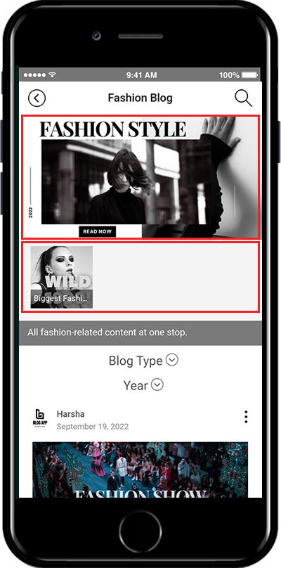

# How to use the bulletin board header

One of the bulletin board features: We will tell you how to use the bulletin board header.

Please check how to set the bulletin board header, how to set the header, and how to sort them in order.

***

<mark style="color:blue;">**▶ What is a bulletin board header?**</mark>

**As you can see from the image above, the bulletin board header is a pin that pins the post to the top.**

At the top of the bulletin board, you’ll see the post thumbnail, so you can see the list of posts only with thumbnails without looking at the list.

You can sort the post thumbnails in order by ranking the registered posts.

<figure><figcaption></figcaption></figure>

***

### <mark style="color:blue;">**STEP.1 Apply Board**</mark>

1. **Go to Manager. Select** Services and click on **Bulletin Board** from the list.
2. Either click on **Create Bulletin Board** to create a new board or click on **Settings** to edit the existing board.
3. Select **Customize** so that you can select board UI and permission as per your requirement.
4. Click on **Save.**

**You can set a bulletin board header in the bulletin board and function setting window.**

&#x20;

***

1. Select **Advanced Style** on the bulletin board and features settings window.
2. Please check the **Used** bulletin board header.
3. Please register the image to enter in the header area.
4. Press the **Save** button to complete.

&#x20;

<mark style="color:blue;">**\* What do you see in the header part? Select the question mark icon to see the image size and header usage tips.**</mark>

<mark style="color:blue;">**The header image is 800px wide by 400px tall.**</mark>

***

### <mark style="color:blue;">**STEP.2 Apply header priority to posts**</mark>

**If you finish applying the header in the board management, go to the board and apply the priority to be shown in the header.**

Go to **Manager** and select **Posts**. Click on the Bulletin Board you want to use in the header.

1. From the list of the posts in the bulletin board, click on **Header**(pin icon).
2. In the pop-up window, select the priority level of the post for the header. (Priority is set from low number first)
3. Click on **Save**.

<mark style="color:orange;">**\*Priority is the order of posts shown in the header area.**</mark>

<mark style="color:orange;">**\*If you want to set the order first, please write number 1.**</mark>

<mark style="color:orange;">**\*Other posts are done in the same way, Enter the number and press ‘Save’.**</mark>

***

### <mark style="color:blue;">**STEP.3 App Launch screen**</mark>

**So let’s see how the header looks like in the app.**

<mark style="color:orange;">**\* Top header image**</mark>\
\-The header image set in the bulletin board management is designated as the top image.

<mark style="color:orange;">**\* Bulletin board header**</mark>\
\-Headers are sorted by the priority value set in Posts.\
\-Selecting a header will take you to that post.

<mark style="color:orange;">**\*Bulletin text**</mark>\
\-The description you have written appears in the header.\
\-Please check the instructions below on how to write a bulletin board.

<figure><figcaption></figcaption></figure>

1. Bulletin board description can be entered in **Bulletin Board and feature settings** window&#x20;
2. **Basic setting**&#x20;
3. Bulletin board and function description.

***

### <mark style="color:blue;">**STEP.4 How can I get a bulletin header?**</mark>

<mark style="color:red;">**When deleting the header, you only need to delete the number entered in the priority.**</mark>

1. From the list of the posts in a bulletin board, click on **Header**(pin icon).
2. Delete the number entered in the priority value in the header setting window.
3. Click on **Save**.

<mark style="color:red;">**If you do not use the bulletin board header function, you can uncheck the bulletin board management- ‘Unused’ bulletin board headers.**</mark>

**If you want to use the header feature but want to post in the header, check out the instructions below!**

<mark style="color:orange;">**▶ App launch screen: Delete header**</mark>

If you delete the header priority and run the app again, you will see that the post is missing from the header area.

Headers can be rearranged by entering a priority value or removed from the header by deleting the number.

<figure><figcaption></figcaption></figure>

***

**It can be useful to make announcements or event posts appear more visible on bulletin boards, or when you want to rearrange old posts in the preceding order when reordering posts.**&#x20;
