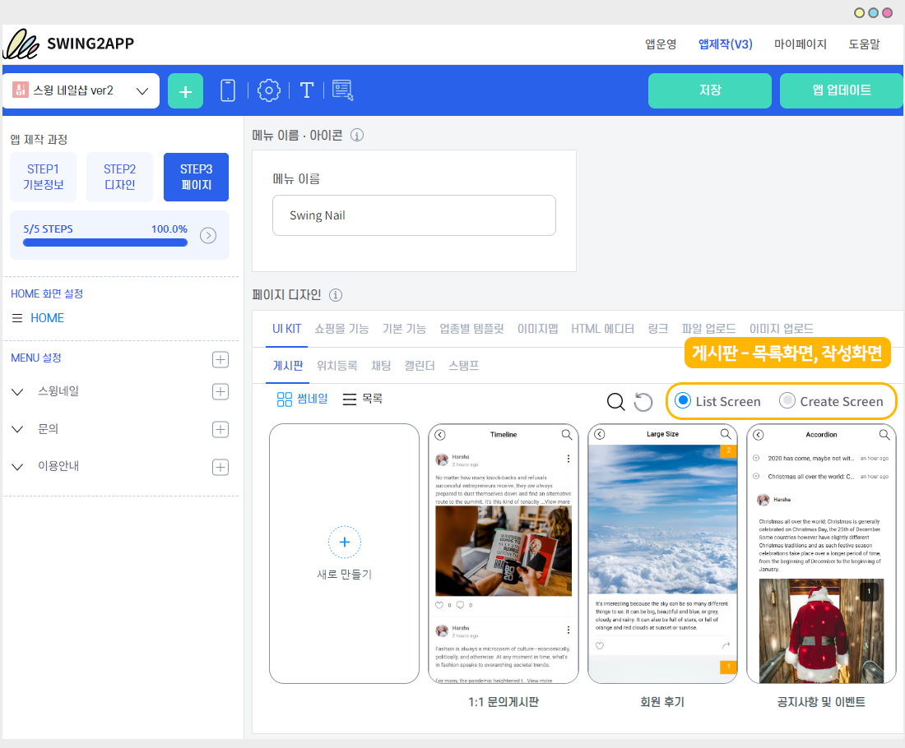
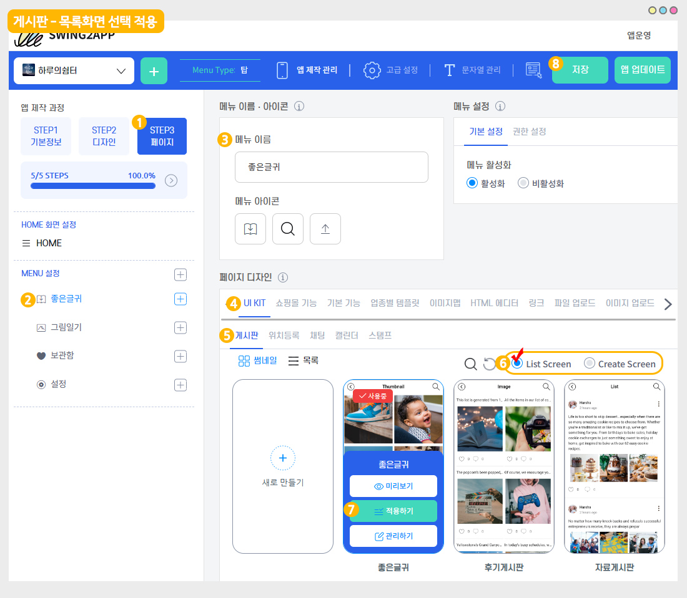
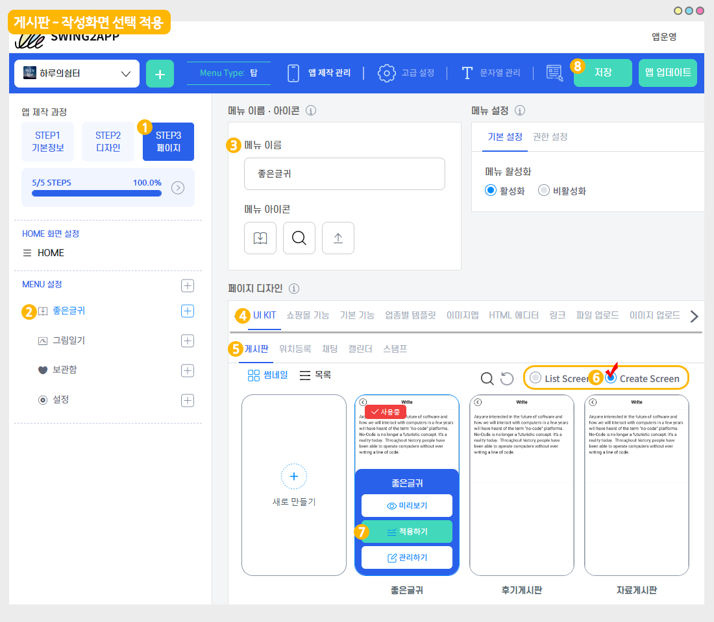

# How to use the list screen and creation screen

<figure><figcaption></figcaption></figure>

When you apply a bulletin board, you choose the style that will load the board.

At this time – Select List screen and Create screen.

**The most basic style is “List Screen”, but depending on the user’s purpose of using the app, you can choose “Create Screen”.**

****

<mark style="color:blue;">**게시판: 목록화면, 작성화면은 어디서 이용하나요?**</mark>

<figure><figcaption></figcaption></figure>

게시판은 앱제작 – STEP3페이지에서 이용가능합니다.

페이지 디자인 - UI KIT 선택 - \[게시판] 선택 - 게시판 화면에서&#x20;

‘목록화면(List Screen)'으로 선택할지 ‘작성화면(Create Screen)’으로 선택할지 체크할 수 있습니다.

<mark style="color:blue;">****</mark>

<mark style="color:blue;">****</mark>

### <mark style="color:blue;">**1. Bulletin board: list screen**</mark>

<figure><figcaption></figcaption></figure>

1\)앱제작 화면 - STEP3 페이지 선택

2\)메뉴 선택

\*메뉴를 만들기 전이라면, 새 메뉴를 만들어주세요. (+ 모양 버튼 선택하여 메뉴 추가)

3\)메뉴 이름을 입력해주세요.

4\)페이지 디자인에서 \[UI KIT] 선택

5\)\[게시판]을 선택해주세요.&#x20;

6\)\[List Screen] 선택해주세요.&#x20;

7\)등록할 게시판을 확인한 뒤 \[적용하기] 버튼을 선택해주세요.&#x20;

(페이지에 마우스 커서를 가져다 대면 적용하기 버튼이 열립니다)

8\)화면 상단 \[저장]버튼을 누르면 앱에 적용됩니다.

<mark style="color:blue;">****</mark>

<mark style="color:blue;">**앱 실행화면**</mark>

**목록화면은 게시판 목록이 보이는 스타일 \*가장 기본적인 게시판 화면이에요.**

게시판 ‘목록화면’을 선택하면 적용된 게시판의 목록(리스트)이 보이게 됩니다.

목록에서 게시물을 선택하면, 게시물 상세보기 페이지로 이동하여 게시물 내용을 확인할 수 있어요.

★게시판 불러오기는 ‘목록화면’으로 기본 셋팅되어서 제공됩니다.

따라서 특별한 경우가 아니면 수정하지 않고, 목록화면으로 보기로 이용해주시면 됩니다.&#x20;

<figure><figcaption></figcaption></figure>

<mark style="color:red;">****</mark>

### <mark style="color:blue;">**2. Bulletin board: writing screen**</mark>

<figure><figcaption></figcaption></figure>

1\)앱제작 화면 - STEP3 페이지 선택

2\)메뉴 선택

\*메뉴를 만들기 전이라면, 새 메뉴를 만들어주세요. (+ 모양 버튼 선택하여 메뉴 추가)

3\)메뉴 이름을 입력해주세요.

4\)페이지 디자인에서 \[UI KIT] 선택

5\)\[게시판]을 선택해주세요.&#x20;

6\)\[Create Screen] 선택해주세요.&#x20;

7\)등록할 게시판을 확인한 뒤 \[적용하기] 버튼을 선택해주세요.&#x20;

(페이지에 마우스 커서를 가져다 대면 적용하기 버튼이 열립니다)

8\)화면 상단 \[저장]버튼을 누르면 앱에 적용됩니다.

<mark style="color:blue;">**앱 실행화면**</mark>

<mark style="color:blue;">****</mark>.png>)<mark style="color:blue;">****</mark>

‘작성화면’을 선택하면 글을 작성할 수 있는 화면(페이지)가 먼저 열리게 됩니다.

게시판의 글 작성 페이지가 보이는 스타일이며 <mark style="color:orange;">**\*특수한 운영 목적에 사용할 수 있어요.**</mark>

\*사용자들이 바로 글을 작성해야 할 때 사용할 수 있지만 사용자들은 해당 게시판의 목록을 볼 수 없어요.

\*즉 글만 작성할 수 있고, 작성된 글 목록은 앱운영페이지에서 관리자만 확인이 가능합니다.

<figure><figcaption></figcaption></figure>

### <mark style="color:blue;">****</mark>



앱제작 V2버전 이용시에는 해당 매뉴얼로 확인해주세요.

### <mark style="color:blue;">**1. Bulletin board: list screen**</mark>

**The style of the bulletin board list  **<mark style="color:red;">**\*This is the most basic board screen.**</mark>

If you select ‘List Screen’ in the bulletin board, the list of the board will be shown.\
When you select a post from the list, you can go to the post detail view page and check the contents of the post.\
As in the preview screen on the right, the list screen will appear to match the bulletin board UI style.

<mark style="color:red;">**★Bulletin board loading is provided by default setting as a ‘list screen’.**</mark>\ <mark style="color:red;"></mark><mark style="color:red;">**Therefore, you should use it as a list screen without editing it unless it is a special case.**</mark>&#x20;

### <mark style="color:blue;">**2. Bulletin board: writing screen**</mark>

**Style of the bulletin board writing page.** <mark style="color:red;">**\*It can be used for special operation purposes.**</mark>

If you select **Create Screen** in the bulletin board, the page to write a post will be opened first.\
<mark style="color:blue;">**\*Users can use this when they need to write a post, but they cannot see the list of the bulletin board.**</mark>\ <mark style="color:blue;"></mark><mark style="color:blue;">**\*In other words, only posts can be written, and the list of written posts can only be checked by the administrator on the Manager page.**</mark>

<mark style="color:red;">**\[Purpose of use]**</mark>

Filling screen settings can be used to \* fill out the content required by the user, such as questionnaire, consent, application, job application.\
It is used to receive only the information that is needed by the users of the app, not in the form of community or interactive boards.\
Administrators can check the article written Swing2App **Manager** page in **Posts.**\

<mark style="color:red;"></mark>\ <mark style="color:red;"></mark><mark style="color:red;">**\[Example: When used as a creation screen]**</mark>

 

As you can see above, you can see the example of selecting a bulletin board creation screen.\
**+You can use it for the member’s self-introduction bulletin board, application form, etc.**\
**+When you select the bulletin board, you’ll immediately open the writing page, so you can write directly to users.**\
**+Administrators can view the articles written by members on the web-app operation page.**

Please select the loading style of the bulletin board according to the purpose of the app operation.

Bulletin boards loading style can also be freely edited, so please set and edit them to the desired style, such as list screens or creation screens.



### <mark style="color:blue;">****</mark>

### <mark style="color:blue;">****</mark>
