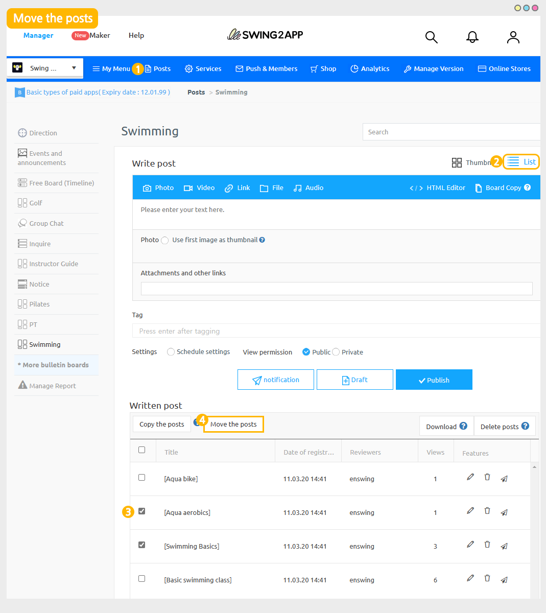
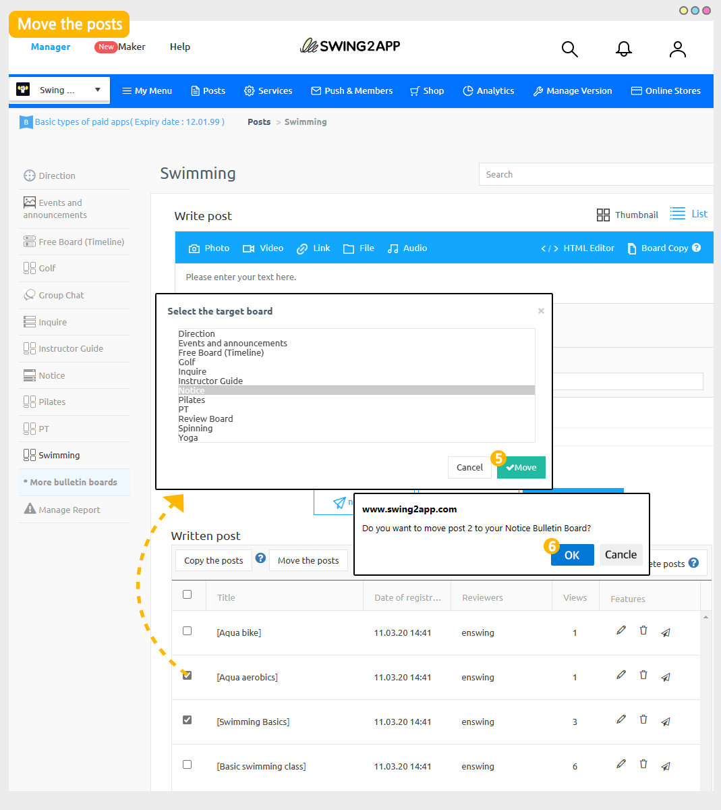
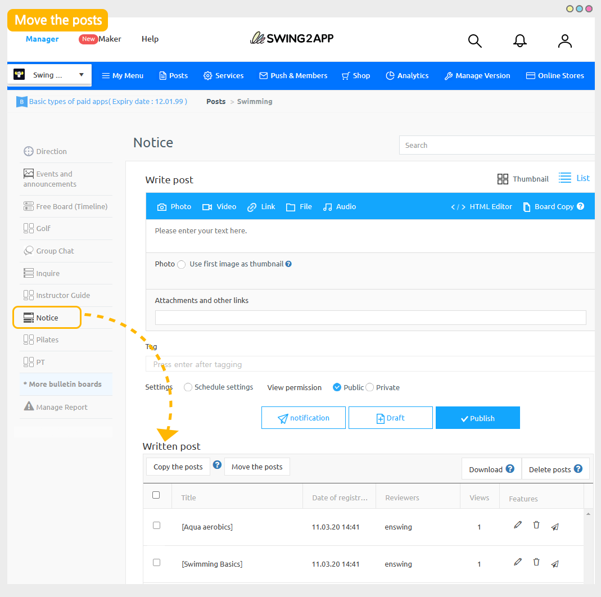

# Move a post

<figure><figcaption></figcaption></figure>

**What is moving a post?**

Move post is a function that allows you to select a post and move it to the desired board.

Unlike copying a post, a post registered on an existing board is deleted, and the date of creation remains the original registration date.

<mark style="color:blue;">****</mark>

 ** **<mark style="color:blue;">**Difference between copying a post and moving a post**</mark><mark style="background-color:blue;">​</mark>

**Copy post**

Ability to copy posts to another board

\+The post will be retained on existing boards.

\+The registered date of the copied text will be modified to the copied date.

​

**Move a post**

Ability to move posts to another board

\+On existing boards, the post will be deleted.

\+Moved articles will retain their original creation date.

<figure><figcaption></figcaption></figure>

##  **** How to move a post

<figure><figcaption></figcaption></figure>

1\) App Manager screen – Select the board created in Manage posts (The board where you want to move the post)

2\. Click on the \[List].

3\) Select the post you want to move from the list of created posts.

4\) Click on the  \[Move the Posts] button.

<figure><figcaption></figcaption></figure>

5\) Select the target board, and then select the \[Move] button.

6\)Click on the \[OK] button to finish the process.

\- You can also move the entire page of the board.

\-You can select any board and move only a few posts.

<figure><figcaption></figcaption></figure>

When you go to the board, you can see that the selected post has been moved.

***
