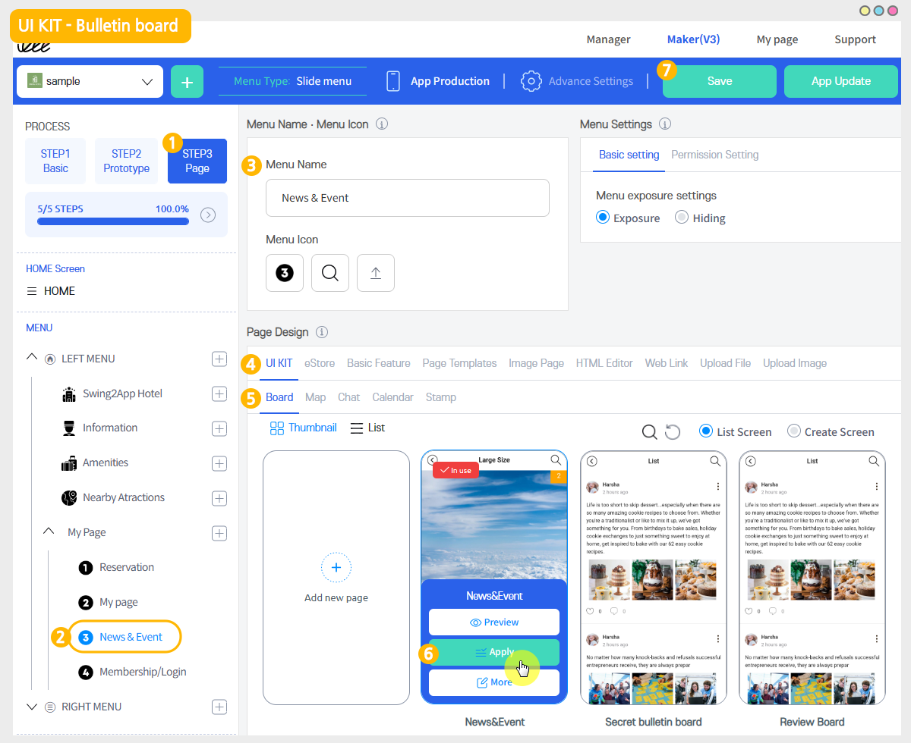

# How to set up a bulletin board post alarm

****

**▶What is the new alarm?**

When a new post is registered on the bulletin board, it is a function to notify in the real-time push that the new post has been registered.

If you select a member who wants to receive an alarm in \[Bulletin administrator page], a push alarm will be sent to the member.

Therefore, the app manager does not necessarily send a new post-alarm.

You must specify a member to receive a new alarm separately. Please don’t forget.

Please check the manual on how to set a new alarm and how notifications are sent through the app launch screen.

## <mark style="color:blue;">1.</mark> <mark style="color:blue;">Bulletin board management-set the alarm</mark>

1. Go to **Manager** and select **Services.** From the drop-down list select **Bulletin Board.**
2. If you need to create a new board on the board management page, click on  **Create Bulletin Board** button. If a bulletin board is created, click the **Settings** button on the bulletin board.
3. Select **Administrators** tab on Bulletin Board and features settings. Click on **Set a New Alarm.**
4. After setting the alarm, click on **Save.**&#x20;

**\*Please refer to the post to see how to use the board administrator settings.**

**☞**[**\[See how to set up a bulletin board administrator\]**](administrator.md)

<figure><figcaption></figcaption></figure>

## 2. Set a new alarm

<mark style="color:red;"></mark>

1. Click on **Set a New Alarm.**&#x20;
2. Members Groups window will be open, select the members who wish to receive the notification from.
3. Click on **Okay.**&#x20;
4. Finally, press the **Save** button.

<figure><figcaption></figcaption></figure>

## 3. Applying bulletin boards to your app

<mark style="color:blue;">**-When using app production V3 version**</mark>

<figure><figcaption></figcaption></figure>

1\) APP CREATION STEP3 Select page

2\) Menu selection

\*If you haven't created a menu, please create a new one. (Select the + shape button to add menu)

3\) Enter a menu name..

4\) Select \[UI KIT] from the page design.

5\) Select \[Bulletin Board].

6\) Check the board to register, and then select the \[Apply] button. (Hover over the mouse cursor on the page to open the Apply button)

7\) Press the \[Save] button at the top of the screen to apply it to the app.

\*\*Icons are optional, please select only when applying an icon in front of the menu.

<mark style="color:blue;">**-When using app production V2 version**</mark>

**On the Swing app creation page, go to the → page menu.**

1\. Select the \[Add category] button to add a menu to apply the board.

2\. Enter a menu name.

3\. Menu Type: Select \[Bulletin Board].

4\. Select the \[Link Wizard] button.

5\. Select the board to apply to the menu, and then select the \[Reflect] button

6\. \[Apply] button

7\. Press the \[Save] button and you're done.

\*Icons are optional, please select only when applying an icon in front of the menu.


<mark style="color:red;">\*Note</mark>

&#x20;<mark style="color:red;">A new post alarm will be sent only from the selected bulletin board. (Not applicable to all bulletin boards)</mark>\ <mark style="color:red;">If you want to receive all bulletin board alarms, go to all bulletin board settings applied to the app and apply a new alarm.</mark>&#x20;


This will complete setting the new alarm.\
You can have multiple members for your new post. (There is no limit)\
And the new alarm is automatically reflected in the app, just run the app to see if it is reflected.\
In order to receive new posts, you must log in with the account that applied the alarm.

<figure><figcaption></figcaption></figure>

## <mark style="color:blue;">**4. Post alarm push confirmation**</mark>

<mark style="color:orange;">**▶ When the post is written on the bulletin board, a notification push will be sent to the app.**</mark>

Like the image below, when a post is written on a bulletin board that applies a new post alarm, a push notification is sent to the member.\
Selecting push notifications will take you to that bulletin board-post.&#x20;

<mark style="color:orange;">**▶ What if you didn’t see the notification right away?**</mark>

If you didn’t see the push notification right away, you can check the notification list by selecting the notification number badge on the main home screen that appears when you launch the app.\
In other words, if you select the number badge on the main home screen after running the app as shown in the image below, the list of notifications sent will pop up.\
Selecting push notifications will take you to that bulletin post.

Push notification number badges can be found in addition to regular alarm notifications.\
Therefore, you can use this feature to check if other push notifications can be useful.

> \[Post Alarm] is a feature that has been upgraded by enhancing the function of the existing alarm push. \
> Previously, when someone commented on or liked your post, you were sent a push notification.\
> However, the newly updated post alarm function will be sent a push notification for all posts registered on the bulletin board.\
> Therefore, the administrator who manages the app can receive the news in real time, so the app can operate more efficiently.
