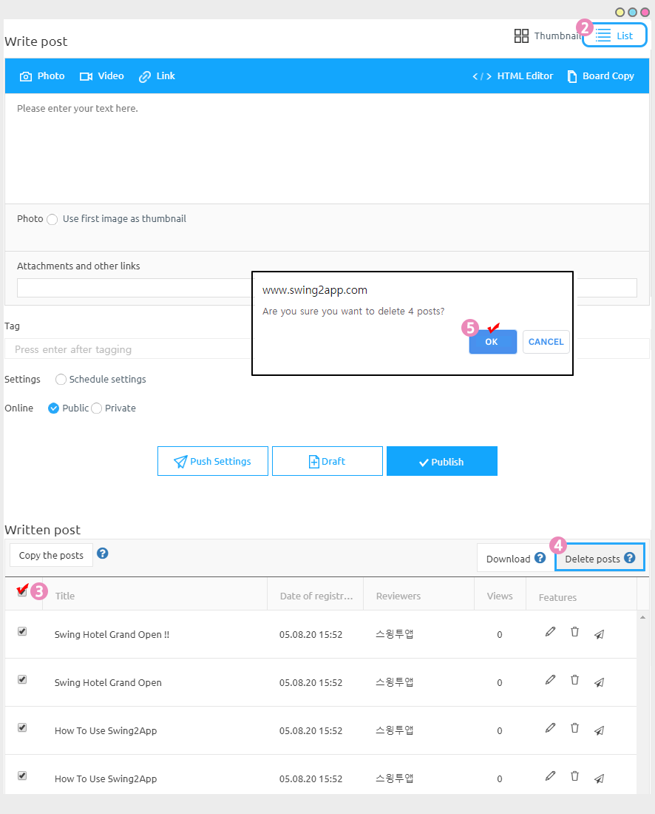

# How to delete bulk posts

**How to delete bulk posts**

Bulk post delete function allows you to delete multiple selected posts at once.

This can be useful when you want to delete several posts from the bulletin board at once.

It’s easy to use! Check out the manual below.

***

<mark style="color:blue;">**Delete Posts**</mark>

1. Go to **Manager** and select **Posts.**
2. Click on the **list view** so that you can select multiple posts easily.
3. Select the post you want to delete.
4. Click on **Delete Posts.**
5. Click **OK.**

You can choose whether to view the post as ‘thumbnail type’ or ‘list’ as the icon.

\-Select ‘View List’. (Second icon)

\-Select multiple posts to delete (If you select all posts, all posts will be selected at once)

\-If you select the \[Delete all posts] button, you can delete the selected posts at once.

***

**Check how to use GIF images**

***

<mark style="color:orange;">**–Instructions–**</mark>

\* Deleted posts won’t be restored, so please make sure to check before deleting them.

\* The list of posts is a list of 10 by default.

If you select more posts, you can select 50 or 100 items by selecting the \[View Each] button below.
