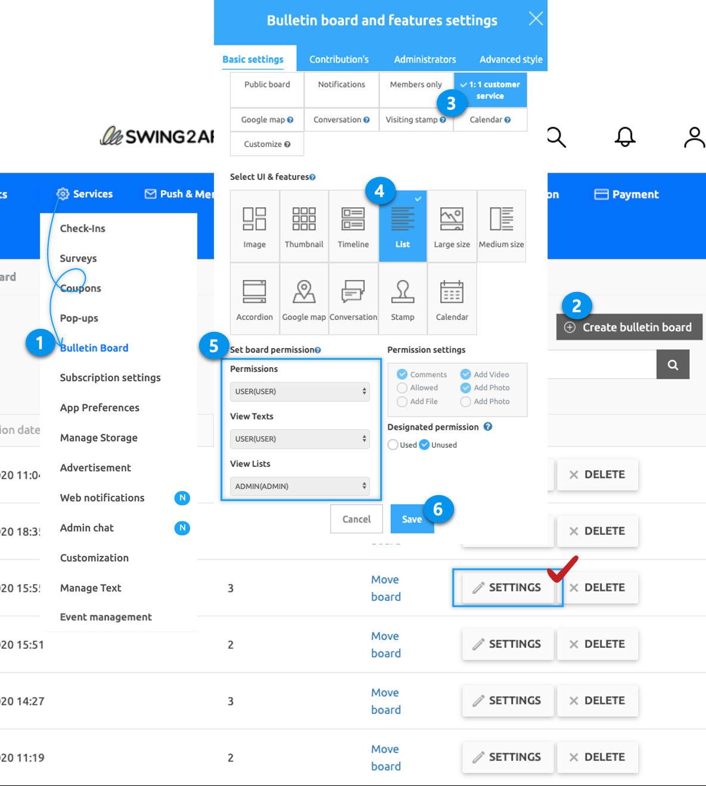

# Create a Secret Bulletin Board (1:1 Customer Service)

<figure><figcaption></figcaption></figure>

A secret bulletin board is a 1:1 customer service style that can only be viewed and answered by administrators, and other users will not be able to see what is written on the bulletin board.

Only the user who created the post and the administrator can check it, so users using the app can easily write on the bulletin board.

In particular, you can write a piece of personal information that should not be seen by others, and because the administrator can immediately check and reply, it is a bulletin board style that can be useful in apps that require communication with customers.

Please read the manual below to find out how to make a secret bulletin board (1:1 Customer Service).

<figure><figcaption></figcaption></figure>

## STEP1.  Create a Secret Bulletin Board

<figure><figcaption></figcaption></figure>

1. Go to **Manager,** select **Services** and click on **Bulletin Board** from the drop-down list
2. Select **Create bulletin board** button on the bulletin board management page to open the bulletin board and function setting window.
3. Enter the board name and select **1:1 Customer Service.**
4. Please select the **List.**
5. Press **Save** to finish.

Here you can choose and create the bulletin board style you want.

You can check and set the various functions used in the bulletin board.

The secret board is for service use – it is automatically set up when you select a 1:1 customer service.

<mark style="color:red;">★ Take a note from here!!</mark>

If the service purpose is not ‘custom’, the bulletin board UI style and tolerance settings below are all fixed and cannot be modified.

Therefore, **when creating a bulletin board, the service is always used! Please select ‘Custom’ and select the bulletin board from the UI function below to create it**.

> <mark style="color:orange;">3.Secret Bulletin Board (1:1 Customer Service)</mark>
>
> **Please select ‘Custom’ from the service, and then select UI functions below.**
>
> 1. Enter the name of the bulletin board and select **Customize**.
> 2. For the UI entry, checks the bulletin board style and selects your desired UI type.\
>    <mark style="color:red;">\* tip: Next to \[UI and features], select the ‘?’ icon to check the bulletin board UI style.</mark>
> 3. Set Permissions Board\
>    If the permissions are not applied properly, the secret bulletin board will not be created, so please set it to the permissions below!\
>    <mark style="color:purple;">**\*Write permission: User**</mark>\
>    <mark style="color:purple;">**\*View post details: User**</mark>\
>    <mark style="color:purple;">**\*View List Permission: Administrator**</mark>\
>    **View the list only as an administrator and you can specify it.**
> 4. Set tolerance: Allow comment photos, attach files, like, and more to complete.\
>    <mark style="color:red;">**\*File attachments and video attachments are only available to administrators on the web dashboard. It’s not a feature used in the app.**</mark>\
>    Allow use of designated permissions: Please check ‘Disable’ because it is not applicable in the secret bulletin board.
> 5. Select the save button, you are done!

<figure><figcaption></figcaption></figure>

## STEP2. Apply the Secret Bulletin Board Created in the App

**Once you’ve created a secret bulletin board, how to apply it to your app?**

### <mark style="color:blue;">**1.**</mark><mark style="color:blue;">When using app production V3 version</mark>

<figure><figcaption></figcaption></figure>

1. App creation screen - Select the STEP3 page
2. Select Menu. \*If you haven't created a menu, please create a new one. (+Select the shape button to add a menu)
3. Enter a menu name.
4. Select \[UI KIT] from the page design.
5. Select \[Bulletin Board].
6. Check the secret version to register, and then select the \[Apply] button. (Hover over the mouse cursor on the page to open the Apply button)
7. Press the \[Save] button at the top of the screen to apply it to the app.

### <mark style="color:blue;">**2.**</mark> <mark style="color:blue;"></mark><mark style="color:blue;">When using the app production V2 version</mark>

<figure><figcaption></figcaption></figure>

**Move to the Maker(V2) → Page menu.**

1. Click on **Add a category** button to add the menu where you want.
2. Please enter the menu name (Please note that group chat will be displayed under the main menu name “Group Chat” even if you edit the menu name)
3. Select **Bulletin Board** in **Menu type.**
4. Click ok the **Link Wizard** button.
5. Select the 1:1 customer service board created in the board list window.
6. Click the **Reflect** button.
7. Select the **Apply** button at the bottom.
8. Select the **Save** button.

<figure><figcaption></figcaption></figure>

## STEP3. App Launch screen – 1:1 Customer Service

After applying the app, launch the app to see how the 1:1 customer service (secret bulletin board) works.

On the 1:1 Inquiry Board, you can check what you wrote.

<mark style="color:orange;">1.Access App Administrator</mark>

The app administrator can view all posts posted by users.

<mark style="color:red;">\*Administrators have the right to view and check all articles.</mark>

<mark style="color:orange;">2. Sign in as another user (without creating a post)</mark>

<figure><figcaption></figcaption></figure>

On the contrary, if you log in as a user other than the user who wrote the post and go to the 1:1 inquiry board, there will be no post.

The text written by other users is not exposed, so it is confidential!

Secret bulletin boards are not available to anyone other than the user who wrote the article.

Only administrators can view the posts on the bulletin board.

***
